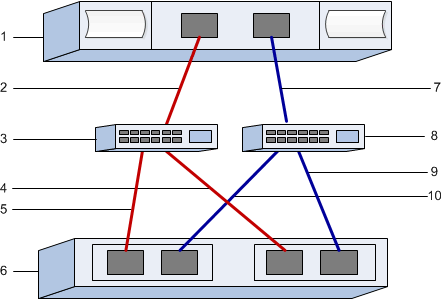

= iSER over IB の設定を記録します
:allow-uri-read: 
:icons: font
:imagesdir: ../media/

[role="lead"]
このページの PDF を生成して印刷し、次のワークシートを使用して iSER over InfiniBand ストレージの構成情報を記録できます。この情報は、プロビジョニングタスクを実行する際に必要になります。

== ホスト識別子

NOTE: ソフトウェアイニシエータの IQN は、タスクの実行中に特定します。 xref:iser-ib-configure-network-attached-hosts-task.adoc[ストレージ接続ホストのネットワークを設定します]。

各ホストのイニシエータ IQN を特定して記録します。一般に、ソフトウェアイニシエータの場合、 IQN は /etc/iscsi/initiatorname.iscsi ファイルに記録されます。

|===
| 番号 | ホストポート接続 | ソフトウェアイニシエータ IQN 

 a| 
1.
 a| 
ホスト（イニシエータ） 1.
 a| 

 a| 
該当なし
 a| 
 a| 

 a| 
該当なし
 a| 
 a| 

 a| 
該当なし
 a| 
 a| 

 a| 
該当なし
 a| 
 a| 

|===

== 推奨される構成

推奨構成は、 2 つのホスト（イニシエータ）ポートと 4 つのターゲットポートで構成されます。

== ターゲット IQN

ストレージアレイのターゲット IQN を記録します。この情報は、で使用します xref:iser-ib-configure-network-attached-hosts-task.adoc[ストレージ接続ホストのネットワークを設定します]。

SANtricity ： * ストレージアレイ * > * iSER * > * 設定の管理 * を使用してストレージアレイ IQN 名を検索します。この情報は、 SendTargets 検出をサポートしないオペレーティングシステムで iSER セッションを作成する際に必要となる場合があります。

|===
| 番号 | アレイ名 | ターゲット IQN 

 a| 
6.
 a| 
アレイコントローラ（ターゲット）
 a| 

|===

== ネットワーク構成：

InfiniBand ファブリック上のホストとストレージに使用するネットワーク設定を記録します。この手順では、 2 つのサブネットを使用して完全な冗長性を実現することを前提としています

次の情報は、ネットワーク管理者から入手できます。この情報は、 xref:iser-ib-configure-network-attached-hosts-task.adoc[ストレージ接続ホストのネットワークを設定します]。

=== サブネット A

使用するサブネットを定義します。

|===
| ネットワークアドレス | ネットマスク 

 a| 
 a| 

|===
アレイポートと各ホストポートで使用する IQN を記録します。

|===
| 番号 | アレイコントローラ（ターゲット）ポート接続 | IQN 

 a| 
3.
 a| 
スイッチ
 a| 
_ 該当なし _

 a| 
5.
 a| 
コントローラ A のポート 1
 a| 

 a| 
4.
 a| 
コントローラ B のポート 1
 a| 

 a| 
2.
 a| 
ホスト 1 、ポート 1
 a| 

 a| 
 a| 
（任意）ホスト 2 、ポート 1
 a| 

|===

=== サブネット B

使用するサブネットを定義します。

|===
| ネットワークアドレス | ネットマスク 

 a| 
 a| 

|===
アレイポートと各ホストポートで使用する IQN を記録します。

|===
| 番号 | アレイコントローラ（ターゲット）ポート接続 | IQN 

 a| 
8.
 a| 
スイッチ
 a| 
_ 該当なし _

 a| 
10.
 a| 
コントローラ A のポート 2
 a| 

 a| 
9.
 a| 
コントローラ B 、ポート 2
 a| 

 a| 
7.
 a| 
ホスト 1 、ポート 2
 a| 

 a| 
 a| 
（任意）ホスト 2 、ポート 2
 a| 

|===

== マッピングホスト名

NOTE: マッピングホスト名はワークフロー中に作成されます。

|===

 a| 
マッピングホスト名
 a| 

 a| 
ホスト OS タイプ
 a| 

|===