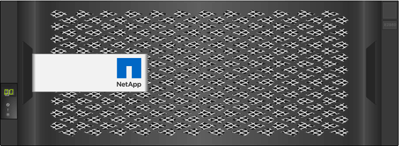

= Eシリーズハードウェアの詳細
:allow-uri-read: 
:icons: font
:imagesdir: ../media/

[role="lead"]
E シリーズストレージアレイには、複数の構成やモデルがあります。

ストレージアレイは、シェルフ、コントローラ、ドライブ、ソフトウェア、およびファームウェアを収容します。アレイはラックまたはキャビネットに設置でき、 1 台または 2 台のコントローラを収容できます。 12 、 24 、または 60 本のドライブを収容できます。ストレージアレイは、複数のタイプのインターフェイスから SAN に接続できるほか、さまざまなホストオペレーティングシステムに接続できます。

利用可能なEシリーズアレイモデルの一部を以下に示します。Eシリーズアレイモデルとそのハードウェアの完全なリストについては、NetApp Hardware Universeを参照してください https://hwu.netapp.com["NetApp Hardware Universe の略"^]。

* EF50シリーズ -- エントリーレベルのオールフラッシュ、オールNVMe
* EF80シリーズ -- ミッドレンジオールフラッシュ、オールNVMe
* E4000 シリーズ - エントリレベルハイブリッド
* EF600 シリーズ - ミッドレンジオールフラッシュ、オール NVMe
* EF300 シリーズ -- エントリレベルのオールフラッシュ、オール NVMe
* EF300C シリーズ -- エントリレベルのオールフラッシュ、オール NVMe
* EF600C シリーズ - ミッドレンジオールフラッシュ、オール NVMe
* E2800 シリーズ - エントリレベルハイブリッド
* EF280 シリーズ - エントリレベルオールフラッシュ
* E5700 シリーズ - ミッドレンジハイブリッド
* EF570 シリーズ - ミッドレンジオールフラッシュ

NOTE: SANtricity OS 11.80GA以降では、SANtricity OSの実行中はすべてのUSBポートが無効になります。

[role="tabbed-block"]
====
.EF50モデル
--
ラックサイズ::
+
--
* 2U24 （ 2 ラックユニット、 24 ドライブ）
+
image::../media/ef50_2u_front.png[EF50 2U]

--
ドライブ::
+
--
* 以下の容量のNVMe SSDドライブをサポートします：
+
** 3.8 TB
** 7.6 TB
** 15.3 TB
** 30 TB
** 60 TB

* コントローラ シェルフで最大24台のNVMe SSDドライブをサポートします。
* コントローラあたり1枚または2枚のホスト インターフェイス カードをサポート。
* デュアル コントローラ通信用のコントローラ間カードとケーブルのサポート。
+

NOTE: EF50システムを構成する際には、ミラーリングケーブルを正しく接続することが非常に重要です。詳細については、 https://docs.netapp.com/us-en/e-series/install-hw-ef50-ef80/install-cable.html#step-1-cable-the-inter-controller-mirroring-connections["コントローラ間ミラーリング接続のケーブル接続 - EF50およびEF80"]を参照してください。

--
インターフェイス::
+
--
次のインターフェイスで使用できます。

* 64Gb NVMe／ファイバーチャネル
* 64Gb ファイバーチャネル

--

--
.EF80モデル
--
ラックサイズ::
+
--
* 2U24 （ 2 ラックユニット、 24 ドライブ）
+
image::../media/ef80_2u_front.png[EF80 2U]

--
ドライブ::
+
--
* 以下の容量のNVMe SSDドライブをサポートします：
+
** 3.8 TB
** 7.6 TB
** 15.3 TB
** 30 TB
** 60 TB

* コントローラ シェルフで最大24台のNVMe SSDドライブをサポートします。
* コントローラあたり1枚、2枚、または3枚のホスト インターフェイス カードをサポート。
* デュアル コントローラ通信用のコントローラ間カードとケーブルのサポート。
+

NOTE: EF80システムを構成する際には、ミラーリングケーブルを正しく接続することが非常に重要です。詳細については、 https://docs.netapp.com/us-en/e-series/install-hw-ef50-ef80/install-cable.html#step-1-cable-the-inter-controller-mirroring-connections["コントローラ間ミラーリング接続のケーブル接続 - EF50およびEF80"]を参照してください。

--
インターフェイス::
+
--
次のインターフェイスで使用できます。

* 200Gb NVMe/RoCE
* 64Gb NVMe／ファイバーチャネル
* 200Gb NVMe/IB
* 64Gb ファイバーチャネル

--

--
.E4000 モデル
--
ラックサイズ::
+
--
* 2U12 （ラックユニット × 2 、ドライブ × 12 ）
+
image::../media/e4000_2u_front.png[E4000 2U]

* 4U60 （ 4 ラックユニット、 60 ドライブ）
+
image::../media/e4000_4u_front.png[E4000 4U]

--
ドライブ::
+
--
は、次のドライブタイプをサポートしています。

* 3.5 インチ NL-SAS （最大 300 本）
* 2.5 インチ SAS SAS SSD （最大 120 本）

--
インターフェイス::
+
--
次のインターフェイスで使用できます。

* 12Gb SAS となります
* 1Gbまたは10Gb Base-T iSCSI
* 1Gb、10Gb、または25Gb iSCSI
* 8Gb、16Gb、または32Gb FC

--

--
.EF600 モデル
--
ラックサイズ::
+
--
2U24 （ 2 ラックユニット、 24 ドライブ）

image:../media/ef570_front.gif["EF600 2U"]

--
ドライブ::
+
--
* NVMe SSDドライブ：コントローラシェルフに最大24本のNVMe SSDドライブを搭載できます。
* 拡張シェルフを備えたNL-SASドライブ：DE212CシェルフとDE460Cシェルフが混在していても、DE212Cシェルフのみを使用しないかぎり、合計420台のNL-SASドライブスロットと7台の拡張シェルフを超えない場合は、DE212Cシェルフを8台使用できます。たとえば、DE460Cシェルフ7台、DE212Cシェルフ8台、DE460Cシェルフ5台、DE212シェルフ2台などです。
* 拡張シェルフを備えたSAS SSDドライブ：DE212C、DE224C、およびDE460Cのシェルフが混在している場合、DE212Cシェルフのみを使用しないかぎりSAS SSDドライブスロット数96と拡張シェルフ7台を超えないようにする必要があります。DE212Cシェルフを使用した場合は、DE212Cシェルフを8台使用できます。たとえば、DE460Cシェルフ1台とDE224Cシェルフ1台とDE212Cシェルフ1台、DE224Cシェルフ4台、DE212Cシェルフ8台などです。
* コントローラごとに2枚のホストインターフェイスカードがサポートされます。
+
** または、コントローラ1台につき200Gb IBホストインターフェイスカードを1枚サポートします。

* オプションのSAS拡張カードをサポートし、SAS拡張シェルフ接続を可能にします。
+
** SAS拡張は、コントローラごとに1つのホストインターフェイスカードを使用する構成でのみサポートされます。

NOTE: SANtricity OS 11.80GA以降では、拡張シェルフ構成でベーストレイにドライブを搭載しない構成がサポートされます。この構成を使用する場合は、システムの電源をオンにする前に、ドライブが拡張シェルフに搭載され、ベーストレイに正しく接続されていることを確認してください。

--
インターフェイス::
+
--
次のインターフェイスで使用できます。

* 25Gb iSCSI です
* 32Gb NVMe/FC チャネル
* 32GB SCSI/ ファイバチャネル
* 100Gb iSER/IB
* 100Gb SRP/IB
* 100Gb NVMe/IB
* 100Gb NVMe/RoCE
* 200GB の iSER/IB
* 200Gb NVMe/IB
* 200Gb NVMe/RoCE

--

--
.EF600C モデル
--
ラックサイズ::
+
--
2U24 （ 2 ラックユニット、 24 ドライブ）

image:../media/ef570_front.gif["EF600 2U"]

--
ドライブ::
+
--
* 30TBまたは60TBの容量NVMe SSDドライブをサポートします。
+
** Dynamic Disk Poolsとの互換性は、従来のRAIDはサポートされていません。

* NVMe SSDドライブ：コントローラシェルフに最大24本のNVMe SSDドライブを搭載できます。
* コントローラごとに2枚のホストインターフェイスカードがサポートされます。
+
** または、コントローラ1台につき200Gb IBホストインターフェイスカードを1枚サポートします。
** 拡張シェルフ構成はサポートされません。

* システムブート時に未割り当てのドライブが十分にない場合は、単一のディスクプールが自動的に作成されます。

--
インターフェイス::
+
--
次のインターフェイスで使用できます。

* 25Gb iSCSI です
* 32Gb NVMe/FC チャネル
* 32GB SCSI/ ファイバチャネル
* 100Gb iSER/IB
* 100Gb SRP/IB
* 100Gb NVMe/IB
* 100Gb NVMe/RoCE
* 200GB の iSER/IB
* 200Gb NVMe/IB
* 200Gb NVMe/RoCE

--

--
.EF300 モデル
--
ラックサイズ::
+
--
2U24 （ 2 ラックユニット、 24 ドライブ）

image:../media/ef570_front.gif["EF300 2U"]

--
ドライブ::
+
--
* NVMe SSDドライブ：コントローラシェルフに最大24本のNVMe SSDドライブを搭載できます。
* 拡張シェルフを備えたNL-SASドライブ：DE212CシェルフとDE460Cシェルフを組み合わせても、DE212Cシェルフのみを使用しないかぎり、合計240台のNL-SASドライブスロットと4台の拡張シェルフを超えないようにします。その後、DE212Cシェルフを8台使用できます。たとえば、DE460Cシェルフ4台、DE212Cシェルフ8台、DE460Cシェルフ2台、DE212シェルフ2台などです。
* 拡張シェルフを備えたSAS SSDドライブ：DE212C、DE224C、およびDE460Cのシェルフが混在している場合、DE212Cシェルフのみを使用しないかぎりSAS SSDドライブスロット数96と拡張シェルフ4台の合計を超えないようにしてください。DE212Cシェルフを8台使用することも可能です。たとえば、DE460Cシェルフ1台とDE224Cシェルフ1台とDE212Cシェルフ1台、DE224Cシェルフ4台、DE212Cシェルフ8台などです。
* オプションのSAS拡張カードをサポートし、SAS拡張シェルフ接続を可能にします。
* コントローラごとに1つのホストインターフェイスカードがサポートされます。

NOTE: SANtricity OS 11.80GA以降では、拡張シェルフ構成でベーストレイにドライブを搭載しない構成がサポートされます。この構成を使用する場合は、システムの電源をオンにする前に、ドライブが拡張シェルフに搭載され、ベーストレイに正しく接続されていることを確認してください。

--
インターフェイス::
+
--
次のインターフェイスで使用できます。

* 25Gb iSCSI です
* 32Gb NVMe/FC チャネル
* 32GB SCSI/ ファイバチャネル
* 100Gb iSER/IB
* 100Gb SRP/IB
* 100Gb NVMe/IB
* 100Gb NVMe/RoCE

--

--
.EF300C モデル
--
ラックサイズ::
+
--
2U24 （ 2 ラックユニット、 24 ドライブ）

image:../media/ef570_front.gif["EF300 2U"]

--
ドライブ::
+
--
* 30TBまたは60TBの容量NVMe SSDドライブをサポートします。
+
** Dynamic Disk Poolsとの互換性は、従来のRAIDはサポートされていません。

* NVMe SSDドライブ：コントローラシェルフに最大24本のNVMe SSDドライブを搭載できます。
+
** 拡張シェルフ構成はサポートされません。

* コントローラごとに1つのホストインターフェイスカードがサポートされます。
* システムブート時に未割り当てのドライブが十分にない場合は、単一のディスクプールが自動的に作成されます。

--
インターフェイス::
+
--
次のインターフェイスで使用できます。

* 25Gb iSCSI です
* 32Gb NVMe/FC チャネル
* 32GB SCSI/ ファイバチャネル
* 100Gb iSER/IB
* 100Gb SRP/IB
* 100Gb NVMe/IB
* 100Gb NVMe/RoCE

--

--
.E2800 モデル
--
ラックサイズ::
+
--
* 2U12 （ラックユニット × 2 、ドライブ × 12 ）
* 2U24 （ 2 ラックユニット、 24 ドライブ）
+
image::../media/e2800_2u_front.gif[E2800 2U]

* 4U60 （ 4 ラックユニット、 60 ドライブ）
+

--
ドライブ::
+
--
は、次のドライブタイプをサポートしています。

* 3.5 インチ NL-SAS （最大 180 本）
* 2.5 インチ SAS SAS SSD （最大 120 本）
* 2.5 インチ SAS SAS HDD （最大 180 本）

--
インターフェイス::
+
--
次のインターフェイスで使用できます。

* 12Gb SAS となります
* 10Gb または 25Gb iSCSI です
* 16Gb または 32Gb Fibre Channel

--

--
.EF280 モデル
--
ラックサイズ::
+
--
2U24 （ 2 ラックユニット、 24 ドライブ）

image:../media/ef570_front.gif["EF280 2U"]

--
ドライブ::
+
--
最大 96 本の SSD 2.5 インチドライブをサポートします

--
インターフェイス::
+
--
次のインターフェイスで使用できます。

* 12Gb SAS となります
* 10Gb または 25Gb iSCSI です
* 16Gb または 32Gb Fibre Channel

--

--
.E5700 モデル
--
ラックサイズ::
+
--
* 2U24 （ 2 ラックユニット、 24 ドライブ）
+
image::../media/e2800_2u_front.gif[E5700 2U]

* 4U60 （ 4 ラックユニット、 60 ドライブ）
+

--
ドライブ::
+
--
次のドライブタイプを最大 480 本サポート：

* 3.5 インチ NL-SAS
* 2.5 インチ SAS SSD
* 2.5 インチ SAS HDD

--
インターフェイス::
+
--
次のインターフェイスで使用できます。

* 12Gb SAS となります
* 10Gb または 25Gb iSCSI です
* 16Gb または 32Gb Fibre Channel
* 32Gb NVMe/FC チャネル
* 100Gb iSER/IB
* 100Gb SRP/IB
* 100Gb NVMe/IB
* 100Gb NVMe/RoCE

--

--
.EF570 モデル
--
ラックサイズ::
+
--
2U24 （ 2 ラックユニット、 24 ドライブ）

image:../media/ef570_front.gif["EF570 2U"]

--
ドライブ::
+
--
最大 120 本の SSD 2.5 インチドライブをサポートします

--
インターフェイス::
+
--
次のインターフェイスで使用できます。

* 12Gb SAS となります
* 10Gb または 25Gb iSCSI です
* 16Gb または 32Gb Fibre Channel
* 32Gb NVMe/FC チャネル
* 100Gb iSER/IB
* 100Gb SRP/IB
* 100Gb NVMe/IB
* 100Gb NVMe/RoCE

--

--
====