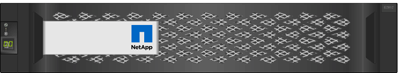

= E シリーズハードウェアの概要
:icons: font
:imagesdir: ../media/

[role="lead"]
E シリーズストレージアレイには、複数の構成やモデルがあります。

ストレージアレイは、シェルフ、コントローラ、ドライブ、ソフトウェア、およびファームウェアを収容します。アレイはラックまたはキャビネットに設置でき、 1 台または 2 台のコントローラを収容できます。 12 、 24 、または 60 本のドライブを収容できます。ストレージアレイは、複数のタイプのインターフェイスから SAN に接続できるほか、さまざまなホストオペレーティングシステムに接続できます。

E シリーズアレイには次のモデルがあります。

* E2800 シリーズ - エントリレベルハイブリッド
* EF280 シリーズ - エントリレベルオールフラッシュ
* EF300 シリーズ -- エントリレベルのオールフラッシュ、オール NVMe
* E5700 シリーズ - ミッドレンジハイブリッド
* EF570 シリーズ - ミッドレンジオールフラッシュ
* EF600 シリーズ - ミッドレンジオールフラッシュ、オール NVMe

== E2800 モデル

|===
| コンポーネント | 仕様 

 a| 
ラックサイズ：
 a| 
* 2U12 （ラックユニット × 2 、ドライブ × 12 ）
* 2U24 （ 2 ラックユニット、 24 ドライブ）
+

* 4U60 （ 4 ラックユニット、 60 ドライブ）
+
image::../media/e2860_front.gif[e2860 前面]

 a| 
ドライブ：
 a| 
は、次のドライブタイプをサポートしています。

* 3.5 インチ NL-SAS （最大 180 本）
* 2.5 インチ SAS SAS SSD （最大 120 本）
* 2.5 インチ SAS SAS HDD （最大 180 本）

 a| 
インターフェイス：
 a| 
次のインターフェイスで使用できます。

* 12Gb SAS となります
* 10Gb または 25Gb iSCSI です
* 16Gb または 32Gb Fibre Channel

|===

== EF280 モデル

|===
| コンポーネント | 仕様 

 a| 
ラックサイズ：
 a| 
2U24 （ 2 ラックユニット、 24 ドライブ）image:../media/ef570_front.gif[""]

 a| 
ドライブ：
 a| 
最大 96 本の SSD 2.5 インチドライブをサポートします

 a| 
インターフェイス：
 a| 
次のインターフェイスで使用できます。

* 12Gb SAS となります
* 10Gb または 25Gb iSCSI です
* 16Gb または 32Gb Fibre Channel

|===

== EF300 モデル

|===
| コンポーネント | 仕様 

 a| 
ラックサイズ：
 a| 
2U24 （ 2 ラックユニット、 24 ドライブ）image:../media/ef570_front.gif[""]

 a| 
ドライブと HIC ：
 a| 
コントローラ 1 台につきホストインターフェイスカード（ HIC ） 1 枚で、最大 24 本の NVMe SSD をサポートします。

 a| 
インターフェイス：
 a| 
次のインターフェイスで使用できます。

* 25Gb iSCSI です
* 32Gb NVMe/FC チャネル
* 32GB SCSI/ ファイバチャネル
* 100Gb iSER/IB
* 100Gb SRP/IB
* 100Gb NVMe/IB
* 100Gb NVMe/RoCE

|===

== E5700 モデル

|===
| コンポーネント | 仕様 

 a| 
ラックサイズ：
 a| 
* 2U24 （ 2 ラックユニット、 24 ドライブ）
+

* 4U60 （ 4 ラックユニット、 60 ドライブ）
+
image::../media/e2860_front.gif[e2860 前面]

 a| 
ドライブ：
 a| 
次のドライブタイプを最大 480 本サポート：

* 3.5 インチ NL-SAS
* 2.5 インチ SAS SSD
* 2.5 インチ SAS HDD

 a| 
インターフェイス：
 a| 
次のインターフェイスで使用できます。

* 12Gb SAS となります
* 10Gb または 25Gb iSCSI です
* 16Gb または 32Gb Fibre Channel
* 32Gb NVMe/FC チャネル
* 100Gb iSER/IB
* 100Gb SRP/IB
* 100Gb NVMe/IB
* 100Gb NVMe/RoCE

|===

== EF570 モデル

|===
| コンポーネント | 仕様 

 a| 
ラックサイズ：
 a| 
2U24 （ 2 ラックユニット、 24 ドライブ）image:../media/ef570_front.gif[""]

 a| 
ドライブ：
 a| 
最大 120 本の SSD 2.5 インチドライブをサポートします

 a| 
インターフェイス：
 a| 
次のインターフェイスで使用できます。

* 12Gb SAS となります
* 10Gb または 25Gb iSCSI です
* 16Gb または 32Gb Fibre Channel
* 32Gb NVMe/FC チャネル
* 100Gb iSER/IB
* 100Gb SRP/IB
* 100Gb NVMe/IB
* 100Gb NVMe/RoCE

|===

== EF600 モデル

|===
| コンポーネント | 仕様 

 a| 
ラックサイズ：
 a| 
2U24 （ 2 ラックユニット、 24 ドライブ）image:../media/ef570_front.gif[""]

 a| 
ドライブと HIC ：
 a| 
コントローラ 1 台につき最大 24 本の NVMe SSD 、 2 枚のホストインターフェイスカード（ HIC ）を搭載できます。

 a| 
インターフェイス：
 a| 
次のインターフェイスで使用できます。

* 25Gb iSCSI です
* 32Gb NVMe/FC チャネル
* 32GB SCSI/ ファイバチャネル
* 100Gb iSER/IB
* 100Gb SRP/IB
* 100Gb NVMe/IB
* 100Gb NVMe/RoCE
* 200GB の iSER/IB
* 200Gb NVMe/IB
* 200Gb NVMe/RoCE

|===