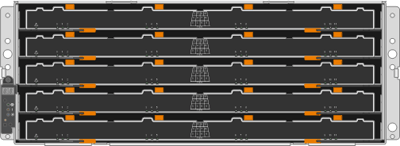

= Eシリーズシェルフタイプの詳細
:allow-uri-read: 
:icons: font
:imagesdir: ../media/

[role="lead"]
E シリーズシステムは、さまざまなシェルフサイズで提供されます。

|===
| シェルフタイプ | 図 

 a| 
* DE212C ： *

* 2u12 （ 2 ラックユニット、 12 ドライブ）
* 3.5 インチ HDD または 2.5 インチ SSD （アダプタ搭載）
* E4000およびE2800コントローラのみ

 a| 
image:../media/e2812_front.gif["DE212C"]

 a| 
* DE224C ： *

* 2u24 （ 2 ラックユニット、 24 ドライブ）
* 2.5 インチ HDD または 2.5 インチ SSD
* E2800 、 EF280 、 E5700 、 EF570 コントローラ

 a| 
image:../media/e2824_front.gif["DE224C"]

 a| 
* DE460C ： *

* 4u60 （ 4 ラックユニット、 60 ドライブ）
* 3.5 インチドライブ、 2.5 インチドライブ（ NL-SAS 、 SAS 、 SSD ）
* E4000、E2800、およびE5700コントローラ

 a| 

 a| 
* NE224 ： *

* 2u24 （ 2 ラックユニット、 24 ドライブ）
* 2.5 インチ NVMe SSD
* EF300、EF600：EF300CおよびEF600Cコントローラ

 a| 
image:../media/ne224.gif["NE224"]

|===