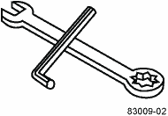

= 必要な工具と機器を用意する
:allow-uri-read: 
:icons: font
:imagesdir: ../media/

[role="lead"]
3040 40U キャビネットを設置する前に、必要な工具と機器が揃っていることを確認します。

.ステップ
. 次の表に示すすべての項目を収集します。
+
|===
|  | 項目 | キャビネットに付属しています 

 a| 

 a| 
*3/4 インチレンチ * （輸送木箱に同梱） -- キャビネット下の水平調節脚を上下するために使用します

* 1 / 4 インチアレンレンチ * -- キャビネット前部の安定脚を上下するために使用します
 a| 
image:../media/77037_11.gif["キャビネットに付属しています"]

 a| 
* NEMA L6-30 *

image:../media/73121_01_dwg_nema_l6_30_power_cord.gif["NEMA L6-30コード"]
 a| 
*AC 電源コード *-- キャビネットを外部電源 ( 壁面プラグ ) に接続するために使用します

** NEMA L6-30 コネクタは、米国とカナダで使用されます。
** IEC-60309 コネクタは、米国とカナダ以外の国で使用されます。

NOTE: 各 PDU を独立した電源に接続する必要があります。
 a| 
image:../media/77037_11.gif["キャビネットに付属しています"]

 a| 
** IEC-60309**

image:../media/73122_01_dwg_iec_60309_power_cord.gif["IEC-60309コード"]

 a| 
image:../media/78038_21.png["キャビネットに付属しています"]
 a| 
** SAS ケーブル ** （オプション）–各ドライブトレイに 2 本のケーブルが付属していますが、ホスト側のケーブルは別途購入する必要があります。

** 通信ケーブル ** （オプション） - トレイをホストに取り付けるために使用します。

その他の必要な項目については、該当するコントローラドライブトレイの設置ガイドを参照してください。
 a| 

 a| 
image:../media/77038_06.gif["SASおよび通信ケーブル"]
 a| 
** マウント可能なケーブルスプール ** –ケーブルをまとめたり配線したりするために、両側に縦に並んだ電源コンセントに沿って取り付けます。各コントローラドライブトレイには 2 個のケーブルスプールが付属していますケーブルスプールは、スタンドアロンのドライブトレイにも付属しています。
 a| 
image:../media/77037_11.gif["マウント可能なケーブルスプール"]

 a| 
 a| 
** せん断 ** - 輸送木枠の金属バンドを切断します。
 a| 

 a| 
 a| 
** フォークリフト ** （オプション） - 輸送パレットからキャビネットを取り出すために使用します。
 a| 

 a| 
 a| 
** 前面パネルキット ** （オプション） - キャビネット前面の空のベイをカバーします。
 a| 

 a| 
 a| 
** 静電気防止用バッグ ** （オプション） - キャビネットの設置手順で取り外したコンポーネントを保護するために使用します。
 a| 

|===

