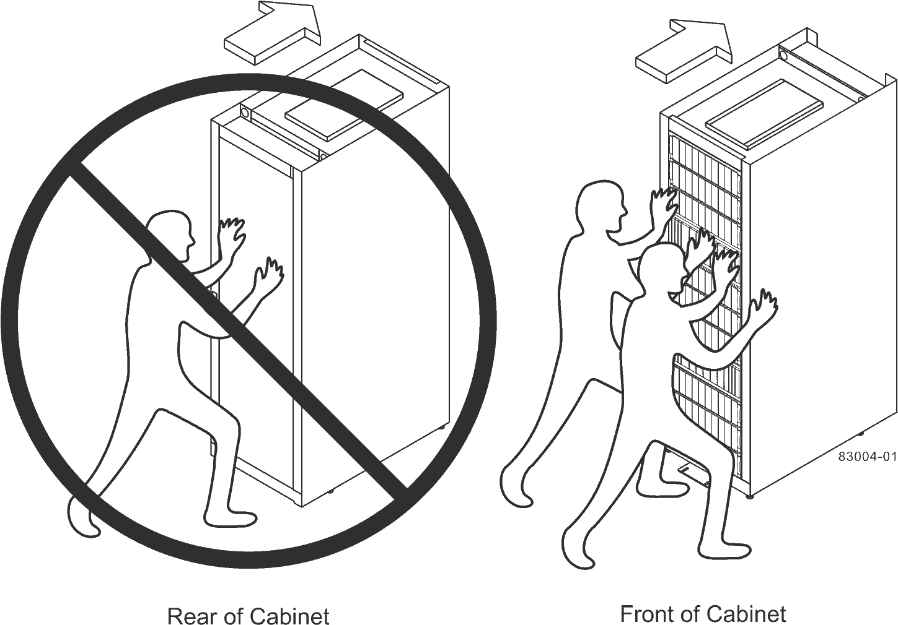

= 最終設置先へのキャビネットの移動
:allow-uri-read: 
:icons: font
:imagesdir: ../media/

[role="lead"]
3040 40U キャビネットには、最終的な設置先に移動するための頑丈なキャスターが付いています。

.作業を開始する前に
* フォークリフトを使わずにキャビネットをパレットから取り出す手順を確認します。
+
輸送木箱には、備え付けの傾斜板と手順書が同梱されています。梱包箱の前面に記載されている開梱手順を参照してください。

* 搬入口とキャビネットの最終設置先の間にあるスロープをすべてチェックします。
+
キャビネットがスロープ上にあるとき、またはキャビネットを傾けたときに、キャビネットの重心がキャビネットの底面積からはみ出さないようにする必要があります。

.このタスクについて
多くのキャビネットにはドライブトレイが搭載されています。このため、ほとんどの重量がキャビネットの前面に集中し、重心が前面に近くなります。

.手順
. キャビネットを最終的な場所に安全に運ぶために、最上部のデバイスを取り外してください。角度が 10 度を超えるスロープがある場合は、この点が特に重要となります。
. 次の図に示す正しい方法でキャビネットを最終設置先に移動します。必ずキャビネットの背面ではなく前面を押してください。
+

