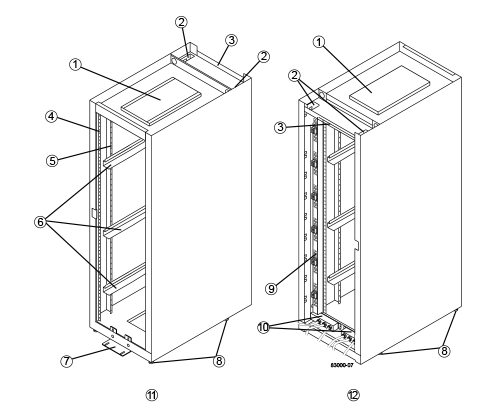

= キャビネットの仕様
:icons: font
:imagesdir: ../media/

[role="lead"]
モデル 3040 40U キャビネットは、以下の標準機能を備えています。

* 背面ドア。ラッチ機構付きでロック可能です
* 標準の Electronic Industry Association （ EIA ）規格の支持レール - 標準的な 48.3cm （ 19 インチ）幅のキャビネットにデバイスを設置するための取り付け穴付き
* キャビネットを移動するためにキャビネットの下に配置された 4 つのローラキャスターと 4 つの水平調節脚で、キャビネットを最終的な設置場所に水平に調整できます
* 安定脚 - 最終設置場所に設置したキャビネットを固定します
* インターフェイスケーブルの開口部にアクセスします
* 電源接続と電力処理能力を統合した 2 つの AC 配電ユニット（ PDU ）

次の図は、キャビネットの前面図（左）と背面図（右）を示しています。

|===

 a| 
1.
 a| 
換気口カバー

 a| 
2.
 a| 
インターフェイスケーブルアクセス用開口部

 a| 
3.
 a| 
リアプレート

 a| 
4.
 a| 
EIA 支持レール

 a| 
5.
 a| 
支持レール

 a| 
6.
 a| 
キャビネットマウントレール

 a| 
7.
 a| 
安定脚

 a| 
8.
 a| 
水平調節脚

 a| 
9.
 a| 
配電ユニット（ 2 つのうちの 1 つ）

 a| 
10.
 a| 
AC 電源入力ボックス

 a| 
11.
 a| 
キャビネットの前面

 a| 
12.
 a| 
キャビネットの背面

|===

CAUTION: * 負傷のリスク * - キャビネットの下半分を空けた状態で、キャビネットの上半分にコンポーネントを取り付けないでください。キャビネットの下半分に対して上半分が重すぎると、キャビネットが倒れて原因負傷するおそれがあります。コンポーネントは、必ずキャビネット内の最も低い位置から順に設置してください。

CAUTION: * 負傷のリスク * -- コンポーネントを取り付けたキャビネットは、フォークリフトまたは十分な人員で移動しないでください。キャビネットの転倒を防ぐために、必ずキャビネットを前面から押してください。フル装備のキャビネットの重量は 909kg （ 2 、 000 ポンド）を超えることがあります。キャビネットを動かすのは平らな場所でも大変な作業です。キャビネットを傾斜面で移動する必要がある場合は、キャビネットの上半分からコンポーネントを取り外し、十分な人員を確保してください。

NOTE: E2860 コントローラシェルフ、 E5760 コントローラシェルフ、 DE460C ドライブシェルフは、 3040 40U キャビネットに設置できません。

NOTE: 3040 キャビネットに DE6600 トレイをフル装備した場合の重量は、 1250.1kg （ 2 、 756 ポンド）を超えます。

== 電力要件と冷却

ここでは、キャビネットの電力と冷却の仕様について説明します。

=== 電力定格

3040 40U キャビネットの定格は 200VAC~240VAC 、 50Hz~60Hz で、この ± 10% で動作します。

=== 配電ユニット（ PDU ）

キャビネットには同一の配電ユニット（ PDU ）が 2 つ搭載されており、各 PDU が最大 72A の電力を供給します。PDU はキャビネットの背面に垂直に取り付けられており、それぞれの 12A の電源バンクが 6 個装備されています。各電源バンクには、 IEC 60320-C19 電源コンセントが 4 個と、 15A の回路ブレーカーが内蔵されています。各 PDU は合計 24 個のコンセントと 6 個の回路ブレーカーを備えています。

各 PDU に 3 つの電源入力ボックスがあり、キャビネットの下部に配置されています。各電源入力ボックスは、次のように 8 つの電源コンセントに電力を供給します。

* 電源入力ボックス 1 は、電源コード C1 から下部の 8 個のコンセントに電力を供給します
* 電源入力ボックス 2 は、電源コード C2 から中央の 8 個のコンセントに電力を供給します
* 電源入力ボックス 3 は、電源コード C3 から上部の 8 個のコンセントに電力を供給します

電源入力ボックスには C1 、 C2 、 C3 のラベルが付いており、ここから電源コードがモジュールに接続されます。

=== キャビネットの電力計算と熱量計算

|===
| コンポーネント | kVA | ワット | BTU/ 時 

 a| 
キャビネットの PDU （ 72A PDU ）
 a| 
14.4
 a| 
14400
 a| 
49176

 a| 
キャビネットの PDU / 12A バンク（ 72A PDU ）
 a| 
2.40 *
 a| 
2400 *
 a| 
8196 *

 a| 
E2612 コントローラのドライブトレイ
 a| 
0.437
 a| 
433
 a| 
1476

 a| 
E2624 コントローラのドライブトレイ
 a| 
0.487
 a| 
482
 a| 
1644 年

 a| 
E2660 コントローラのドライブトレイ
 a| 
1.128
 a| 
1117
 a| 
3810

 a| 
E2712 コントローラドライブトレイ
 a| 
0.516
 a| 
511
 a| 
1744

 a| 
E2724 コントローラドライブトレイ
 a| 
0.561
 a| 
555
 a| 
1894 年

 a| 
E2760 コントローラドライブトレイ
 a| 
1.205
 a| 
1193.
 a| 
4072

 a| 
E5412 コントローラのドライブトレイ
 a| 
0.558
 a| 
552
 a| 
1883 年

 a| 
E5424 コントローラドライブトレイと EF540 フラッシュアレイ
 a| 
0.607
 a| 
601
 a| 
2051 年になります

 a| 
E5460 コントローラのドライブトレイ
 a| 
1.254
 a| 
1242
 a| 
4237

 a| 
E5512 コントローラドライブトレイ
 a| 
0.587
 a| 
581
 a| 
1982 年

 a| 
E5524 コントローラドライブトレイと EF550 フラッシュアレイ
 a| 
0.637
 a| 
630
 a| 
2150

 a| 
E5560 コントローラドライブトレイ
 a| 
1.285
 a| 
1272
 a| 
4342

 a| 
E5612 コントローラドライブトレイ
 a| 
0.625
 a| 
619
 a| 
2111

 a| 
E5624 コントローラドライブトレイと EF560 フラッシュアレイ
 a| 
0.675
 a| 
668
 a| 
2279

 a| 
E5660 コントローラドライブトレイ
 a| 
1.325
 a| 
1312
 a| 
4477

 a| 
DE1600 ドライブトレイ
 a| 
0.325
 a| 
322
 a| 
1099

 a| 
DE5600 のドライブトレイ
 a| 
0.375
 a| 
371
 a| 
1267

 a| 
DE6600 のドライブトレイ
 a| 
0.1.011
 a| 
1001
 a| 
3415

|===

== トレイの最大数

3040 40U キャビネットに取り付けることのできるトレイの最大数は、ラックユニット（ U ）で表した各トレイの高さによって異なります。

=== ラックユニット（ U ）で表したトレイの高さ

1 ラックユニットは 4.45cm （ 1.75 インチ）です。たとえば、 4U トレイは最大 10 個、 2U トレイは最大 20 個、 2U トレイと 4U トレイは組み合わせて最大 40U 取り付けることができます。

|===
| トレイ | ラックユニット（ U ） 

 a| 
E2x12 または E2x24 コントローラドライブトレイ
 a| 
2U

 a| 
E2x60 コントローラドライブトレイ
 a| 
4U

 a| 
E5x12 または E5x24 コントローラドライブトレイ
 a| 
2U

 a| 
E5x60 コントローラドライブトレイ
 a| 
4U

 a| 
EF5x0 フラッシュアレイ
 a| 
2U

 a| 
DE1600 ドライブトレイ
 a| 
2U

 a| 
DE5600 のドライブトレイ
 a| 
2U

 a| 
DE6600 のドライブトレイ
 a| 
4U

|===