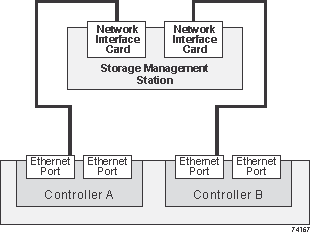

= 管理ステーションでのイーサネットケーブル接続
:allow-uri-read: 
:icons: font
:imagesdir: ../media/

[role="lead"]
ストレージアレイのアウトオブバンド管理のためにストレージシステムをイーサネットネットワークに接続することができます。ストレージアレイ管理接続にはイーサネットケーブルを使用する必要があります。

== 直接トポロジ

直接トポロジでは、コントローラをイーサネットネットワークに直接接続します。

各コントローラの管理ポート 1 をアウトオブバンド管理用に接続し、ポート 2 はテクニカルサポートがストレージアレイへのアクセスに使用できるように残しておく必要があります。

.直接ストレージ管理接続

== ファブリックトポロジ

ファブリックトポロジでは、スイッチを使用してコントローラをイーサネットネットワークに接続します。

各コントローラの管理ポート 1 をアウトオブバンド管理用に接続し、ポート 2 はテクニカルサポートがストレージアレイへのアクセスに使用できるように残しておく必要があります。

.ファブリックストレージ管理接続
image::../media/74110.gif[74110]
