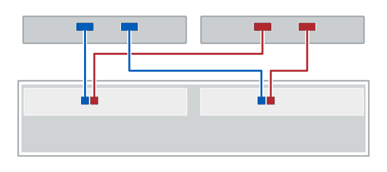

= ホストのケーブル接続
:allow-uri-read: 
:icons: font
:imagesdir: ../media/

[role="lead"]
ホストは直接コントローラに接続することも（直接接続トポロジ）、スイッチを使用してコントローラに接続することもできます。

== 直接接続トポロジでのケーブル接続

直接接続トポロジでは、ホストアダプタをストレージシステムのコントローラに直接接続します。

次の図に接続例を示します。パフォーマンスが最大になるように、使用可能なすべてのホストアダプタポートを使用してください。

.2 台のホストと 2 台のコントローラ

* （ 1 ） * _ 各ホストアダプタポートをコントローラのホストポートに直接接続します。 _

== スイッチトポロジでのケーブル接続

スイッチトポロジは、スイッチを使用して、ストレージシステムのコントローラにホストを接続します。スイッチは、ホストとコントローラの間で使用される接続タイプをサポートしている必要があります。

次の図に接続例を示します。プロビジョニング機能を備えたスイッチの場合は、イニシエータとターゲットの各ペアを分離する必要があります。

.2 台のホストと 2 台のスイッチ
image::../media/topology_host_fabric_generic.png[トポロジホストファブリック一般]

* （ 1 ） * _ 各ホストアダプタをスイッチに直接接続します。 _

* （ 2 ） * _ 各スイッチをコントローラのホストポートに直接接続します。パフォーマンスが最大になるように、使用可能なすべてのホストアダプタポートを使用してください。 _
