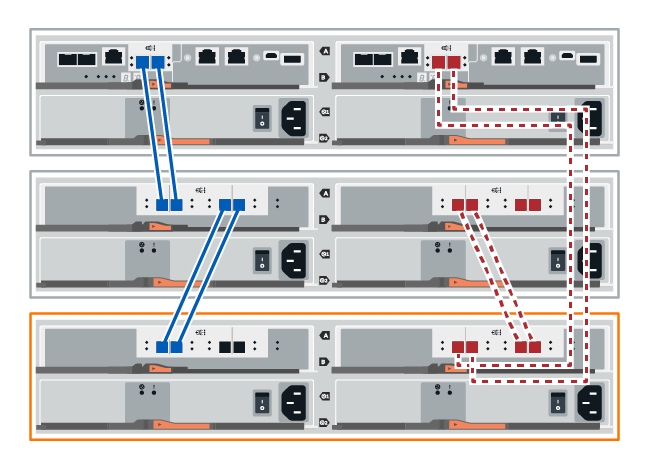

= ドライブシェルフのホットアド- IOM12またはIOM12Bモジュール（Eシリーズ）
:allow-uri-read: 
:icons: font
:imagesdir: ../media/

[role="lead"]
ストレージシステムの他のコンポーネントに電源が投入されている状態で、新しいドライブシェルフを追加できます。ストレージシステム容量の設定、再設定、追加、または再割り当てを、ユーザのデータアクセスを中断することなく実行できます。

.作業を開始する前に
この手順は複雑であるため、次のことを推奨します。

* 手順を開始する前に、すべての手順を確認してください。
* ドライブシェルフのホットアドが必要な手順であることを確認します。

.このタスクについて
ここで説明する手順は、DE212C、DE224C、DE460Cの各ドライブシェルフをE2800、E2800B、EF280、E5700、E5700B、EF570、EF300、EF600、EF300C、EF600C、またはE4000の各コントローラシェルフにホットアドする場合に該当します。

この手順は、IOM12、IOM12B、および IOM12C ドライブ シェルフに適用されます。

NOTE: IOM12C モジュールは、SANtricity OS 11.90R3 以降でのみサポートされます。IOM12Cをインストールまたはアップグレードする前に、コントローラのファームウェアが更新されていることを確認してください。

NOTE: この手順 は、シェルフの IOM のホットスワップや交換に使用されます。つまり、 IOM12 モジュールを別の IOM12 モジュールに交換するか、 IOM12C モジュールを別の IOM12C モジュールに交換しなければなりません。（シェルフに IOM12 モジュールを 2 台搭載することも、 IOM12C モジュールを 2 つ使用することもできます）

古いコントローラシェルフを DE212C 、 DE224C 、または DE460 に接続する方法については、を参照してください https://mysupport.netapp.com/ecm/ecm_download_file/ECMLP2859057["IOM ドライブシェルフを既存の E27XX 、 E56XX 、または EF560 コントローラシェルフに追加"^]。

NOTE: システムの整合性を維持するには、手順を記載された順序で正確に実行する必要があります。

== 手順 1 ：ドライブシェルフを追加する準備を行います

ドライブシェルフのホットアドを準備するには、重大イベントの有無を確認し、 IOM のステータスを確認する必要があります。

.作業を開始する前に
* ストレージシステムの電源が、新しいドライブシェルフの電力要件に対応できる必要があります。ドライブシェルフの電源仕様については、を参照してください https://hwu.netapp.com/Controller/Index?platformTypeId=2357027["Hardware Universe"^]。
* 既存のストレージシステムのケーブル接続パターンが、この手順に表示されるいずれかの方式と一致している必要があります。

.手順
. SANtricity システムマネージャで、 * サポート * > * サポートセンター * > * 診断 * を選択します。
. 「サポートデータの収集」を選択します。
+
[ サポートデータの収集 ] ダイアログボックスが表示されます。

. [*Collect*]( 収集 ) をクリックします
+
ブラウザの Downloads フォルダに、 support-data.7z という名前でファイルが保存されます。データはテクニカルサポートに自動的に送信されません。

. [*Support*>*Event Log] を選択します。
+
イベントログページにイベントデータが表示されます。

. 重要なイベントをリストの先頭にソートするには、「 * 優先度 * 」列の見出しを選択します。
. 過去 2~3 週間に発生したシステムの重大イベントを確認し、最近の重大イベントが解決または対処されていることを確認します。
+

NOTE: 過去 2~3 週間以内に発生した未解決の重大イベントがある場合は、手順を停止してテクニカルサポートにお問い合わせください。問題が解決したら、手順を続行します。

. ハードウェアにIOMを接続している場合は、次の手順を実行します。それ以外の場合は、<<step2_install_drive_shelf,手順2：ドライブシェルフを設置して電源を投入します。>>
+
.. 「 * ハードウェア * 」を選択します。
.. IOM （ ESM ） * アイコンを選択します。
+
image::../media/sam1130_ss_hardware_iom_icon.gif[IOM（ESM）アイコン]

+
Shelf Component Settings （シェルフコンポーネントの設定）ダイアログボックスが表示され、 * IOM （ ESM ） * タブが選択されます。

.. 各 IOM / ESM に表示されるステータスが「 _optimal_」 であることを確認します。
.. [ 詳細設定を表示する *] をクリックします。
.. 次の条件を満たしていることを確認します。
+
*** 検出された ESM / IOM の数がシステムおよび各ドライブシェルフに取り付けられている ESM / IOM の数と同じである。
*** ESM / IOM のどちらの通信状況も正常である。
*** DE212C 、 DE224C 、および DE460C ドライブシェルフの場合は 12Gb/ 秒、その他のドライブトレイの場合は 6Gb/ 秒のデータ速度が必要です。

== 手順 2 ：ドライブシェルフを設置して電源を投入する

新しいドライブシェルフまたは以前に設置されていたドライブシェルフを設置して電源をオンにし、注意が必要な LED を確認します。

.手順
. ストレージシステムに以前に設置されていたドライブシェルフを設置する場合は、ドライブを取り外します。この手順の後半でドライブを 1 つずつ取り付ける必要があります。
+
設置するドライブシェルフの過去の設置状況が不明な場合は、ストレージシステムに以前に設置されていたものとして作業します。

. ストレージシステムコンポーネントが取り付けられているラックにドライブシェルフを設置します。
+

NOTE: 物理的な設置と電源のケーブル接続については、使用するモデルの設置手順書を参照手順してください。モデルの設置手順には、ドライブシェルフを安全に設置するために考慮する必要がある注意事項と警告が含まれています。

. 新しいドライブシェルフの電源をオンにし、ドライブシェルフの黄色の警告 LED が点灯しないことを確認します。可能であれば、障害をすべて解決してからこの手順を続行してください。

== 手順 3 ：システムにケーブルを接続します

古いコントローラシェルフを DE212C 、 DE224C 、または DE460 に接続する方法については、を参照してください https://mysupport.netapp.com/ecm/ecm_download_file/ECMLP2859057["IOM ドライブシェルフを既存の E27XX 、 E56XX 、または EF560 コントローラシェルフに追加"^]。

[role="tabbed-block"]
====
.E2800またはE5700のドライブシェルフの接続
--
ドライブシェルフをコントローラ A に接続し、 IOM のステータスを確認し、ドライブシェルフをコントローラ B に接続します

.手順
. ドライブシェルフをコントローラ A に接続します
+
次の図では、追加のドライブシェルフをコントローラ A に接続する例を示しますモデル上のポートの位置を確認するには、を参照してください https://hwu.netapp.com/Controller/Index?platformTypeId=2357027["Hardware Universe"^]。

+
image::../media/hot_e5700_0.png[ドライブシェルフをコントローラに接続]

+
image::../media/hot_e5700_1.png[ドライブシェルフをコントローラに接続]

. SANtricity システムマネージャで、 * ハードウェア * をクリックします。
+

NOTE: 手順のこの時点では、コントローラシェルフへのアクティブパスは 1 つだけです。

. 必要に応じて下にスクロールして、新しいストレージシステムのドライブシェルフをすべて表示します。新しいドライブシェルフが表示されない場合は、接続問題を解決します。
. 新しいドライブシェルフの * ESM / IOM * アイコンを選択します。
+
image::../media/sam1130_ss_hardware_iom_icon.gif[[ESMS/IOMs]アイコン]

+
[* Shelf Component Settings] ダイアログ・ボックスが表示されます。

. 「 * Shelf Component Settings * 」（シェルフコンポーネントの設定）ダイアログボックスで「 * ESM / IOM * 」（ * ESM / IOM * ）タブを選択します。
. 「 * 詳細オプションを表示 * 」を選択して、次のことを確認します。
+
** IOM / ESM A が表示されている。
** 現在のデータ速度が SAS-3 ドライブシェルフで 12Gbps になっている。
** カードの通信に問題はありません。

. コントローラ B からすべての拡張ケーブルを外します
. ドライブシェルフをコントローラ B に接続します
+
次の図では、追加のドライブシェルフをコントローラ B に接続する例を示しますモデル上のポートの位置を確認するには、を参照してください https://hwu.netapp.com/Controller/Index?platformTypeId=2357027["Hardware Universe"^]。

+

. ESM / IOM * タブが選択されていない場合は、 * Shelf Component Settings * （シェルフコンポーネント設定 * ）ダイアログボックスで * ESM / IOM * タブを選択し、 * Show more options * （詳細オプションを表示）を選択します。カード通信が *YES* であることを確認します。
+

NOTE: 「最適」ステータスは、新しいドライブシェルフに関連する冗長性の喪失エラーが解決され、ストレージシステムが安定していることを示しています。

--
.EF300またはEF600のドライブシェルフの接続
--
ドライブシェルフをコントローラ A に接続し、 IOM のステータスを確認し、ドライブシェルフをコントローラ B に接続します

.作業を開始する前に
* ファームウェアを最新バージョンに更新しました。ファームウェアを更新するには、の手順に従います link:../upgrade-santricity/index.html["SANtricity OS のアップグレード中です"]。

.手順
. スタック内の以前の最後のシェルフから A 側のコントローラケーブルを両方とも IOM12 ポート 1 と 2 から外し、新しいシェルフの IOM12 ポート 1 と 2 に接続します。
+
image::../media/de224c_sides.png[コントローラAからケーブルを外して新しいシェルフに接続]

. 新しいシェルフから以前の最後のシェルフの IOM12 ポート 1 と 2 に、ケーブルを A 側の IOM12 ポート 3 と 4 に接続します。
+
次の図では、追加のドライブシェルフを前の最後のシェルフに接続する例を示します。モデル上のポートの位置を確認するには、を参照してください https://hwu.netapp.com/Controller/Index?platformTypeId=2357027["Hardware Universe"^]。

+
image::../media/hot_ef_0.png[ドライブシェルフのケーブル接続の例]

+
image::../media/hot_ef_1.png[ドライブシェルフのケーブル接続の例]

. SANtricity システムマネージャで、 * ハードウェア * をクリックします。
+

NOTE: 手順のこの時点では、コントローラシェルフへのアクティブパスは 1 つだけです。

. 必要に応じて下にスクロールして、新しいストレージシステムのドライブシェルフをすべて表示します。新しいドライブシェルフが表示されない場合は、接続問題を解決します。
. 新しいドライブシェルフの * ESM / IOM * アイコンを選択します。
+
image::../media/sam1130_ss_hardware_iom_icon.gif[[ESMS/IOMs]アイコン]

+
[* Shelf Component Settings] ダイアログ・ボックスが表示されます。

. 「 * Shelf Component Settings * 」（シェルフコンポーネントの設定）ダイアログボックスで「 * ESM / IOM * 」（ * ESM / IOM * ）タブを選択します。
. 「 * 詳細オプションを表示 * 」を選択して、次のことを確認します。
+
** IOM / ESM A が表示されている。
** 現在のデータ速度が SAS-3 ドライブシェルフで 12Gbps になっている。
** カードの通信に問題はありません。

. スタック内の前の最後のシェルフから B 側のコントローラケーブルを両方とも IOM12 ポート 1 と 2 から外し、新しいシェルフの IOM12 ポート 1 と 2 に接続します。
. 新しいシェルフの B 側 IOM12 ポート 3 と 4 を以前の最後のシェルフの IOM12 ポート 1 と 2 にケーブルを接続します。
+
次の図では、追加のドライブシェルフを前の最後のシェルフに接続する B 側の接続例を示しています。モデル上のポートの位置を確認するには、を参照してください https://hwu.netapp.com/Controller/Index?platformTypeId=2357027["Hardware Universe"^]。

+
image::../media/hot_ef_2.png[ドライブシェルフのケーブル接続の例]

. ESM / IOM * タブが選択されていない場合は、 * Shelf Component Settings * （シェルフコンポーネント設定 * ）ダイアログボックスで * ESM / IOM * タブを選択し、 * Show more options * （詳細オプションを表示）を選択します。カード通信が *YES* であることを確認します。
+

NOTE: 「最適」ステータスは、新しいドライブシェルフに関連する冗長性の喪失エラーが解決され、ストレージシステムが安定していることを示しています。

--
.E4000のドライブシェルフの接続
--
ドライブシェルフをコントローラ A に接続し、 IOM のステータスを確認し、ドライブシェルフをコントローラ B に接続します

.手順
. ドライブシェルフをコントローラ A に接続します
+
image::../media/hot_e4000_cabling_1.png[ドライブシェルフのケーブル接続]

. SANtricity システムマネージャで、 * ハードウェア * をクリックします。
+

NOTE: 手順のこの時点では、コントローラシェルフへのアクティブパスは 1 つだけです。

. 必要に応じて下にスクロールして、新しいストレージシステムのドライブシェルフをすべて表示します。新しいドライブシェルフが表示されない場合は、接続問題を解決します。
. 新しいドライブシェルフの * ESM / IOM * アイコンを選択します。
+
image::../media/sam1130_ss_hardware_iom_icon.gif[IOMハードウェアアイコン]

+
[* Shelf Component Settings] ダイアログ・ボックスが表示されます。

. 「 * Shelf Component Settings * 」（シェルフコンポーネントの設定）ダイアログボックスで「 * ESM / IOM * 」（ * ESM / IOM * ）タブを選択します。
. 「 * 詳細オプションを表示 * 」を選択して、次のことを確認します。
+
** IOM / ESM A が表示されている。
** 現在のデータ速度が SAS-3 ドライブシェルフで 12Gbps になっている。
** カードの通信に問題はありません。

. コントローラ B からすべての拡張ケーブルを外します
. ドライブシェルフをコントローラ B に接続します
+
image::../media/hot_e4000_cabling_2.png[ドライブシェルフのケーブル接続]

. ESM / IOM * タブが選択されていない場合は、 * Shelf Component Settings * （シェルフコンポーネント設定 * ）ダイアログボックスで * ESM / IOM * タブを選択し、 * Show more options * （詳細オプションを表示）を選択します。カード通信が *YES* であることを確認します。
+

NOTE: 「最適」ステータスは、新しいドライブシェルフに関連する冗長性の喪失エラーが解決され、ストレージシステムが安定していることを示しています。

--
====

== 手順 4 ：ホットアドを完了します

ホットアドが完了したら、エラーがないことを確認し、新しく追加したドライブシェルフが最新のファームウェアを使用していることを確認します。

.手順
. SANtricity システムマネージャで、 * ホーム * をクリックします。
. ページ上部中央に「問題からリカバリする」というラベルのリンクが表示された場合は、そのリンクをクリックして Recovery Guru に示される問題を解決します。
. SANtricity システムマネージャで、 * ハードウェア * をクリックし、必要に応じて下にスクロールして、新しく追加したドライブシェルフを表示します。
. 別のストレージシステムに取り付けられていたドライブを、新たに設置したドライブシェルフに 1 本ずつ追加します。各ドライブが認識されるまで待ってから、次のドライブを挿入します。
+
ストレージ・システムがドライブを認識すると ' ハードウェア * ページのドライブ・スロットが青色の四角形で表示されます

. [ サポート * （ Support * ） ] > [ サポートセンター * （ * Support Center * ） ] > [ サポートリソース * （ * Support Resources * ） ] タブ
. [* Software and Firmware Inventory] リンクをクリックし、新しいドライブシェルフにインストールされている IOM / ESM ファームウェアとドライブファームウェアのバージョンを確認します。
+

NOTE: このリンクが見つからない場合は、ページを下にスクロールしてください。

. 必要に応じて、ドライブファームウェアをアップグレードします。
+
アップグレード機能を無効にしていないかぎり、 IOM / ESM ファームウェアは自動的に最新バージョンにアップグレードされます。

これでホットアド手順は完了です。通常の運用を再開することができます。
