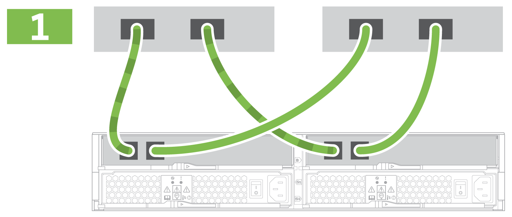

= ストレージシステムのセットアップと設定を完了
:allow-uri-read: 
:icons: font
:imagesdir: ../media/

[role="lead"]
コントローラをネットワークに接続する方法と、ストレージシステムのセットアップと設定を実行する方法について説明します。

== 手順 1 ：データホストをケーブル接続します

ネットワークトポロジに応じてシステムをケーブル接続します。

NOTE: AIX ® を使用している場合は、アレイに接続する前に、ホストに E シリーズマルチパスドライバをインストールする必要があります。

=== オプション 1 ：直接接続トポロジ

次の例は、直接接続トポロジを使用したデータホストへのケーブル接続を示しています。

|===

 a| 

 a| 
. 各ホストアダプタをコントローラのホストポートに直接接続します。

|===

=== オプション 2 ：ファブリックトポロジ

次の例は、ファブリックトポロジを使用したデータホストへのケーブル接続を示しています。

|===

 a| 
image:../media/2U_FabricTopology.png[""]
 a| 
. 各ホストアダプタをスイッチに直接接続します。
. 各スイッチをコントローラのホストポートに直接接続します。

|===

== 手順 2 ：管理接続を接続して設定します

コントローラの管理ポートは、 DHCP サーバまたは静的 IP アドレスのいずれかを使用して設定できます。

=== オプション 1 ： DHCP サーバ

DHCP サーバを使用して管理ポートを設定する方法について説明します。

.作業を開始する前に
* IP アドレス、サブネットマスク、およびゲートウェイアドレスを各コントローラの永続的なリースとして関連付けるように DHCP サーバを設定します。
* ストレージシステムへの接続に使用する IP アドレスを、ネットワーク管理者から入手します。

.手順
. 各コントローラの管理ポートにイーサネットケーブルを接続し、ケーブルのもう一方の端をネットワークに接続します。
+
|===

 a| 
image:../media/cable_ethernet_inst-hw-e2800-e5700.png[""]
 a| 
イーサネットケーブル（発注した場合）

|===
+
次の図は、コントローラの管理ポートの場所の例を示しています。

+
|===

 a| 
image:../media/e2800_mgmt_ports.png[""]

E2800 コントローラ P1 の管理ポート
 a| 
image:../media/e5700_mgmt_ports.png[""]

E5700 コントローラ P1 の管理ポート

|===
. ブラウザを開き、ネットワーク管理者から入手したコントローラ IP アドレスのいずれかを使用してストレージシステムに接続します。

=== オプション 2 ：静的 IP アドレス

[role="lead"]
IP アドレスとサブネットマスクを入力して、管理ポートを手動で設定する方法について説明します。

.作業を開始する前に
* コントローラの IP アドレス、サブネットマスク、ゲートウェイアドレス、および DNS サーバと NTP サーバの情報をネットワーク管理者から取得します。
* 使用しているラップトップが DHCP サーバからネットワーク設定を受信していないことを確認します。

.手順
. コントローラ A の管理ポートとラップトップのイーサネットポートをイーサネットケーブルで接続します。
+
|===

 a| 
image:../media/cable_ethernet_inst-hw-e2800-e5700.png[""]
 a| 
イーサネットケーブル（発注した場合）

|===
+
次の図は、コントローラの管理ポートの場所の例を示しています。

+
|===

 a| 
image:../media/e2800_mgmt_ports.png[""]

E2800 コントローラ P1 の管理ポート
 a| 
image:../media/e5700_mgmt_ports.png[""]

E5700 コントローラ P1 の管理ポート

|===
. ブラウザを開き、デフォルトの IP アドレス（ 169.254.128.101 ）を使用してコントローラへの接続を確立します。コントローラから自己署名証明書が返されます。接続がセキュアでないことを示すメッセージがブラウザに表示されます。
+

NOTE: SANtricity 11.60以降を実行しているプラットフォームでは、デフォルトのサブネットマスクは255.255.0.0です。

. ブラウザの指示に従って、 SANtricity System Manager を起動します。
+

NOTE: 接続を確立できない場合は、 DHCP サーバからネットワーク設定を受け取っていないことを確認してください。

. ストレージシステムのパスワードを設定してログインします。
. ネットワーク管理者から提供されたネットワーク設定を使用して、 * ネットワーク設定 * ウィザードでコントローラ A のネットワーク設定を構成し、 * 完了 * を選択します。
+

NOTE: IP アドレスをリセットしたため、 System Manager からコントローラへの接続は失われます。

. ラップトップをストレージシステムから切断し、コントローラ A の管理ポートをネットワークに接続します。
. ネットワークに接続されているコンピュータでブラウザを開き、コントローラ A の新しく設定された IP アドレスを入力します。
+

NOTE: コントローラ A との接続が失われた場合は、コントローラ B にイーサネットケーブルを接続し、コントローラ B （ 169.254.128.102 ）を介してコントローラ A との接続を再確立できます。

. 前の手順で設定したパスワードを使用してログインします。
+
ネットワーク設定ウィザードが表示されます。

. ネットワーク管理者から提供されたネットワーク設定を使用して、 * ネットワーク設定の構成 * ウィザードを実行し、コントローラ B のネットワーク設定を構成し、 * 完了 * を選択します。
. コントローラ B をネットワークに接続します。
. コントローラ B の新しく設定された IP アドレスをブラウザに入力して、コントローラ B のネットワーク設定を確認します。
+

NOTE: コントローラ B との接続が失われた場合は、前の手順で確認したコントローラ A への接続を使用し、コントローラ A を介してコントローラ B との接続を再確立できます

== 手順 3 ：ストレージシステムを設定する

ハードウェアの設置が完了したら、 SANtricity ソフトウェアを使用して、ストレージシステムを設定および管理します。

.作業を開始する前に
* 管理ポートを設定します。
* パスワードと IP アドレスを確認して記録します。

.手順
. SANtricity ソフトウェアを使用して、ストレージアレイを設定および管理します。
. 最もシンプルなネットワーク構成では、コントローラを Web ブラウザに接続し、 SANtricity System Manager を使用して E2800 シリーズまたは E5700 シリーズの単一のストレージアレイを管理します。

|===

 a| 
image:../media/management_s_g2285tation_inst-hw-e2800-e5700_g2285.png[""]
 a| 
System Manager にアクセスするには、管理ポートの設定に使用した IP アドレスを使用します。

|===