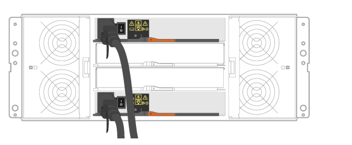

= シェルフをケーブル接続
:icons: font
:imagesdir: ../media/

[role="lead"]
電源ケーブルを接続してドライブシェルフの電源をオンにする方法について説明します。

.作業を開始する前に
* ハードウェアを設置
* 静電気防止処置を施します。

.手順
. シェルフをケーブル接続
+
構成に応じてシステムをケーブル接続します。この項で示す例よりも多くのケーブル接続オプションが必要な場合は、を参照してください link:../install-hw-cabling/index.html["ケーブル配線"]。

+
このセクションの例では、次のケーブルが必要です。

+
|===

 a| 
image:../media/sas_cable.png[""]
 a| 
* SAS ケーブル *

|===
+
image:../media/example_a_2860.png[""]

+
.. コントローラ A を最初のドライブシェルフの IOM A にケーブル接続します。
.. 最初のドライブシェルフの IOM A を 2 番目のドライブシェルフの IOM A にケーブル接続します。
.. 最初のドライブシェルフの IOM B を 2 番目のドライブシェルフの IOM B にケーブル接続します。
.. コントローラ B を 2 台目のドライブシェルフの IOM B にケーブル接続します。

+

+
.. コントローラ A を IOM A にケーブル接続します
.. コントローラ B を IOM B にケーブル接続します

. ドライブシェルフの電源を投入します。
+
次のケーブルが必要です。

+
|===

 a| 
image:../media/power_cable_inst-hw-e2800-e5700.png[""]
 a| 
* 電源ケーブル *

|===
+

CAUTION: ドライブシェルフの電源スイッチがオフになっていることを確認する。

+
.. 各シェルフの 2 本の電源ケーブルを、キャビネットまたはラック内の別々の配電ユニット（ PDU ）に接続します。
.. ドライブシェルフがある場合は、最初に 2 つの電源スイッチをオンにします。2 分待ってからコントローラシェルフの電源をオンにします。
.. コントローラシェルフの 2 つの電源スイッチをオンにします。
.. 各コントローラの LED とデジタル表示ディスプレイを確認します。
+
ブート時に、デジタル表示ディスプレイの OS 、 SD 、消灯の順に切り替わり、コントローラで一日の最初の処理が実行されていることが示されます。コントローラがブートすると、シェルフ ID が表示されます。

+
|===

 a| 
* 例：電源接続はシェルフ背面にあります。 *image:../media/trafford_power.png[""]

|===

