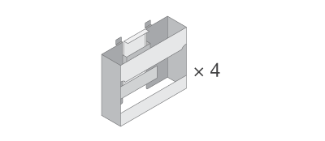

= 設置を準備
:allow-uri-read: 
:icons: font
:imagesdir: ../media/

[role="lead"]
E2860 、 E5760 、または DE460 シリーズのストレージシステムをインストールするための準備方法について説明します。

.手順
. アカウントを作成し、でハードウェアを登録します http://mysupport.netapp.com/["ネットアップサポート"^]。
. 次のものが同梱されていることを確認してください。
+
|===

 a| 
image:../media/trafford_overview.png["ドライブとベゼルが取り付けられたシェルフ"]
 a| 
シェルフ、ベゼル、およびラックマウントハードウェア

 a| 

 a| 
シェルフハンドル × 4

|===
+
次の表に、同梱されているケーブルの種類を示します。表に記載されていないケーブルがある場合は、を参照してください https://hwu.netapp.com/["Hardware Universe"^] ケーブルの場所を確認し、用途を特定します。

+
|===
| コネクタのタイプ | ケーブルのタイプ | 使用 

 a| 

 a| 
イーサネットケーブル

（発注した場合）
 a| 
管理接続

 a| 
image:../media/cable_io_inst-hw-e2800-e5700.png["I/O ケーブル"]
 a| 
I/O ケーブル

（発注した場合）
 a| 
データホストのケーブル接続

 a| 
image:../media/cable_power_inst-hw-e2800-e5700.png["電源ケーブル"]
 a| 
電源ケーブル

X2 （シェルフあたり）

（発注した場合）
 a| 
ストレージシステムの電源

 a| 
image:../media/sas_cable.png["SAS ケーブル"]
 a| 
SAS ケーブル（ドライブシェルフにのみ付属）
 a| 
シェルフのケーブル接続

|===
. 次のものを用意します。
+
|===

 a| 
image:../media/screwdriver_inst-hw-e2800-e5700.png["No.2 プラスドライバ"]
 a| 
No.2 プラスドライバ

 a| 
image:../media/flashlight_inst-hw-e2800-e5700.png["懐中電灯"]
 a| 
懐中電灯

 a| 
image:../media/wrist_strap_inst-hw-e2800-e5700.png["静電気防止用ストラップ"]
 a| 
静電気防止用ストラップ

 a| 
image:../media/4u_dummy.png["4Uラックインチ"]
 a| 
4U のラックスペース：標準の 48.3cm48.30cm （ 48.30cm ）ラック

* 深さ *:38.25 インチ（ 97.16 cm ）

* 幅 * ： 17.66 インチ（ 44.86 cm ）

* 高さ *:6.87 インチ（ 17.46 cm ）

* 最大重量 * ： 113 kg （ 250 ポンド）

 a| 
image:../media/management_station_inst-hw-e2800-e5700_g60b3.png["管理ソフトウェアでサポートされているブラウザを使用した管理ステーション"]
 a| 
管理ソフトウェアでサポートされているブラウザ：

** Google Chrome（バージョン89以降）
** Microsoft Edge（バージョン90以降）
** Mozilla Firefox（バージョン80以降）
** Safari（バージョン14以降）

|===

