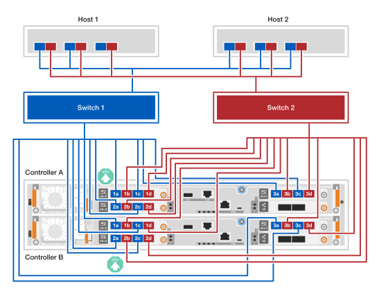

= ハードウェアをケーブルで接続する - EF50およびEF80
:allow-uri-read: 
:icons: font
:imagesdir: ../media/

[role="lead"]
EF50またはEF80ストレージ システムのハードウェアをインストールしたら、コントローラ間のミラーリング接続とホスト ネットワーク接続をケーブルで接続します。（管理ポートの配線は、後ほど「ストレージ システム全体のセットアップ」のセクションで行います。）

.このタスクについて
* この手順では、「I/O モジュール」という用語は、ホスト インターフェイス カード（HIC）を指すために使用されます。
* ケーブル配線図には、コネクタをポートに挿入する際のケーブル コネクタの引き抜きタブの正しい向き（上向きまたは下向き）を示す矢印アイコンが付いています。
+
コネクタを差し込むと、カチッと音がして所定の位置に収まるはずです。音がしない場合は、一度取り外して裏返し、もう一度試してください。

+
image:../media/drw_cable_pull_tab_direction_ieops-1699.svg["ケーブル プル タブの方向"]

== 手順1：コントローラ間ミラーリング接続をケーブル接続する

コントローラ同士をケーブルで接続して、コントローラ間のミラーリング機能を有効にします。コントローラ間のミラーリング接続は、システム全体の冗長性を確保し、キャッシュ ミラーリングやI/O転送に使用されます。EF50とEF80ストレージ システムのケーブル配線は同じです。

NOTE: ストレージシステムに搭載されているコントローラ間ミラーリングI/Oモジュールの速度（ストレージシステムがサポートする100GbEまたは200GbE）に関わらず、付属の200GbEケーブルを使用します。コントローラ間ミラーリングI/Oモジュールの速度が100GbEの場合、接続は低速（100GbE）で動作します。

.手順
. コントローラを相互に接続します：
+
.. コントローラAのポートe4aをコントローラBのポートe4aにケーブルで接続します。
.. ケーブルコントローラAポートe4bからコントローラBポートe4bへ。
+
*200 GbE イーサネットケーブル*

+
image::../media/oie_cable100_gbe_qsfp28.png[ミラーリング接続に使用される100 GbEイーサネットケーブル]

+
image:../media/drw_ef50-ef80_mirroring_2p_100gbe_ieops-2659.svg["ef50およびef80コントローラ間のミラーリング接続ケーブル配線"]

== ステップ2：ホスト接続をケーブル接続する

ストレージシステムのホスト接続は、ネットワークトポロジー（直接接続またはファブリック接続）に応じて配線してください。

.このタスクについて
* ストレージシステムのモデルによっては、ストレージシステムに搭載されるホストI/Oモジュールは、イーサネットまたはファイバチャネル（FC）のいずれかになります。この手順で示すケーブル接続例は、ストレージシステムモデルでサポートされている両方のタイプのホストI/Oモジュールを示しています。
* 配線例では、ホスト1とホスト2に4ポート64Gb FC HBAは示されていませんが、これらがインストールされている場合は、2ポートHBAの場合と同様に、1つおきのポートを配線してください。

[role="tabbed-block"]
====
.直接接続トポロジー
--
以下の例は、直接接続トポロジーを使用してストレージシステムをホストにケーブル接続する方法を示しています。

.EF50（2個の4ポート64Gb FC I/Oモジュール搭載）
[%collapsible]
=====
.このタスクについて
* ケーブル配線の例では、ホストI/Oモジュールがスロット1と2に装着されています。これは、EF50ストレージシステムでサポートされるホストI/Oモジュールの最大数です。ただし、スロット1のホストI/Oモジュールのみが必要であり、スロット2のホストI/Oモジュールはオプションです。
+
ストレージシステムにホストI/Oモジュールが1つ搭載されている場合は、追加のホストI/Oモジュールへのケーブル接続は無視して、搭載済みのホストI/Oモジュールにのみケーブル接続できます。

* 直接接続型ストレージシステムには、冗長性を確保するための2つの独立したパスがあります：パスAとパスB。
+
** パスAの接続は、ホストおよびコントローラ上の青色のケーブルと青色のポートで示されています。各ホスト上のHBAポートをコントローラAのポートaおよびcに接続します。
** パスBの接続は、ホストおよびコントローラ上の赤いケーブルと赤いポートで示されています。各ホストのHBAポートをコントローラBのポートaおよびcに接続します。

* ケーブル接続の例ではI/Oモジュールのポートaとcがホストに接続されていますが、ポートaとb、またはポートcとdを使用することもできます。

.手順
. ホストをコントローラにケーブルで接続します：
+
.. ケーブルホスト1のパスA（青色）HBAポートをコントローラAのaポート（1aおよび2a）に接続します。
.. ケーブルホスト1のパスB（赤色）HBAポートをコントローラBのaポート（1aおよび2a）に接続します。
.. ケーブルホスト2のパスA（青色）のHBAポートをコントローラAのcポート（1cと2c）に接続します。
.. ケーブルホスト2のパスB（赤色）のHBAポートをコントローラBのcポート（1cと2c）に接続します。
+
*64 Gb/s FCケーブル*

+
image:../media/oie_cable_sfp_gbe_copper.png["64 Gb fcケーブル"]

+
image:../media/drw_ef50_4p_64gb_fc_2hic_direct_ieops-2670.svg["2つの4ポート64Gb FC I/Oモジュールを使用したホストへのEF50ダイレクトアタッチトポロジー"]

=====
.3つの2ポート200 GbE I/Oモジュールを備えたEF80
[%collapsible]
=====
.このタスクについて
* ケーブル配線の例では、ホストI/Oモジュールがスロット1、2、3に装着されています。これは、EF80ストレージシステムでサポートされるホストI/Oモジュールの最大数です。ただし、スロット1のホストI/Oモジュールのみが必要であり、スロット2とスロット3のホストI/Oモジュールはどちらもオプションです。
+
ストレージシステムに搭載されているホストI/Oモジュールの数が少ない場合は、追加のホストI/Oモジュールへのケーブル接続は無視して、既に搭載されているホストI/Oモジュールにのみケーブル接続すれば構いません。

* 直接接続型ストレージシステムには、冗長性を確保するための2つの独立したパスがあります：パスAとパスB。
+
** パスAの接続は、ホストおよびコントローラ上の青色のケーブルと青色のポートで示されています。各ホストのHBAポートをコントローラAのポートaおよびbに接続します。
** パスBの接続は、ホストおよびコントローラ上の赤いケーブルと赤いポートで示されています。各ホストのHBAポートをコントローラBのポートaおよびbに接続します。

.手順
. ホストをコントローラにケーブルで接続します：
+
.. ケーブルホスト1のパスA（青色）HBAポートをコントローラAのaポート（e1a、e2a、e3a）に接続します。
.. ケーブルホスト1のパスB（赤色）HBAポートをコントローラBのaポート（e1a、e2a、e3a）に接続します。
.. ケーブルホスト2のパスA（青色）のHBAポートをコントローラAのbポート（e1b、e2b、e3b）に接続します。
.. ケーブルホスト2のパスB（赤色）のHBAポートをコントローラBのbポート（e1b、e2b、e3b）に接続します。
+
*200 GbE ケーブル*

+
image::../media/oie_cable_sfp_gbe_copper.png[200 GbE ケーブル]

+
image:../media/drw_ef80_2p_200gbe_ib_3hic_direct_ieops-2680.svg["3つの2ポート200GbE IB I/Oモジュールを使用したホストへのEF80ダイレクトアタッチトポロジー"]

=====
.3つの4ポート64Gb FC I/Oモジュールを搭載したEF80
[%collapsible]
=====
.このタスクについて
* ケーブル配線の例では、ホストI/Oモジュールがスロット1、2、3に装着されています。これは、EF80ストレージシステムでサポートされるホストI/Oモジュールの最大数です。ただし、スロット1のホストI/Oモジュールのみが必要であり、スロット2とスロット3のホストI/Oモジュールはどちらもオプションです。
+
ストレージシステムに搭載されているホストI/Oモジュールの数が少ない場合は、追加のホストI/Oモジュールへのケーブル接続は無視して、既に搭載されているホストI/Oモジュールにのみケーブル接続すれば構いません。

* 直接接続型ストレージシステムには、冗長性を確保するための2つの独立したパスがあります：パスAとパスB。
+
** パスAの接続は、ホストおよびコントローラ上の青色のケーブルと青色のポートで示されています。各ホスト上のHBAポートをコントローラAのポートaおよびcに接続します。
** パスBの接続は、ホストおよびコントローラ上の赤いケーブルと赤いポートで示されています。各ホストのHBAポートをコントローラBのポートaおよびcに接続します。

* ケーブル接続の例ではI/Oモジュールのポートaとcがホストに接続されていますが、ポートaとb、またはポートcとdを使用することもできます。

.手順
. ホストをコントローラにケーブルで接続します：
+
.. ケーブルホスト1のパスA（青色）HBAポートをコントローラAのaポート（1a、2a、3a）に接続します。
.. ケーブルホスト1のパスB（赤）HBAポートをコントローラBのaポート（1a、2a、3a）に接続します。
.. ケーブルホスト2のパスA（青色）のHBAポートをコントローラAのcポート（1c、2c、3c）に接続します。
.. ケーブルホスト2のパスB（赤色）のHBAポートをコントローラBのcポート（1c、2c、3c）に接続します。
+
*64 Gb/s FCケーブル*

+
image:../media/oie_cable_sfp_gbe_copper.png["64 Gb fcケーブル"]

+
image:../media/drw_ef80_4p_64gb_fc_3hic_direct_ieops-2674.svg["3つの4ポート64Gb FC I/Oモジュールを使用した、ホストへのEF80直接接続トポロジ"]

=====
--
.ファブリック接続型トポロジー
--
以下の例は、ファブリック接続トポロジーを使用してストレージシステムをホストにケーブル接続する方法を示しています。

.EF50（2個の4ポート64Gb FC I/Oモジュール搭載）
[%collapsible]
=====
.このタスクについて
* ケーブル配線の例では、ホストI/Oモジュールがスロット1と2に装着されています。これは、EF50ストレージシステムでサポートされるホストI/Oモジュールの最大数です。ただし、スロット1のホストI/Oモジュールのみが必要であり、スロット2のホストI/Oモジュールはオプションです。
+
ストレージシステムにホストI/Oモジュールが1つ搭載されている場合は、追加のホストI/Oモジュールへのケーブル接続は無視して、搭載済みのホストI/Oモジュールにのみケーブル接続できます。

* ファブリック接続型ストレージシステムには、冗長性を確保するために、switch 1パスとswitch 2パスという2つの独立したスイッチパスがあります。
+
** スイッチ1のパス接続は、ホストおよびコントローラ上の青色のケーブルと青色のポートで示されています。これは、スイッチ1を介して各ホストのHBAポートをコントローラAとコントローラBのaポートおよびcポートに接続します。
** スイッチ2のパス接続は、ホストおよびコントローラ上の赤いケーブルと赤いポートで示されています。これは、スイッチ2を介して各ホストのHBAポートをコントローラAとコントローラBのbポートおよびdポートに接続します。

.手順
. ホストをスイッチに接続します。
+
スイッチのどのポートでも使用できます。

+
.. ケーブルホスト1とホスト2のスイッチ1パス（青色）のHBAポートをスイッチ1に接続します。
.. ケーブルホスト1およびホスト2スイッチ2パス（赤）HBAポートをスイッチ2に接続します。

. スイッチをコントローラに接続します：
+
.. ケーブルスイッチ1（青色）をコントローラAのaポートとcポート（1a、2a、1c、2c）に接続します。
.. ケーブルスイッチ1（青色）をコントローラBのaポートとcポート（1a、2a、1c、2c）に接続します。
.. ケーブルスイッチ2（赤色）をコントローラAのbポートとdポート（1b、2b、1d、2d）に接続します。
.. ケーブルスイッチ2（赤色）をコントローラBのbポートとdポート（1b、2b、1d、2d）に接続します。
+
*64 Gb/s FCケーブル*

+
image:../media/oie_cable_sfp_gbe_copper.png["64 Gb fcケーブル"]

+
image:../media/drw_ef50_4p_64gb_fc_2hic_fabric_ieops-2673.svg["2つの4ポート64Gb FC I/Oモジュールを使用したEF50ファブリック接続トポロジー"]

=====
.3つの2ポート200 GbE I/Oモジュールを備えたEF80
[%collapsible]
=====
.このタスクについて
* ケーブル配線の例では、ホストI/Oモジュールがスロット1、2、3に装着されています。これは、EF80ストレージシステムでサポートされるホストI/Oモジュールの最大数です。ただし、スロット1のホストI/Oモジュールのみが必要であり、スロット2とスロット3のホストI/Oモジュールはどちらもオプションです。
+
ストレージシステムに搭載されているホストI/Oモジュールの数が少ない場合は、追加のホストI/Oモジュールへのケーブル接続は無視して、既に搭載されているホストI/Oモジュールにのみケーブル接続すれば構いません。

* ケーブル接続の例では、各ホストに3つのHBAが搭載されています。ホストに搭載されているHBAが3つ未満の場合は、追加のHBAへのケーブル接続は無視して、インストールされているHBAにのみケーブル接続してください。
* ファブリック接続型ストレージシステムには、冗長性を確保するために、switch 1パスとswitch 2パスという2つの独立したスイッチパスがあります。
+
** スイッチ1のパス接続は、ホストおよびコントローラ上の青色のケーブルと青色のポートで示されています。これは、スイッチ1を介して各ホストのHBAポートをコントローラAとコントローラBのaポートに接続します。
** スイッチ2のパス接続は、ホストおよびコントローラ上の赤いケーブルと赤いポートで示されています。これは、スイッチ2を介して各ホストのHBAポートをコントローラAとコントローラBのbポートに接続します。

.手順
. ホストをスイッチに接続します：
+
スイッチのどのポートでも使用できます。

+
.. ケーブルホスト1とホスト2のスイッチ1パス（青色）のHBAポートをスイッチ1に接続します。
.. ケーブルホスト1およびホスト2スイッチ2パス（赤）HBAポートをスイッチ2に接続します。

. スイッチをコントローラに接続します：
+
.. ケーブルスイッチ1（青色）をコントローラAのaポート（e1a、e2a、e3a）に接続します。
.. ケーブルスイッチ1（青色）をコントローラBのaポート（e1a、e2a、e3a）に接続します。
.. ケーブルスイッチ2（赤色）をコントローラAのbポート（e1b、e2b、e3b）に接続します。
.. ケーブルスイッチ2（赤色）をコントローラBのbポート（e1b、e2b、e3b）に接続します。
+
*200 GbE ケーブル*

+
image::../media/oie_cable_sfp_gbe_copper.png[200 GbE ケーブル]

+
image:../media/drw_ef80_2p_200gbe_ib_3hic_fabric_ieops-2679.svg["3つの2ポート200GbE I/Oモジュールを使用したEF80ファブリック接続トポロジ"]

=====
.3つの4ポート64Gb FC I/Oモジュールを搭載したEF80
[%collapsible]
=====
.このタスクについて
* ケーブル配線の例では、ホストI/Oモジュールがスロット1、2、3に装着されています。これは、EF80ストレージシステムでサポートされるホストI/Oモジュールの最大数です。ただし、スロット1のホストI/Oモジュールのみが必要であり、スロット2とスロット3のホストI/Oモジュールはどちらもオプションです。
+
ストレージシステムに搭載されているホストI/Oモジュールの数が少ない場合は、追加のホストI/Oモジュールへのケーブル接続は無視して、既に搭載されているホストI/Oモジュールにのみケーブル接続すれば構いません。

* ケーブル接続の例では、各ホストに3つのHBAが搭載されています。ホストに搭載されているHBAが3つ未満の場合は、追加のHBAへのケーブル接続は無視して、インストールされているHBAにのみケーブル接続してください。
* ファブリック接続型ストレージシステムには、冗長性を確保するために、switch 1パスとswitch 2パスという2つの独立したスイッチパスがあります。
+
** スイッチ1のパス接続は、ホストおよびコントローラ上の青色のケーブルと青色のポートで示されています。これは、スイッチ1を介して各ホストのHBAポートをコントローラAとコントローラBのaポートおよびcポートに接続します。
** スイッチ2のパス接続は、ホストおよびコントローラ上の赤いケーブルと赤いポートで示されています。これは、スイッチ2を介して各ホストのHBAポートをコントローラAとコントローラBのbポートおよびdポートに接続します。

.手順
. ホストをスイッチに接続します：
+
スイッチのどのポートでも使用できます。

+
.. ケーブルホスト1とホスト2のスイッチ1パス（青色）のHBAポートをスイッチ1に接続します。
.. ケーブルホスト1およびホスト2スイッチ2パス（赤）HBAポートをスイッチ2に接続します。

. スイッチをコントローラに接続します：
+
.. ケーブルスイッチ1（青色）をコントローラAのaポートとcポート（1a、2a、3a、1c、2c、3c）に接続します。
.. ケーブルスイッチ1（青色）をコントローラBのaポートとcポート（1a、2a、3a、1c、2c、3c）に接続します。
.. ケーブルスイッチ2（赤色）をコントローラAのbポートとdポート（1b、2b、3b、1d、2d、3d）に接続します。
.. ケーブルスイッチ2（赤色）をコントローラBのbポートとdポート（1b、2b、3b、1d、2d、3d）に接続します。
+
*64 Gb/s FCケーブル*

+
image:../media/oie_cable_sfp_gbe_copper.png["64 Gb fcケーブル"]

+

=====
--
====
.次の手順
ストレージシステムのコントローラー間ミラーリングとホスト接続をケーブルで接続した後、link:install-power-hardware.html["ストレージシステムの電源をオンにします"]。
