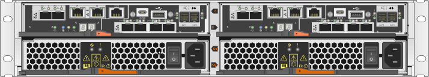

= E2800 コントローラの交換に際しての要件
:icons: font
:imagesdir: ../media/

[role="lead"]
E2800 コントローラを交換または追加する前に、要件と考慮事項を確認してください。

各コントローラキャニスターには、コントローラカード、バッテリ、およびオプションでホストインターフェイスカード（ HIC ）が搭載されています。シンプレックス構成に 2 台目のコントローラを追加したり、障害が発生したコントローラを交換したりできます。

この 手順 環境 IOM12 および IOM12B ドライブシェルフを使用します。

NOTE: この手順 は、シェルフの IOM のホットスワップや交換に使用されます。つまり、 IOM12 モジュールを別の IOM12 モジュールに交換するか、 IOM12B モジュールを別の IOM12B モジュールに交換しなければなりません。（シェルフに IOM12 モジュールを 2 台搭載することも、 IOM12B モジュールを 2 つ使用することもできます）

== 2 台目のコントローラの追加に際しての要件

2 台目のコントローラキャニスターは、シンプレックスバージョンの次のコントローラシェルフに追加することができます。

* E2812 コントローラシェルフ
* E2824 コントローラシェルフ
* EF280 フラッシュアレイ

この図は、 2 台目のコントローラを追加する前（ 1 台のコントローラキャニスターとブランクカバー）と 2 台目のコントローラを追加したあとのコントローラシェルフの例を示したものです。

image::../media/28_dwg_2800_controller_simplex.gif[28 DWG 2800 コントローラシンプレックス]

NOTE: この図はコントローラキャニスターの例を示したものです。コントローラキャニスターのホストポートは、この図と異なる場合があります。

2 台目のコントローラを追加する前に、次の作業を完了しておく必要があります

* 現在取り付けられているコントローラキャニスターと同じパーツ番号の新しいコントローラキャニスター。
* 現在取り付けられているコントローラキャニスターの HIC と同じ新しい HIC （現在取り付けられているコントローラキャニスターにホストインターフェイスカードが搭載されている場合のみ）。
* 新しいコントローラポートの接続に必要なすべてのケーブル、トランシーバ、スイッチ、ホストバスアダプタ（ HBA ）。
+
互換性のあるハードウェアについては、を参照してください https://mysupport.netapp.com/NOW/products/interoperability["NetApp Interoperability Matrix を参照してください"^] または http://hwu.netapp.com/home.aspx["NetApp Hardware Universe の略"^]。

* ホストにマルチパスドライバがインストールされているため、両方のコントローラを使用できます。を参照してください link:../config-linux/index.html["Linux の簡単な設定"]、 link:../config-windows/index.html["Windows の簡単な設定"]または link:../config-vmware/index.html["VMware の簡単な設定"] 手順については、を参照し
* ESD リストバンドを装着するか、静電気防止処置を施しておきます。
* No.1 プラスドライバ。
* 新しいケーブルを識別するためのラベル。
* コントローラの SANtricity System Manager にアクセスできるブラウザを備えた管理ステーション。（ System Manager インターフェイスを開くには、ブラウザでコントローラのドメイン名または IP アドレスを指定します）。
+
必要に応じて、コマンドラインインターフェイス（ CLI ）を使用して一部の手順を実行できます。CLI にアクセスできない場合は、次のいずれかを実行できます。

+
** * SANtricity System Manager （バージョン 11.60 以降） * - System Manager から CLI パッケージ（ zip ファイル）をダウンロードします。[ 設定 ] 、 [ システム ] 、 [ アドオン ] 、 [ コマンドラインインターフェイス ] の順に選択します。次に、 DOS C ：プロンプトなどのオペレーティングシステムプロンプトから問題 CLI コマンドを実行します。
** * SANtricity Storage Manager/Enterprise Management Window （ EMW ）：ソフトウェアをダウンロードしてインストールするには ' エクスプレス・ガイドの指示に従ってくださいEMW から CLI コマンドを実行するには、次のメニューを選択します： Tools [Execute Script]

== コントローラの交換に際しての要件

障害が発生したコントローラキャニスターを交換するときは、バッテリと HIC が取り付けられている場合は元のコントローラキャニスターから取り外して、交換用コントローラキャニスターに取り付ける必要があります。

コントローラキャニスターに障害が発生したかどうかは、次の 2 つの方法で確認できます。

* SANtricity System Manager の Recovery Guru で、コントローラキャニスターを交換するように指示されます。
* コントローラキャニスターの黄色の警告 LED が点灯して、コントローラに障害が発生したことが通知されます。

image::../media/28_dwg_2800_controller_attn_led_maint-e2800.gif[28 DWG 2800 controller Attn led maint e2800]

* （ 1 ） * _Attention LED_

NOTE: この図はコントローラキャニスターの例を示したものです。コントローラキャニスターのホストポートは、この図と異なる場合があります。

コントローラを交換する前に、次の作業を完了しておく必要があります。

* 交換するコントローラキャニスターと同じパーツ番号の交換用コントローラキャニスター。
* ESD リストバンドを装着するか、静電気防止処置を施しておきます。
* コントローラキャニスターに接続する各ケーブルを識別するためのラベル。
* No.1 プラスドライバ。
* コントローラの SANtricity System Manager にアクセスできるブラウザを備えた管理ステーション。（ System Manager インターフェイスを開くには、ブラウザでコントローラのドメイン名または IP アドレスを指定します）。
+
必要に応じて、コマンドラインインターフェイス（ CLI ）を使用して一部の手順を実行できます。CLI にアクセスできない場合は、次のいずれかを実行できます。

+
** * SANtricity System Manager （バージョン 11.60 以降） * - System Manager から CLI パッケージ（ zip ファイル）をダウンロードします。[ 設定 ] 、 [ システム ] 、 [ アドオン ] 、 [ コマンドラインインターフェイス ] の順に選択します。次に、 DOS C ：プロンプトなどのオペレーティングシステムプロンプトから問題 CLI コマンドを実行します。
** * SANtricity Storage Manager/Enterprise Management Window （ EMW ）：ソフトウェアをダウンロードしてインストールするには ' エクスプレス・ガイドの指示に従ってくださいEMW から CLI コマンドを実行するには、次のメニューを選択します： Tools [Execute Script]

=== デュプレックス構成の要件

コントローラシェルフにコントローラを 2 台搭載したデュプレックス構成の場合は、次の条件を満たしていれば、ストレージアレイの電源をオンにした状態でホスト I/O 処理を継続したままコントローラキャニスターを交換できます。

* シェルフのもう一方のコントローラキャニスターのステータスが「最適」である。
* SANtricity System Manager の Recovery Guru の詳細領域の「 * 削除してもよろしいですか？」というメッセージが表示され、このコンポーネントを削除しても安全であることを示します。

=== シンプレックス構成の要件

コントローラキャニスターが 1 つだけのシンプレックス構成の場合は、コントローラキャニスターの交換が完了するまでストレージアレイのデータにアクセスできません。ホスト I/O 処理を停止し、ストレージアレイの電源をオフにする必要があります。
