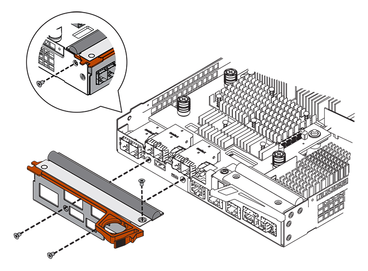

= E2800 に 2 台目のコントローラキャニスターを追加する
:allow-uri-read: 
:experimental: 
:icons: font
:imagesdir: ../media/

[role="lead"]
E2800 アレイには 2 台目のコントローラキャニスターを追加できます。

.このタスクについて
このタスクでは、 2 台目のコントローラキャニスターをシンプレックスバージョンの E2812 コントローラシェルフ、 E2824 コントローラシェルフ、または EF280 フラッシュアレイに追加する方法について説明します。この手順は、オンライン手順であるシンプレックスからデュプレックスへの変換とも呼ばれます。この手順の実行中もストレージアレイ上のデータにアクセスすることができます。

.作業を開始する前に
次のものがあることを確認します。

* 現在取り付けられているコントローラキャニスターと同じパーツ番号の新しいコントローラキャニスター。（部品番号を確認するには、手順 1 を参照してください）。
* 現在取り付けられているコントローラキャニスターの HIC と同じ新しい HIC （現在取り付けられているコントローラキャニスターにホストインターフェイスカードが搭載されている場合のみ）。
* ESD リストバンドを装着するか、静電気防止処置を施します。
* No.1 プラスドライバ。
* 新しいケーブルを識別するためのラベル。互換性のあるハードウェアについては、を参照してください https://mysupport.netapp.com/NOW/products/interoperability["NetApp Interoperability Matrix を参照してください"^] または http://hwu.netapp.com/home.aspx["NetApp Hardware Universe の略"^]。
* 新しいコントローラポートの接続に必要なすべてのケーブル、トランシーバ、スイッチ、ホストバスアダプタ（ HBA ）。
* コントローラの SANtricity System Manager にアクセスできるブラウザを備えた管理ステーション。（ System Manager インターフェイスを開くには、ブラウザでコントローラのドメイン名または IP アドレスを指定します）。

== 手順1：新しいコントローラのパーツ番号を確認する

新しいコントローラのパーツ番号が現在取り付けられているコントローラと同じであることを確認します。

.手順
. 新しいコントローラキャニスターを開封し、静電気防止処置を施した平らな場所に置きます。
. コントローラキャニスターの背面にある MAC アドレスと FRU パーツ番号のラベルを確認します。
+
image::../media/28_dwg_e2800_labels_maint-e2800.gif[28 DWG e2800 ラベル maint e2800]

+
*(1) *_MAC アドレス :_ 管理ポート 1 の MAC アドレス ("P1") 。元のコントローラの IP アドレスが DHCP を使用して取得したアドレスである場合は、新しいコントローラに接続する際にこのアドレスが必要になります。

+
* （ 2 ） * _FRU パーツ番号： _ この番号は、現在取り付けられているコントローラの交換パーツ番号と一致している必要があります。

. SANtricity System Manager で、取り付けられているコントローラキャニスターの交換パーツ番号を確認します。
+
.. 「 * ハードウェア * 」を選択します。
.. コントローラアイコンが付いたコントローラシェルフを探します image:../media/sam1130_ss_hardware_controller_icon_maint-e2800.gif[""]。
.. コントローラアイコンをクリックします。
.. コントローラを選択し、 * 次へ * をクリックします。
.. [*Base] タブで、コントローラの交換パーツ番号 * をメモします。

. 取り付けられているコントローラの交換パーツ番号が新しいコントローラの FRU パーツ番号と同じであることを確認します。
+

CAUTION: * データアクセスが失われる可能性 * -- 2 つのパーツ番号が同じでない場合は、この手順を試みないでください。また、元のコントローラキャニスターにホストインターフェイスカード（ HIC ）が搭載されている場合は、新しいコントローラキャニスターに同じ HIC を取り付ける必要があります。コントローラや HIC 原因が一致していないと、新しいコントローラをオンラインにしたときにロックダウン状態になります。

== 手順 2 ：ホストインターフェイスカードを取り付ける

現在取り付けられているコントローラに HIC が搭載されている場合は、同じモデルのホストインターフェイスカード（ HIC ）を 2 台目のコントローラキャニスターに取り付ける必要があります。

.手順
. 新しい HIC を開封し、既存の HIC と同じであることを確認します。
+

CAUTION: * データアクセスが失われる可能性 * - 2 つのコントローラキャニスターに同じ HIC を取り付ける必要があります。交換用 HIC と交換する HIC が同じでない場合は、この手順を使用しないでください。HIC 原因が一致していないと、新しいコントローラをオンラインにしたときにロックダウン状態になります。

. カバーが上になるように新しいコントローラキャニスターを裏返します。
. カバーのボタンを押し、カバーをスライドさせて取り外します。
. コントローラキャニスターにブランクカバーを固定している 4 本のネジを No.1 プラスドライバを使用して外し、カバーを取り外します。
. HIC の 3 本の取り付けネジをコントローラの対応する穴に合わせ、 HIC の底面のコネクタをコントローラカードの HIC インターフェイスコネクタに合わせます。
+
HIC の底面やコントローラカードの表面のコンポーネントをこすったりぶつけたりしないように注意してください。

. HIC を所定の位置に慎重に置き、 HIC をそっと押して HIC コネクタを固定します。
+

CAUTION: * 機器の破損の可能性 * -- HIC と取り付けネジの間にあるコントローラ LED の金色のリボンコネクタをはさまないように十分に注意してください。

+
image::../media/28_dwg_e2800_hic_thumbscrews_maint-e2800.gif[28 dwg e2800 HIC 蝶ネジ maint e2800]

+
* （ 1 ） * _ ホスト・インターフェイス・カード _

+
* （ 2 ） * _ 蝶ねじ _

. HIC の取り付けネジを手で締めます。
+
ネジを締め付けすぎる可能性があるため、ドライバは使用しないでください。

. 新しい HIC カバーをコントローラキャニスターに取り付け、前の手順で外した 4 本のネジで No.1 プラスドライバを使用して固定します。
+

. カチッという音がしてボタンが固定されるまでカバーを前方から後方にスライドして、コントローラキャニスターにカバーを再度取り付けます。
. 取り付け準備ができるまで、コントローラキャニスターを脇に置きます。

== 手順 3 ：サポートデータを収集する

コンポーネントを交換する前後にサポートデータを収集しておけば、交換しても問題が解決しない場合に、テクニカルサポートにすべてのログを送信できます。

.手順
. SANtricity System Manager のホームページで、ストレージアレイのステータスが最適であることを確認します。
+
ステータスが「最適」でない場合は、 Recovery Guru を使用するかテクニカルサポートに問い合わせて問題を解決してください。この手順を続行しないでください。

. SANtricity システムマネージャを使用してストレージアレイのサポートデータを収集します。
+
.. メニューを選択します。 Support [ Support Center > Diagnostics ] （サポートセンター > 診断）。
.. 「サポートデータの収集」を選択します。
.. [*Collect*]( 収集 ) をクリックします
+
ブラウザの Downloads フォルダに、「 * support-data.7z * 」という名前でファイルが保存されます。

. ストレージアレイと接続されているすべてのホストの間で I/O 処理が発生しないようにします。たとえば、次の手順を実行します。
+
** ストレージからホストにマッピングされた LUN に関連するすべてのプロセスを停止します。
** ストレージからホストにマッピングされた LUN にアプリケーションがデータを書き込んでいないことを確認します。
** アレイのボリュームに関連付けられているファイルシステムをすべてアンマウントします。
+

NOTE: ホスト I/O 処理を停止する具体的な手順はホストオペレーティングシステムや構成によって異なり、ここでは説明していません。環境内でホスト I/O 処理を停止する方法がわからない場合は、ホストをシャットダウンすることを検討してください。

+

CAUTION: * データ損失の可能性 * - I/O 処理の実行中にこの手順を続行すると、データが失われる可能性があります。

== 手順 4 ：設定をデュプレックスに変更する

コントローラシェルフに 2 台目のコントローラを追加する前に、構成をデュプレックスに変更する必要があります。これを行うには、新しい NVSRAM ファイルをインストールし、コマンドラインインターフェイスを使用してストレージアレイをデュプレックスに設定します。デュプレックスバージョンの NVSRAM ファイルは、 SANtricity OS ソフトウェア（コントローラファームウェア）のダウンロードファイルに付属しています。

.手順
. 最新の NVSRAM ファイルをネットアップサポートサイトから管理クライアントにダウンロードします。
+
.. SANtricity System Manager で、メニューからサポート [Upgrade Center] を選択します。「 SANtricity OS Software upgrade 」というラベルの付いた領域で、「 NetApp SANtricity OS Downloads * 」をクリックします。
.. ネットアップサポートサイトで、「 * E-Series SANtricity OS Controller software * 」を選択します。
.. オンラインの手順に従ってインストールする NVSRAM のバージョンを選択し、ファイルのダウンロードを完了します。NVSRAM のデュプレックスバージョンを選択してください（ファイル名の末尾に「 D 」が付いています）。
+
ファイル名は次のようになります。 * N290X-830834-D01.dlp *

. SANtricity System Manager を使用してファイルをアップグレードします。
+

CAUTION: * データ損失のリスク、ストレージアレイの損傷のリスク * -- アップグレードの実行中にストレージアレイを変更しないでください。ストレージアレイの電源は切らないでください。

+
アップグレード前の健常性チェックの間は処理をキャンセルできますが、転送またはアクティブ化の実行中はキャンセルできません。

+
** SANtricity システムマネージャで次の作業を行います。
+
... SANtricity OS ソフトウェアのアップグレード * で、 * アップグレードの開始 * をクリックします。
... Select Controller NVSRAM file * の横の * Browse * をクリックし、ダウンロードした NVSRAM ファイルを選択します。
... [ * スタート * ] をクリックし、操作を確定します。
+
アップグレードが開始され、次の処理が実行されます。

+
**** アップグレード前の健常性チェックが開始されます。アップグレード前の健常性チェックに失敗した場合は、 Recovery Guru を使用するか、テクニカルサポートに問い合わせて問題を解決してください。
**** コントローラファイルが転送されてアクティブ化されます。所要時間はストレージアレイの構成によって異なります。
**** コントローラが自動的にリブートし、新しい設定が適用されます。

** または、次の CLI コマンドを使用してアップグレードを実行することもできます。
+
[listing]
----
download storageArray NVSRAM file="filename" healthCheckMelOverride=FALSE;
----
+
このコマンドで、「 filename 」はコントローラ NVSRAM ファイルの二重バージョンのファイルパスとファイル名です（名前に「 `D` 」が付いたファイル）。ファイルパスとファイル名は二重引用符（ "" ）で囲みます。例：

+
[listing]
----
file="C:\downloads\N290X-830834-D01.dlp"
----

. （オプション）アップグレードされた内容のリストを表示するには、 * ログの保存 * をクリックします。
+
ブラウザの Downloads フォルダに、「 * latest-upgrade-log-timestamp.txt * 」という名前でファイルが保存されます。

+
** コントローラ NVSRAM をアップグレードしたら、 SANtricity System Manager で次の点を確認します。
+
*** ハードウェアページに移動し、すべてのコンポーネントが表示されることを確認します。
*** [Software and Firmware Inventory] ダイアログボックス（ [Support [Upgrade Center] メニューに移動し、 [* Software and Firmware Inventory] のリンクをクリックします）。新しいソフトウェアとファームウェアのバージョンを確認します。

** コントローラ NVSRAM をアップグレードする場合、既存の NVSRAM に適用されていたカスタム設定はアクティブ化のプロセスで失われます。カスタム設定は、アクティブ化のプロセスの完了後に NVSRAM に再度適用する必要があります。

. CLI コマンドを使用してストレージアレイの設定をデュプレックスに変更します。CLI を使用するには、 CLI パッケージをダウンロードした場合はコマンドプロンプトを、 Storage Manager がインストールされている場合は Enterprise Management Window （ EMW ）を開くことができます。
+
** コマンドプロンプトから、次の手順を実行します
+
... 次のコマンドを使用して、アレイをシンプレックスからデュプレックスに切り替えます。
+
[listing]
----
set storageArray redundancyMode=duplex;
----
... コントローラをリセットするには、次のコマンドを使用します。
+
[listing]
----
reset controller [a];
----

** EMW インターフェイスから：
+
... ストレージアレイを選択します。
... メニューから [ ツール ][ スクリプトの実行 ] を選択します。
... テキストボックスに次のコマンドを入力します。
+
[listing]
----
set storageArray redundancyMode=duplex;
----
... メニューから [ ツール ][ 検証と実行 ] を選択します。
... テキストボックスに次のコマンドを入力します。
+
[listing]
----
reset controller [a];
----
... メニューから [ ツール ][ 検証と実行 ] を選択します。

コントローラの再起動後、「 alternate controller missing 」というエラーメッセージが表示されます。コントローラ A がデュプレックスモードに変換されました。このメッセージは、 2 台目のコントローラを取り付けてホストのケーブルを接続するまで表示されます。

== 手順 5 ：ブランクカバーを取り外します

2 台目のコントローラを取り付ける前に、ブランクカバーを取り外します。ブランクカバーは、コントローラが 1 台だけのコントローラシェルフに取り付けられています。

.手順
. ブランクカバーのカムハンドルのラッチを外れるまで押し、カムハンドルを右側に開きます。
. ブランクカバーをスライドしてシェルフから引き出し、脇に置きます。
+
ブランクカバーを取り外すと、可動式のふたが所定の位置に戻って空いているベイがふさがれます。

== 手順 6 ： 2 台目のコントローラキャニスターを取り付ける

2 台目のコントローラキャニスターを取り付けてシンプレックス構成からデュプレックス構成に変更します。

.手順
. 取り外し可能なカバーが下になるようにコントローラキャニスターを裏返します。
. カムハンドルを開いた状態でコントローラキャニスターをスライドし、コントローラシェルフに最後まで挿入します。
+
image::../media/28_dwg_e2824_add_controller_canister.gif[28 dwg e2824 ：コントローラキャニスターを追加します]

+
* （ 1 ） * _ コントローラキャニスター _

+
* （ 2 ） * _CAM ハンドル _

. カムハンドルを左側に動かして、コントローラキャニスターを所定の位置にロックします。
. SFP+ トランシーバを挿入し、新しいコントローラにケーブルを接続します。

== 手順 7 ： 2 台目のコントローラの追加を完了します

2 台目のコントローラが正しく動作していることを確認し、デュプレックスの NVSRAM ファイルを再インストールし、コントローラにボリュームを分散し、サポートデータを収集します。

.手順
. コントローラのブート時に、コントローラの LED とデジタル表示ディスプレイを確認します。
+
もう一方のコントローラとの通信が再確立されると次のような状態

+
** デジタル表示ディスプレイの表示が、コントローラがオフラインになっていることを示す連続した * OS * 、 * OL * 、 * _ blank_ * と表示されます。
** 黄色の警告 LED が点灯した状態になります。
** ホストリンク LED は、ホストインターフェイスに応じて、点灯、点滅、消灯のいずれかになります。image:../media/28_dwg_attn_led_7s_display_maint-e2800.gif[""]
+
* （ 1 ） * _Attention LED （アンバー） _

+
* （ 2 ） * _デジタル 表示ディスプレイ _

+
* （ 3 ） * _ ホストリンク LED _

. デジタル表示ディスプレイで、コントローラがオンラインになるときのコードを確認します。次のいずれかの順にディスプレイの表示が切り替わる場合は、すぐにコントローラを取り外します。
+
** * OE * 、 * L0 * 、 * _ 消灯 _ * （コントローラの不一致）
** * OE * 、 * L6 * 、 * _ BLANK_* （サポート対象外の HIC ）
+

CAUTION: * データアクセスが失われる可能性 * - 取り付けたコントローラでこれらのいずれかのコードが表示される場合、もう一方のコントローラが何らかの理由でリセットされると、 2 台目のコントローラもロックダウン状態になる可能性があります。

. 次の CLI コマンドを使用して、アレイの設定をシンプレックスからデュプレックスに更新します。
+
'et storageArray redundancyMode=duplex;

. SANtricity System Manager で、コントローラのステータスが「最適」になっていることを確認します。
+
ステータスが「最適」でない場合やいずれかの警告 LED が点灯している場合は、すべてのケーブルが正しく装着され、コントローラキャニスターが正しく取り付けられていることを確認します。必要に応じて、コントローラキャニスターを取り外して再度取り付けます。

+

NOTE: 問題が解決しない場合は、テクニカルサポートにお問い合わせください。

. SANtricity System Manager を使用して、デュプレックスバージョンの NVSRAM ファイルを再インストールします。
+
この手順により、両方のコントローラでこのファイルのバージョンが同じになります。

+

CAUTION: * データ損失のリスク、ストレージアレイの損傷のリスク * -- アップグレードの実行中にストレージアレイを変更しないでください。ストレージアレイの電源は切らないでください。

+

NOTE: SANtricity System Manager を使用して新しい NVSRAM ファイルをインストールする場合は、 SANtricity OS ソフトウェアをインストールする必要があります。最新バージョンの SANtricity OS ソフトウェアがすでにインストールされている場合は、そのバージョンを再インストールする必要があります。

+
.. 必要に応じて、ネットアップサポートサイトから SANtricity OS ソフトウェアの最新バージョンをダウンロードします。
.. System Manager で、アップグレードセンターにアクセスします。
.. SANtricity OS ソフトウェアのアップグレード * で、 * アップグレードの開始 * をクリックします。
.. [*Browse*]( 参照 ) をクリックし、 SANtricity OS ソフトウェアファイルを選択します。
.. * 参照 * をクリックし、コントローラ NVSRAM ファイルを選択します。
.. [ * スタート * ] をクリックし、操作を確定します。
+
制御の転送が開始されます。

. コントローラのリブート後、必要に応じてコントローラ A と新しいコントローラ B にボリュームを分散します
+
.. 選択メニュー： Storage [Volumes]
.. All Volumes （すべてのボリューム）タブで、 MENU （メニュー）： More （詳細） Change Ownership （所有権の変更）を選択し
.. テキストボックスに「所有権の変更」というコマンドを入力します
+
所有権の変更ボタンが有効になります。

.. 再配布するボリュームごとに、 [* Preferred Owner* （優先所有者 * ） ] リストから [* Controller B* （コントローラ B * ） ] を選択します。
+
image::../media/sam1130_ss_change_volume_ownership.gif[sam1130 ss ：ボリューム所有権の変更]

.. [ 所有権の変更 ] をクリックします。
+
プロセスが完了すると、 [ ボリューム所有権の変更 ] ダイアログに、 * 優先所有者 * と * 現在の所有者 * の新しい値が表示されます。

. SANtricity システムマネージャを使用してストレージアレイのサポートデータを収集します。
+
.. メニューを選択します。 Support [ Support Center > Diagnostics ] （サポートセンター > 診断）。
.. [*Collect*]( 収集 ) をクリックします
+
ブラウザの Downloads フォルダに、「 * support-data.7z * 」という名前でファイルが保存されます。

.次の手順
これで 2 台目のコントローラを追加する処理は完了です。通常の運用を再開することができます。
