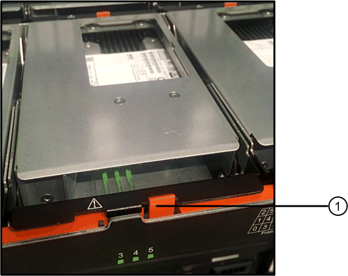

= E2800 のドライブの交換（ 60 ドライブシェルフ）
:allow-uri-read: 
:icons: font
:imagesdir: ../media/

[role="lead"]
E2800 のドライブを 60 ドライブシェルフと交換することができます。

.このタスクについて
ストレージアレイのドライブは SANtricity System Manager の Recovery Guru で監視され、ドライブ障害の兆候や実際のドライブ障害が見つかると通知されます。ドライブで障害が発生すると黄色の警告 LED が点灯します。ホットスワップに対応しており、ストレージアレイで I/O 処理を継続したまま、障害が発生したドライブを交換することができます。

この 手順 環境 DCM および DCM2 ドライブ・シェルフ

.作業を開始する前に
* のドライブ処理要件を確認します link:drives-overview-supertask-concept.html["E2800 ドライブの交換に際しての要件"]。
* 次のものがあることを確認します。
+
** ネットアップがコントローラシェルフまたはドライブシェルフにサポートする交換用ドライブ。
** ESD リストバンドを装着するか、静電気防止処置を施しておきます。
** コントローラの SANtricity System Manager にアクセスできるブラウザを備えた管理ステーション。（ System Manager インターフェイスを開くには、ブラウザでコントローラのドメイン名または IP アドレスを指定します）。

== 手順 1 ：ドライブを交換する準備をします

ドライブを交換する準備として、 SANtricity System Manager の Recovery Guru を確認し、前提となる手順を完了します。その後、障害が発生したコンポーネントを特定できます。

.手順
. SANtricity System Manager の Recovery Guru でドライブ障害の兆候が通知されましたが、ドライブがまだ使用停止になっていない場合は、 Recovery Guru の手順に従ってドライブを使用停止にします。
. 必要に応じて、 SANtricity System Manager を使用して、適切な交換用ドライブがあることを確認します。
+
.. 「 * ハードウェア * 」を選択します。
.. シェルフの図で障害が発生したドライブを選択します。
.. ドライブをクリックしてコンテキストメニューを表示し、 * 設定の表示 * を選択します。
.. 交換用ドライブの容量が交換するドライブと同じかそれよりも大きく、必要な機能を備えていることを確認します。
+
たとえば、ハードディスクドライブ（ HDD ）はソリッドステートディスク（ SSD ）とは交換しないでください。同様に、セキュリティ対応ドライブを交換する場合は、交換用ドライブもセキュリティ対応であることを確認してください。

. 必要に応じて、 SANtricity System Manager を使用して、ストレージアレイ内のドライブの場所を特定します。
+
.. シェルフにベゼルがある場合は、ベゼルを取り外さないと LED は見えません。
.. ドライブのコンテキストメニューから、 * ロケーターライトを点灯 * を選択します。
+
ドライブドロワーの警告 LED （黄色）が点滅し、正しいドライブドロワーを開いて交換が必要なドライブを特定できます。

+
image::../media/2860_dwg_attn_led_on_drawer_maint-e2800.gif[2860 dwg Attn はドロワー maint e2800 をリードしました]

+
* （ 1 ） * _Attention LED_

.. 両方のレバーを引いてドライブドロワーを外します。
.. 伸ばしたレバーを使用して、ドライブドロワーを停止するところまで慎重に引き出します。
.. ドライブドロワーで各ドライブの前面の警告 LED を確認します。
+
image::../media/2860_dwg_amber_on_drive_maint-e2800.gif[2860 DWG アンバー（ drive maint e2800 ）]

* （ 1 ） * _ 右上のドライブの警告 LED が点灯します

各ドライブの前面の左側にあるドライブドロワーの警告 LED が点灯し、 LED のすぐ後ろのドライブハンドルに警告アイコンが表示されます。

image::../media/28_dwg_e2860_de460c_attention_led_drive_maint-e2800.gif[28 dwg e2860 de460c アテンション LED drive maint e2800]

* （ 1 ） * _ 注意アイコン _

* （ 2 ） * _Attention LED_

== 手順 2 ：障害が発生したドライブを取り外す

新しいドライブに交換するために、障害が発生したドライブを取り外します。

.手順
. 交換用ドライブを開封し、静電気防止処置を施した平らな場所に置きます。
+
梱包材は、ドライブの返送が必要になったときのためにすべて保管しておいてください。

. 該当するドライブドロワーの両方のレバーをドロワーの外側に開きます。
. ドライブドロワーのレバーを慎重に引いて、ドライブドロワーをエンクロージャからは取り外さずに限界まで引き出します。
. 取り外すドライブの前面にあるオレンジのリリースラッチをそっと引いて戻します。
+
ドライブのカムハンドルが途中まで開き、ドライブがドロワーから外れます。

+

+
* （ 1 ） * _ オレンジリリースラッチ _

. カムハンドルを開き、ドライブを少し持ち上げます。
. 30 秒待ちます。
. カムハンドルをつかんでシェルフからドライブを持ち上げます。
+
image::../media/92_dwg_de6600_install_or_remove_drive_maint-e2800.gif[92 dwg de6600 install or remove drive maint e2800 ( ドライブのメンテナンスをインストールまたは削除する]

. 近くに磁場がない、静電気防止処置を施したやわらかい場所にドライブを置きます。
. ドライブが取り外されたことがソフトウェアで認識されるまで 30 秒待ちます。
+

NOTE: アクティブなドライブを誤って取り外した場合は、少なくとも 30 秒待ってから再度取り付けてください。リカバリ手順については、ストレージ管理ソフトウェアを参照してください。

== 手順 3 ：新しいドライブを取り付ける

障害が発生したドライブの代わりに、新しいドライブを取り付けます。

CAUTION: 障害が発生したドライブを取り外したあと、できるだけ早く交換用ドライブを取り付けてください。そうしないと、機器が過熱状態になるリスクがあります。

CAUTION: * データアクセスが失われる可能性 * - ドライブドロワーをエンクロージャに戻すときは、乱暴に扱わないように十分に注意してください。ドロワーに衝撃を与えたり、ストレージアレイにぶつけて破損したりしないように、ゆっくりと押し込んでください。

.手順
. 新しいドライブのカムハンドルを垂直な位置まで持ち上げます。
. ドライブキャリアの両側にある 2 つの突起ボタンをドライブドロワーのドライブチャネルにある対応するくぼみに合わせます。
+
image::../media/28_dwg_e2860_de460c_drive_cru_maint-e2800.gif[28 dwg e2860 de460c drive CRU maint e2800]

+
* （ 1 ） * _ ドライブキャリアの右側の突起ボタン _

. ドライブを真上から下ろし、ドライブがオレンジのリリースラッチの下に完全に固定されるまでカムハンドルを下に回転させます。
. ドライブドロワーをエンクロージャに慎重に戻します。ドロワーに衝撃を与えたり、ストレージアレイにぶつけて破損したりしないように、ゆっくりと押し込んでください。
. 両方のレバーを内側に押してドライブドロワーを閉じます。
+
交換したドライブが正しく挿入されていれば、ドライブドロワーの前面にある緑のアクティビティ LED が点灯します。

+
構成によっては、データが新しいドライブに自動的に再構築される場合があります。シェルフでホットスペアドライブを使用している場合は、交換したドライブにデータをコピーする前に、ホットスペアへの完全な再構築が必要になることがあります。この再構築プロセスにより、この手順を完了するまでの時間が長くなります。

== 手順 4 ：ドライブの交換後の処理

新しいドライブが正しく動作していることを確認します。

.手順
. 交換したドライブの電源 LED と警告 LED を確認します。（最初にドライブを挿入したときに警告 LED が点灯することがありますが、問題がなければ 1 分以内に消灯します）。
+
** 電源 LED が点灯または点滅し、警告 LED が消灯している：新しいドライブが正しく動作しています。
** 電源 LED が消灯している：ドライブが正しく取り付けられていない可能性があります。ドライブを取り外し、 30 秒待ってから再度取り付けてください。
** 警告 LED が点灯している：新しいドライブが故障している可能性があります。別の新しいドライブと交換してください。

. SANtricity システムマネージャの Recovery Guru にまだ問題が表示されている場合、「 * 再確認」を選択して問題が解決されたことを確認してください。
. Recovery Guru でドライブの再構築が自動的に開始されなかったことが通知された場合は、次の手順に従って再構築を手動で開始します。
+

NOTE: この処理は、テクニカルサポートまたは Recovery Guru から指示があった場合にのみ実行してください。

+
.. 「 * ハードウェア * 」を選択します。
.. 交換したドライブをクリックします。
.. ドライブのコンテキストメニューで、「 * Reconstruct * 」を選択します。
.. この処理を実行することを確定します。
+
ドライブの再構築が完了すると、ボリュームグループの状態が「最適」になります。

. 必要に応じて、ベゼルを再度取り付けます。
. 障害のある部品は、キットに付属する RMA 指示書に従ってネットアップに返却してください。

.次の手順
これでドライブの交換は完了です。通常の運用を再開することができます。
