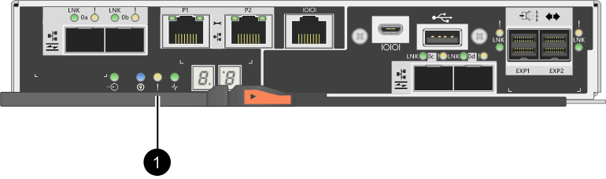

= E2800 のホストプロトコルの変更
:allow-uri-read: 
:experimental: 
:icons: font
:imagesdir: ../media/

[role="lead"]
SFP+ （光ファイバ）ホストポートを搭載した E2800 ストレージアレイを使用している場合は、ホストポートプロトコルを Fibre Channel （ FC ）から iSCSI に、または iSCSI から FC に変更できます。

コントローラ搭載のホストポート（ _Baseboard host ports_） で使用されるプロトコル、ホストインターフェイスカード上のホストポートで使用されるプロトコル（ _HIC ports_） 、またはすべてのホストポートのプロトコルを変更できます。

== 手順 1 ：デュアルプロトコル SFP があるかどうかを確認します

SANtricity System Manager を使用して、搭載されている SFP トランシーバのタイプを確認します。これらの SFP は FC と iSCSI の両方のプロトコルで使用できるため、デュアルプロトコル SFP または統合 SFP と呼ばれます。

.手順
. SANtricity システムマネージャで、 * サポート * を選択します。
. [ サポートセンター * （ Support Center * ） ] タイルを選択します。
. [ サポートリソース ] タブで、 [* ストレージアレイプロファイル * ] リンクを探して選択します。
. テキストボックスに「 * SFP * 」と入力し、「 * 検索」をクリックします。
. ストレージアレイプロファイルにリストされている各 SFP について、サポートされているデータ速度 * のエントリを探します。
+
image::../media/sam1130_ss_e2800_unified_spf_maint-e2800.gif[sam1130 ss e2800 Unified spf maint e2800]

. 次の表を参照して、 SFP を再利用できるかどうかを確認します。
+
|===
| サポートされるデータ速度 | SFP タイプ | サポートされるプロトコル 

 a| 
16Gbps 、 10Gbps 、 4Gbps 、 4Gbps
 a| 
デュアルプロトコル
 a| 
** * FC ： * 16Gbps 、 4Gbps
** ** iSCSI ： ** 10 Gbps

 a| 
25Gbps 、 10Gbps
 a| 
25Gbps 。10Gbps 、
 a| 
iSCSI のみ

 a| 
32Gbps 、 16Gbps 、 8Gbps 、 4Gbps
 a| 
32Gbps 、 16Gbps
 a| 
FC のみ

|===
+
** SFP がデュアルプロトコルの場合は、プロトコルの変更後も引き続き使用できます。
+

NOTE: デュアルプロトコル SFP では、 1Gb の iSCSI はサポートされません。ホストポートを iSCSI に変更する場合、デュアルプロトコル SFP でサポートされる接続されたポートへのリンクは 10Gb のみになることに注意してください。

** SFP が 16Gbps で、ホストポートを iSCSI に変更する場合は、プロトコルの変更後に SFP を取り外し、デュアルプロトコルまたは 10Gbps の SFP に交換する必要があります。必要に応じて、専用のツインアキシャルケーブルを使用して、 SFP で 10Gbps の iSCSI カッパーを使用することもできます。
+

NOTE: E28xx コントローラまたは E57xx コントローラでは、 8Gbps の FC SFP はサポートされません。16Gbps および 32Gbps の FC SFP のみがサポートされます。

** SFP が 10Gbps で、ホストポートを FC に変更する場合は、プロトコルの変更後にそれらのポートから SFP を取り外し、デュアルプロトコルまたは 16Gbps の SFP に交換する必要があります。

== 手順 2 ：機能パックを入手する

機能パックを入手するには、コントローラシェルフのシリアル番号、 Feature Activation Code 、およびストレージアレイの機能有効識別子が必要です。

.手順
. シリアル番号を確認します。
+
.. SANtricity システムマネージャで、メニューサポート [ サポートセンター ] を選択します。
.. Support Resources * タブを選択した状態で、 * View top storage array properties * セクションまでスクロールします。
.. シャーシのシリアル番号 * を探し、この値をテキストファイルにコピーします。
+
image::../media/sam1130_ss_e2800_storage_array_profile_sn_smid_copy_maint-e2800.gif[sam1130 ss e2800 storage array profile snsmid copy maint e2800 です]

. 機能パックサブモデル ID * を確認します。
+
.. [ サポートリソース ] タブで、 [* ストレージアレイプロファイル * ] リンクを探して選択します。
.. テキストボックスに * feature pack サブモデル ID* と入力し、 * 検索 * をクリックします。
.. 変更前の構成の機能パックサブモデル ID を確認します。
+
image::../media/storage_array_profile2_maint-e2800.gif[storage array profile2 maint e2800]

. 機能パックサブモデル ID を使用して、変更前の構成の対応するコントローラサブモデル ID を確認し、以下の表から変更後の構成の Feature Activation Code を探します。次に、その Feature Activation Code をテキストファイルにコピーします。
+
|===
3+| 変更前の構成 3+| 変更後の構成 .2+| Feature Activation Code （機能アクティベーションコード） 

| コントローラサブモデル ID | ベースボードポート | HIC ポート | コントローラサブモデル ID | ベースボードポート | HIC ポート 

 a| 
318
 a| 
FC
 a| 
FC
 a| 
319
 a| 
FC
 a| 
iSCSI
 a| 
ZGW-4L2-Z36IJ

 a| 
320
 a| 
iSCSI
 a| 
FC
 a| 
4GZ-NL2-Z4NRP

 a| 
321
 a| 
iSCSI
 a| 
iSCSI
 a| 
TG2-7L2-Z5485

 a| 
_no HIC か光 HIC ではありません _
 a| 
321
 a| 
iSCSI
 a| 
TG2-7L2-Z5485

 a| 
319
 a| 
FC
 a| 
iSCSI
 a| 
318
 a| 
FC
 a| 
FC
 a| 
1G5 - QL2 - Z7LFC

 a| 
320
 a| 
iSCSI
 a| 
FC
 a| 
FG7-AL2-Z82RW

 a| 
321
 a| 
iSCSI
 a| 
iSCSI
 a| 
5G7-0K2-Z0G8X

 a| 
320
 a| 
iSCSI
 a| 
FC
 a| 
318
 a| 
FC
 a| 
FC
 a| 
4GP-HL2-ZYRKP

 a| 
319
 a| 
FC
 a| 
iSCSI
 a| 
PGU-KL2-Z1P7I

 a| 
321
 a| 
iSCSI
 a| 
iSCSI
 a| 
BGA-8K2-ZQWM5

 a| 
321
 a| 
iSCSI
 a| 
iSCSI
 a| 
318
 a| 
FC
 a| 
FC
 a| 
SGH-UK2-ZUCJG

 a| 
319
 a| 
FC
 a| 
iSCSI
 a| 
1GK-EK2-ZVSW1

 a| 
320
 a| 
iSCSI
 a| 
FC
 a| 
AGM - XL2 - ZWA8A

|===
+
|===
3+| 変更前の構成 3+| 変更後の構成 .2+| Feature Activation Code （機能アクティベーションコード） 

| コントローラサブモデル ID | ベースボードポート | HIC ポート | コントローラサブモデル ID | ベースボードポート | HIC ポート 

 a| 
338
 a| 
FC
 a| 
FC
 a| 
339
 a| 
FC
 a| 
iSCSI
 a| 
PGC-RK2-ZREUT

 a| 
340
 a| 
iSCSI
 a| 
FC
 a| 
MGF-BK2-ZSU3Z

 a| 
341
 a| 
iSCSI
 a| 
iSCSI
 a| 
NGR-1L2-ZZ8QC

 a| 
_no HIC か光 HIC ではありません _
 a| 
341
 a| 
iSCSI
 a| 
NGR-1L2-ZZ8QC

 a| 
339
 a| 
FC
 a| 
iSCSI
 a| 
338
 a| 
FC
 a| 
FC
 a| 
DGT-7M2 - ZKBMD

 a| 
340
 a| 
iSCSI
 a| 
FC
 a| 
GGA - TL2 - Z9J50

 a| 
341
 a| 
iSCSI
 a| 
iSCSI
 a| 
WGC - DL2 - ZBZIB

 a| 
340
 a| 
iSCSI
 a| 
FC
 a| 
338
 a| 
FC
 a| 
FC
 a| 
4GM-km2 - ZGWS1

 a| 
339
 a| 
FC
 a| 
iSCSI
 a| 
PG0-4M2-ZHDZ6

 a| 
341
 a| 
iSCSI
 a| 
iSCSI
 a| 
XGR-NM2-ZJUGR

 a| 
341
 a| 
iSCSI
 a| 
iSCSI
 a| 
338
 a| 
FC
 a| 
FC
 a| 
3GE-WL2-ZCHNY

 a| 
339
 a| 
FC
 a| 
iSCSI
 a| 
FGH-HL2-ZDY3R

 a| 
340
 a| 
iSCSI
 a| 
FC
 a| 
VGJ-1L2-ZFFEW

|===
+

NOTE: この表にコントローラサブモデル ID が記載されていない場合は、にお問い合わせください http://mysupport.netapp.com["ネットアップサポート"^]。

. System Manager で、機能有効識別子を確認します。
+
.. メニュー「 Settings （設定）」 [ System （システム） ] に移動します。
.. 下にスクロールして * アドオン * を表示します。
.. * 機能パックの変更 * で、 * 機能有効識別子 * を探します。
.. この 32 桁の番号をコピーしてテキストファイルに貼り付けます。
+
image::../media/sam1130_ss_e2800_change_feature_pack_feature_enable_identifier_copy_maint-e2800.gif[sam1130 ss e2800 変更機能パックのイネーブル ID コピー maint e2800]

. に進みます http://partnerspfk.netapp.com["ネットアップライセンスのアクティブ化：ストレージアレイプレミアム機能のアクティブ化"^]をクリックし、機能パックの入手に必要な情報を入力します。
+
** シャーシのシリアル番号
** Feature Activation Code （機能アクティベーションコード）
** 機能有効識別子
+

NOTE: プレミアム機能ライセンス認証 Web サイトには、「プレミアム機能ライセンス認証手順」へのリンクがあります。 この手順では、この手順を使用しないでください。

. 機能パックのキーファイルを E メールで受け取るかサイトから直接ダウンロードするかを選択します。

== 手順 3 ：ホスト I/O を停止します

ホストポートのプロトコルを変更する前に、ホストからの I/O 処理をすべて停止する必要があります。変更が完了するまではストレージアレイのデータにアクセスできません。

.手順
. ストレージアレイと接続されているすべてのホストの間で I/O 処理が発生しないようにします。たとえば、次の手順を実行します。
+
** ストレージからホストにマッピングされた LUN に関連するすべてのプロセスを停止します。
** ストレージからホストにマッピングされた LUN にアプリケーションがデータを書き込んでいないことを確認します。
** アレイのボリュームに関連付けられているファイルシステムをすべてアンマウントします。
+

NOTE: ホスト I/O 処理を停止する具体的な手順はホストオペレーティングシステムや構成によって異なり、ここでは説明していません。環境内でホスト I/O 処理を停止する方法がわからない場合は、ホストをシャットダウンすることを検討してください。

+

CAUTION: * データ損失の可能性 * - I/O 処理の実行中にこの手順を続行すると、ストレージがアクセスできないため、ホストアプリケーションがデータにアクセスできなくなる可能性があります。

. ストレージアレイでミラー関係が確立されている場合は、セカンダリストレージアレイのすべてのホスト I/O 処理を停止します。
. キャッシュメモリ内のデータがドライブに書き込まれるまで待ちます。
+
キャッシュされたデータをドライブに書き込む必要がある場合は、各コントローラの背面にある緑のキャッシュアクティブ LED が点灯します。この LED が消灯するまで待つ必要があります。

+
|===
| コールアウト | ホストポートのタイプ 

 a| 
* （ 1 ） *
 a| 
キャッシュアクティブ LED

|===
. SANtricity システムマネージャのホームページで、「 * 進行中の操作を表示」を選択します。
. すべての処理が完了するまで待ってから、次の手順に進みます。

== 手順 4 ：機能パックを変更する

機能パックを変更して、ベースボードホストポート、 IB HIC ポート、または両方のタイプのポートのホストプロトコルを変更します。

.手順
. SANtricity システムマネージャで、 [MENU: Settings （メニュー：設定） ] [System] （システム）を選択します。
. [ * アドオン * ] で、 [ * 機能パックの変更 * ] を選択します。
+
image::../media/sam1130_ss_system_change_feature_pack_maint-e2800.gif[sam1130 ss system change feature pack maint e2800]

. [ * 参照 ] をクリックし、適用する機能パックを選択します。
. フィールドに「 CHANGE 」と入力します。
. [ 変更（ Change ） ] をクリックします。
+
機能パックの移行が開始されます。両方のコントローラが自動的に 2 回リブートし、新しい機能パックが有効になります。リブートが完了すると、ストレージアレイは応答可能な状態に戻ります。

. ホストポートのプロトコルが想定したプロトコルになっていることを確認します。
+
.. SANtricity システムマネージャで、 * ハードウェア * を選択します。
.. Show back of shelf* （シェルフの背面を表示）をクリックします。
.. コントローラ A またはコントローラ B の図を選択します
.. コンテキストメニューから * 表示設定 * （ * View settings * ）を選択します。
.. [ * ホスト・インターフェイス * ] タブを選択します。
.. [ 詳細設定を表示する *] をクリックします。
.. ベースボードポートと HIC ポート（「 'sot 1' 」というラベルが付いたポート）の詳細を確認し、各タイプのポートのプロトコルが想定したプロトコルになっていることを確認します。

に進みます link:hpp-complete-protocol-conversion-task.html["ホストプロトコル変更後の処理"]。
