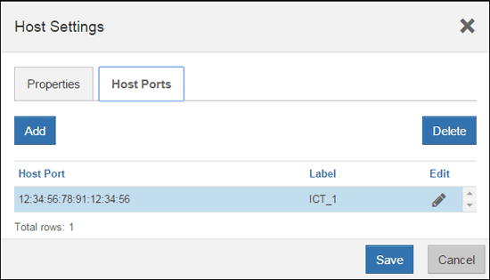

= E2800 のホストプロトコル変更後の処理
:allow-uri-read: 
:experimental: 
:icons: font
:imagesdir: ../media/

[role="lead"]
ホストポートのプロトコルを変更したあと、新しいプロトコルを使用する前に追加の手順を実行する必要があります。

この手順は、ベースボードホストポートおよび HIC ポートの変更前と変更後のプロトコルによって異なります。

== FC から iSCSI への変換を完了します

すべてのホストポートを FC から iSCSI に変換した場合は、 iSCSI ネットワークを設定する必要があります。

.手順
. スイッチを設定します。
+
iSCSI トラフィックの転送に使用するスイッチは、ベンダーの iSCSI に関する推奨事項に従って設定する必要があります。これらの推奨事項には、設定の指示とコードの更新が含まれる場合があります。

. SANtricity System Manager で、メニュー：ハードウェア [iSCSI ポートの設定 ] を選択します。
. ポート設定を選択します。
+
iSCSI ネットワークはさまざまな方法でセットアップできます。環境に最適な構成を選択するには、ネットワーク管理者に相談してください。

. SANtricity システムマネージャでホスト定義を更新します。
+

NOTE: ホストまたはホストクラスタを追加する手順を確認する必要がある場合は、 SANtricity System Manager のオンラインヘルプを参照してください。

+
.. メニューから「 Storage [Hosts] 」を選択します。
.. ポートを関連付けるホストを選択し、 * 表示 / 設定の編集 * をクリックします。
+
ホスト設定ダイアログボックスが表示されます。

.. [ ホストポート *] タブをクリックします。
+
ダイアログボックス]

.. [ * 追加 ] をクリックし、 [ * ホスト・ポートの追加 * ] ダイアログ・ボックスを使用して、新しいホスト・ポート識別子をホストに関連付けます。
+
ホストポート識別子名の長さは、ホストインターフェイスのテクノロジによって決まります。FC のホストポート識別子名は 16 文字です。iSCSI のホストポート識別子名は最大 223 文字です。ポートは一意である必要があります。すでに設定されているポート番号は使用できません。

.. 削除 * をクリックし、 * ホストポートの削除 * ダイアログボックスを使用して、ホストポート識別子を削除（関連付けを解除）します。
+
* Delete * オプションを使用しても、ホスト・ポートは物理的には削除されません。このオプションを選択すると、ホストポートとホストの間の関連付けが削除されます。ホストバスアダプタまたは iSCSI イニシエータを削除しないかぎり、ホストポートは引き続きコントローラで認識されます。

.. [Save] をクリックして、ホストポート識別子の設定に変更を適用します。
.. 上記の手順を繰り返して、すべてのホストポート識別子の追加と削除を行います。

. LUN が正しく検出されるように、ホストをリブートするか再スキャンを実行します。
. ボリュームを再マウントするか、ブロックボリュームの使用を開始します。

== iSCSI から FC への変換を完了

すべてのホストポートを iSCSI から FC に変換した場合は、 FC ネットワークを設定する必要があります。

.手順
. HBA ユーティリティをインストールし、イニシエータの WWPN を確認します。
. スイッチをゾーニングします。
+
スイッチをゾーニングすることで、ホストをストレージに接続し、パスの数を制限することができます。スイッチのゾーニングはスイッチの管理インターフェイスで設定します。

. SANtricity システムマネージャでホスト定義を更新します。
+
.. メニューから「 Storage [Hosts] 」を選択します。
.. ポートを関連付けるホストを選択し、 * 表示 / 設定の編集 * をクリックします。
+
ホスト設定ダイアログボックスが表示されます。

.. [ ホストポート *] タブをクリックします。
+
ダイアログ]

.. [ * 追加 ] をクリックし、 [ * ホスト・ポートの追加 * ] ダイアログ・ボックスを使用して、新しいホスト・ポート識別子をホストに関連付けます。
+
ホストポート識別子名の長さは、ホストインターフェイスのテクノロジによって決まります。FC のホストポート識別子名は 16 文字です。iSCSI のホストポート識別子名は最大 223 文字です。ポートは一意である必要があります。すでに設定されているポート番号は使用できません。

.. 削除 * をクリックし、 * ホストポートの削除 * ダイアログボックスを使用して、ホストポート識別子を削除（関連付けを解除）します。
+
* Delete * オプションを使用しても、ホスト・ポートは物理的には削除されません。このオプションを選択すると、ホストポートとホストの間の関連付けが削除されます。ホストバスアダプタまたは iSCSI イニシエータを削除しないかぎり、ホストポートは引き続きコントローラで認識されます。

.. [Save] をクリックして、ホストポート識別子の設定に変更を適用します。
.. 上記の手順を繰り返して、すべてのホストポート識別子の追加と削除を行います。

. マッピングされたストレージが正しく検出されるように、ホストをリブートするか再スキャンを実行します。
. ボリュームを再マウントするか、ブロックボリュームの使用を開始します。

== FC から FC / iSCSI への変換を実行する

FC ホストポートのみを使用していた環境で、そのうちの一部のポートを iSCSI に変換した場合は、 iSCSI をサポートするために既存の設定の変更が必要になることがあります。

新しい iSCSI ポートを使用するには、次のいずれかのオプションを使用します。具体的な手順は、現在および計画しているネットワークトポロジによって異なります。オプション 1 は、新しい iSCSI ホストをアレイに接続する場合です。オプション 2 は、変換したポートに接続されているホストを FC から iSCSI に変換する場合です。

=== オプション 1 ： FC ホストを移動して新しい iSCSI ホストを追加する

. FC ホストを新しい iSCSI ポートから FC のまま残すポートに移動します。
. デュアルプロトコル SFP を使用していない場合は、 FC SFP をすべて取り外します。
. 新しい iSCSI ホストを上記のポートに直接またはスイッチを使用して接続します。
. 新しいホストおよびポートに対して iSCSI ネットワークを設定します。手順については、を参照してください link:../config-linux/index.html["Linux の簡単な設定"]、 link:../config-windows/index.html["Windows の簡単な設定"]または link:../config-vmware/index.html["VMware の簡単な設定"]。

=== オプション 2 ： FC ホストを iSCSI に変換する

. 変換したポートに接続されている FC ホストをシャットダウンします。
. 変換したポートの iSCSI トポロジを構成します。たとえば、スイッチを FC から iSCSI に変換します。
. デュアルプロトコル SFP を使用していない場合は、 FC SFP を変換したポートから取り外して iSCSI SFP またはデュアルプロトコル SFP に交換します。
. 変換したポートの SFP にケーブルを接続し、ケーブルが正しい iSCSI スイッチまたはホストに接続されていることを確認します。
. ホストの電源をオンにします。
. を使用します https://mysupport.netapp.com/NOW/products/interoperability["NetApp Interoperability Matrix を参照してください"^] iSCSI ホストを構成するためのツール。
. ホストパーティションを編集し、 iSCSI ホストポート ID を追加して FC ホストポート ID を削除します。
. iSCSI ホストのリブート後、ボリュームを登録してオペレーティングシステムで使用できるようにするための手順を各ホストで実行します。
+
** smcliコマンドを使用できます。 `-identifyDevices` をクリックして、ボリュームに適用可能なデバイス名を表示します。SMcliはSANtricity OSに含まれており、SANtricityシステムマネージャからダウンロードできます。SANtricityシステムマネージャからSMcliをダウンロードする方法の詳細については、 https://docs.netapp.com/us-en/e-series-santricity/sm-settings/download-cli.html["SANtricity System Managerオンラインヘルプのコマンドラインインターフェイス（CLI）のダウンロードのトピック"^]。
** オペレーティングシステムに付属の特定のツールやオプションを使用して、ボリュームを使用できるようにする（ドライブレターの割り当て、マウントポイントの作成など）必要がある場合があります。詳細については、ホストオペレーティングシステムのドキュメントを参照してください。

== iSCSI から FC / iSCSI への変換を完了します

iSCSI ホストポートのみを使用していた環境で、そのうちの一部のポートを FC に変換した場合は、 FC をサポートするために既存の設定の変更が必要になることがあります。

新しい FC ポートを使用するには、次のいずれかのオプションを使用します。具体的な手順は、現在および計画しているネットワークトポロジによって異なります。オプション 1 は、新しい FC ホストをアレイに接続する場合です。オプション 2 は、変換したポートに接続されているホストを iSCSI から FC に変換する場合です。

=== オプション 1 ： iSCSI ホストを移動して新しい FC ホストを追加する

. iSCSI ホストを新しい FC ポートから iSCSI のまま残すポートに移動します。
. デュアルプロトコル SFP を使用していない場合は、 FC SFP をすべて取り外します。
. 新しい FC ホストを上記のポートに直接またはスイッチを使用して接続します。
. 新しいホストおよびポートに対して FC ネットワークを設定します。手順については、を参照してください link:../config-windows/index.html["Linux の簡単な設定"]、 link:../config-windows/index.html["Windows の簡単な設定"]または link:../config-vmware/index.html["VMware の簡単な設定"]。

=== オプション 2 ： iSCSI ホストを FC に変換する

. 変換したポートに接続されている iSCSI ホストをシャットダウンします。
. 変換したポートに対して FC トポロジを構成します。たとえば、スイッチを iSCSI から FC に変換します。
. デュアルプロトコル SFP を使用していない場合は、 iSCSI SFP を変換したポートから取り外して FC SFP またはデュアルプロトコル SFP に交換します。
. 変換したポートの SFP にケーブルを接続し、ケーブルが正しい FC スイッチまたはホストに接続されていることを確認します。
. ホストの電源をオンにします。
. を使用します https://mysupport.netapp.com/NOW/products/interoperability["NetApp Interoperability Matrix を参照してください"^] FC ホストを設定するツール。
. ホストパーティションを編集し、 FC ホストポート ID を追加して iSCSI ホストポート ID を削除します。
. 新しい FC ホストがリブートしたら、ボリュームを登録してオペレーティングシステムで使用できるようにするための手順を各ホストで実行します。
+
** smcliコマンドを使用できます。 `-identifyDevices` をクリックして、ボリュームに適用可能なデバイス名を表示します。SMcliはSANtricity OSに含まれており、SANtricityシステムマネージャからダウンロードできます。SANtricityシステムマネージャからSMcliをダウンロードする方法の詳細については、 https://docs.netapp.com/us-en/e-series-santricity/sm-settings/download-cli.html["SANtricity System Managerオンラインヘルプのコマンドラインインターフェイス（CLI）のダウンロードのトピック"^]。
** オペレーティングシステムに付属の特定のツールやオプションを使用して、ボリュームを使用できるようにする（ドライブレターの割り当て、マウントポイントの作成など）必要がある場合があります。詳細については、ホストオペレーティングシステムのドキュメントを参照してください。

== FC / iSCSI から FC への変換を実行

FC ホストポートと iSCSI ホストポートを組み合わせて使用していた環境で、すべてのポートを FC に変換した場合は、新しい FC ポートを使用するために既存の設定の変更が必要になることがあります。

新しい FC ポートを使用するには、次のいずれかのオプションを使用します。具体的な手順は、現在および計画しているネットワークトポロジによって異なります。オプション 1 は、新しい FC ホストをアレイに接続する場合です。オプション 2 は、ポート 1 およびポート 2 に接続されているホストを iSCSI から FC に変換する場合です。

=== オプション 1 ： iSCSI ホストを削除して FC ホストを追加する

. デュアルプロトコル SFP を使用していない場合は、 iSCSI SFP をすべて取り外して FC SFP またはデュアルプロトコル SFP に交換します。
. デュアルプロトコル SFP を使用していない場合は、 FC SFP をすべて取り外します。
. 新しい FC ホストを上記のポートに直接またはスイッチを使用して接続します
. 新しいホストおよびポートに対して FC ネットワークを設定します。手順については、を参照してください link:../config-linux/index.html["Linux の簡単な設定"]、 link:../config-windows/index.html["Windows の簡単な設定"]または link:../config-vmware/index.html["VMware の簡単な設定"]。

=== オプション 2 ： iSCSI ホストを FC に変換する

. 変換したポートに接続されている iSCSI ホストをシャットダウンします。
. これらのポートに対して FC トポロジを構成します。たとえば、ホストに接続されているスイッチを iSCSI から FC に変換します。
. デュアルプロトコル SFP を使用していない場合は、 iSCSI SFP をポートから取り外して FC SFP またはデュアルプロトコル SFP に交換します。
. SFP にケーブルを接続し、ケーブルが正しい FC スイッチまたはホストに接続されていることを確認します。
. ホストの電源をオンにします。
. を使用します https://mysupport.netapp.com/NOW/products/interoperability["NetApp Interoperability Matrix を参照してください"^] FC ホストを設定するツール。
. ホストパーティションを編集し、 FC ホストポート ID を追加して iSCSI ホストポート ID を削除します。
. 新しい FC ホストがリブートしたら、ボリュームを登録してオペレーティングシステムで使用できるようにするための手順を各ホストで実行します。
+
** smcliコマンドを使用できます。 `-identifyDevices` をクリックして、ボリュームに適用可能なデバイス名を表示します。SMcliはSANtricity OSに含まれており、SANtricityシステムマネージャからダウンロードできます。SANtricityシステムマネージャからSMcliをダウンロードする方法の詳細については、 https://docs.netapp.com/us-en/e-series-santricity/sm-settings/download-cli.html["SANtricity System Managerオンラインヘルプのコマンドラインインターフェイス（CLI）のダウンロードのトピック"^]。
** オペレーティングシステムに付属の特定のツールやオプションを使用して、ボリュームを使用できるようにする（ドライブレターの割り当て、マウントポイントの作成など）必要がある場合があります。詳細については、ホストオペレーティングシステムのドキュメントを参照してください。

== FC / iSCSI から iSCSI への変換を完了します

FC ホストポートと iSCSI ホストポートを組み合わせて使用していた環境で、すべてのポートを iSCSI に変換した場合は、新しい iSCSI ポートを使用するために既存の設定の変更が必要になることがあります。

新しい iSCSI ポートを使用するには、次のいずれかのオプションを使用します。具体的な手順は、現在および計画しているネットワークトポロジによって異なります。オプション 1 は、新しい iSCSI ホストをアレイに接続する場合です。オプション 2 は、ホストを FC から iSCSI に変換する場合です。

=== オプション 1 ： FC ホストを削除して iSCSI ホストを追加する

. デュアルプロトコル SFP を使用していない場合は、すべての FC SFP を取り外して iSCSI SFP またはデュアルプロトコル SFP に交換します。
. 新しい iSCSI ホストを上記のポートに直接またはスイッチを使用して接続します。
. 新しいホストおよびポートに対して iSCSI ネットワークを設定します。手順については、を参照してください link:../config-linux/index.html["Linux の簡単な設定"]、 link:../config-windows/index.html["Windows の簡単な設定"]または link:../config-vmware/index.html["VMware の簡単な設定"]。

=== オプション 2 ： FC ホストを iSCSI に変換する

. 変換したポートに接続されている FC ホストをシャットダウンします。
. これらのポートに対して iSCSI トポロジを構成します。たとえば、ホストに接続されているスイッチを FC から iSCSI に変換します。
. デュアルプロトコル SFP を使用していない場合は、 FC SFP をポートから取り外して iSCSI SFP またはデュアルプロトコル SFP に交換します。
. SFP にケーブルを接続し、ケーブルが正しい iSCSI スイッチまたはホストに接続されていることを確認します。
. ホストの電源をオンにします。
. を使用します https://mysupport.netapp.com/NOW/products/interoperability["NetApp Interoperability Matrix を参照してください"^] iSCSI ホストを構成するためのツール。
. ホストパーティションを編集し、 iSCSI ホストポート ID を追加して FC ホストポート ID を削除します。
. 新しい iSCSI ホストがリブートしたら、ボリュームを登録してオペレーティングシステムで使用できるようにするための手順を各ホストで実行します。
+
** smcliコマンドを使用できます。 `-identifyDevices` をクリックして、ボリュームに適用可能なデバイス名を表示します。SMcliはSANtricity OSに含まれており、SANtricityシステムマネージャからダウンロードできます。SANtricityシステムマネージャからSMcliをダウンロードする方法の詳細については、 https://docs.netapp.com/us-en/e-series-santricity/sm-settings/download-cli.html["SANtricity System Managerオンラインヘルプのコマンドラインインターフェイス（CLI）のダウンロードのトピック"^]。
** オペレーティングシステムに付属の特定のツールやオプションを使用して、ボリュームを使用できるようにする（ドライブレターの割り当て、マウントポイントの作成など）必要がある場合があります。詳細については、ホストオペレーティングシステムのドキュメントを参照してください。

