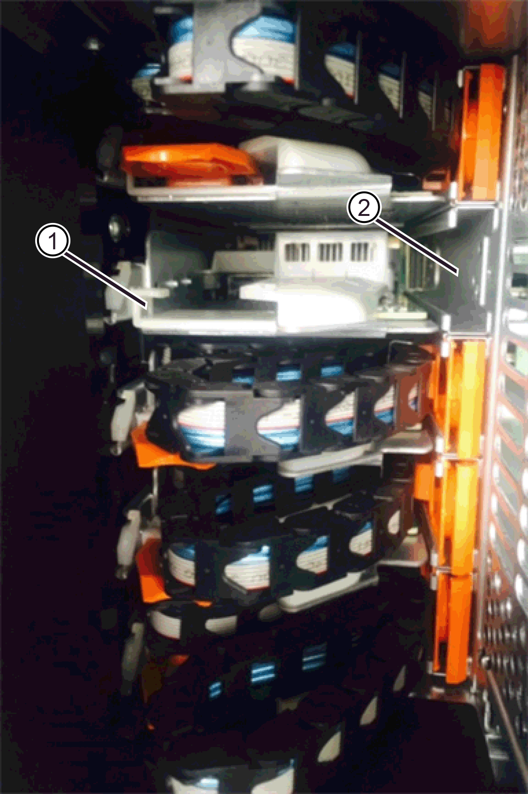

= ドライブドロワーの交換- E4000（60ドライブシェルフ）
:allow-uri-read: 
:experimental: 
:icons: font
:imagesdir: ../media/

[role="lead"]
E4060 コントローラシェルフまたは DE460C ドライブシェルフに搭載されたドライブドロワーを交換することができます。

.このタスクについて
E4060 コントローラシェルフまたは DE460C ドライブシェルフの障害が発生したドライブドロワーを交換する手順は、ドロワー内のボリュームがドロワー損失の保護で保護されているかどうかによって異なります。ドライブドロワー内のすべてのボリュームがドロワー損失の保護が有効なディスクプールまたはボリュームグループに含まれている場合は、この手順をオンラインで実行できます。それ以外の場合は、ドライブドロワーを交換する前に、ホストの I/O アクティビティをすべて停止し、シェルフの電源をオフにする必要があります。

.作業を開始する前に
* ドライブシェルフが次のすべての条件を満たしていることを確認します。
+
** ドライブシェルフが過熱状態になっていない必要があります。
** 両方のファンが取り付けられていて、ステータスが「最適」である必要があります。
** ドライブシェルフのすべてのコンポーネントが設置されている必要があります。
** ドライブドロワー内のボリュームがデグレード状態でないこと。
+

CAUTION: * データアクセスが失われる可能性 * - ボリュームがすでにデグレード状態の場合、ドライブドロワーからドライブを取り外すと、ボリュームが使用停止になることがあります。

* 次のものがあることを確認します。
+
** 交換用ドライブドロワー
** ESD リストバンドを装着するか、静電気防止処置を施しておきます。
** 懐中電灯。
** ドロワーからドライブを取り外すときに各ドライブの場所を記入するための油性ペン。
** ストレージアレイのコマンドラインインターフェイス（ CLI ）にアクセスします。CLI にアクセスできない場合は、次のいずれかを実行できます。
+
*** * SANtricity System Manager （バージョン 11.60 以降） * - System Manager から CLI パッケージ（ zip ファイル）をダウンロードします。[ 設定 ] 、 [ システム ] 、 [ アドオン ] 、 [ コマンドラインインターフェイス ] の順に選択します。次に、 DOS C ：プロンプトなどのオペレーティングシステムプロンプトから問題 CLI コマンドを実行します。
*** * SANtricity Storage Manager/Enterprise Management Window （ EMW ）：ソフトウェアをダウンロードしてインストールするには ' エクスプレス・ガイドの指示に従ってくださいEMW から CLI コマンドを実行するには、次のメニューを選択します： Tools [Execute Script]

NOTE: EシリーズDE460c拡張シェルフの交換方法については、を参照してください https://kb.netapp.com/on-prem/E-Series/Hardware-KBs/How_to_replace_an_E_Series_DE460c_controller_expansion_shelf["NetAppナレッジベース"^]。

== 手順 1 ：ドライブドロワーを交換する準備を行います

ドライブシェルフがオンラインのときに交換用手順を実行できるかどうか、またはホストの I/O アクティビティを停止してシェルフの電源をオフにする必要があるかどうかを判断します。

ドロワーを交換するシェルフでドロワー損失の保護が有効になっていれば、ホストの I/O アクティビティを停止してシェルフの電源をオフにする必要はありません。

.手順
. ドライブシェルフの電源がオンになっているかどうかを確認します。
+
** 電源がオフになっている場合は、 CLI コマンドを問題に切り替える必要はありません。に進みます <<手順 2 ：ケーブルチェーンを取り外す>>。
** 電源がオンになっている場合は、次の手順に進みます。

. CLI にアクセスし、次のコマンドを入力します。
+
[listing]
----
SMcli <ctlr_IP1\> -p "array_password" -c "set tray [trayID] drawer [drawerID]
serviceAllowedIndicator=on;"
----
+
ここで、

+
** 「 <CTLR_IP1> 」は、コントローラの識別子です。
** 「 array_password 」は、ストレージ・アレイのパスワードです。「 array_password 」の値は二重引用符（ "" ）で囲む必要があります。
** 「 [trayID] 」は、交換するドライブドロワーが格納されているドライブシェルフの識別子です。ドライブシェルフ ID の値は 0~99 のいずれかです。trayID の値は角かっこで囲む必要があります。
** 「 [drawerID] 」は、交換するドライブドロワーの識別子です。ドロワー ID の値は 1 （一番上のドロワー） ~5 （一番下のドロワー）のいずれかです。「 rawerID 」の値は角かっこで囲む必要があります。
+
ドライブシェルフ 10 の一番上のドロワーを取り外す場合のコマンドは次のとおりです。

+
[listing]
----
SMcli <ctlr_IP1\> -p "safety-1" -c "set tray [10] drawer [1]
serviceAllowedIndicator=forceOnWarning;"
----
. ホストの I/O アクティビティを停止する必要があるかどうかを次のようにして判断します。
+
** コマンドが成功した場合は、ホストの I/O アクティビティを停止する必要はありません。ドロワー内のすべてのドライブがドロワー損失の保護が有効なプールまたはボリュームグループに含まれています。に進みます <<手順 2 ：ケーブルチェーンを取り外す>>。
+

CAUTION: * ドライブの破損の可能性 * -- コマンドが完了してからドライブドロワーを開くまで、 60 秒待ちます。60 秒待つとドライブがスピンダウンし、ハードウェアの破損を防ぐことができます。

** このコマンドを完了できなかったことを示す警告が表示された場合は、ドロワーを取り外す前にホストの I/O アクティビティを停止する必要があります。この警告は、該当するドロワー内の 1 つ以上のドライブがドロワー損失の保護が有効になっていないプールまたはボリュームグループに含まれている場合に表示されます。データ損失を防ぐには、次の手順を実行して、ホストの I/O アクティビティを停止し、ドライブシェルフとコントローラシェルフの電源をオフにする必要があります。

. ストレージアレイと接続されているすべてのホストの間で I/O 処理が発生しないようにします。たとえば、次の手順を実行します。
+
** ストレージからホストにマッピングされた LUN に関連するすべてのプロセスを停止します。
** ストレージからホストにマッピングされた LUN にアプリケーションがデータを書き込んでいないことを確認します。
** アレイのボリュームに関連付けられているファイルシステムをすべてアンマウントします。
+

NOTE: ホスト I/O 処理を停止する具体的な手順はホストオペレーティングシステムや構成によって異なり、ここでは説明していません。環境内でホスト I/O 処理を停止する方法がわからない場合は、ホストをシャットダウンすることを検討してください。

. ストレージアレイでミラー関係が確立されている場合は、セカンダリストレージアレイのすべてのホスト I/O 処理を停止します。
+

CAUTION: * データ損失の可能性 * - I/O 処理の実行中にこの手順を続行すると、ストレージアレイにアクセスできないため、ホストアプリケーションがデータを失う可能性があります。

. キャッシュメモリ内のデータがドライブに書き込まれるまで待ちます。
+
キャッシュされたデータをドライブに書き込む必要がある場合は、各コントローラの背面にある緑のキャッシュアクティブ LED が点灯します。この LED が消灯するまで待つ必要があります。

. SANtricity システムマネージャのホームページで、「 * 進行中の操作を表示」を選択します。
. すべての処理が完了するまで待ってから、次の手順に進みます。
. 次のいずれかの手順に従って、シェルフの電源をオフにします。
+
** _ シェルフ * のドロワーを * ドロワー損失の保護で交換する場合 _ ：シェルフの電源をオフにする必要はありません。ドライブドロワーをオンラインにした状態で手順の交換を実行できます。これは、 Set Drawer Service Action Allowed Indicator CLI コマンドが正常に完了したためです。
** _ コントローラ * シェルフ内のドロワーを交換する際に * ドロワー損失の保護が有効でない場合 _ ：
+
... コントローラシェルフの両方の電源スイッチをオフにします。
... コントローラシェルフのすべての LED が消灯するまで待ちます。

** _ 拡張ドライブシェルフ * でドロワーを交換する場合 * ドロワー損失の保護なし _ ：
+
... コントローラシェルフの両方の電源スイッチをオフにします。
... コントローラシェルフのすべての LED が消灯するまで待ちます。
... ドライブシェルフの両方の電源スイッチをオフにします。
... ドライブのアクティビティが停止するまで 2 分待ちます。

== 手順 2 ：ケーブルチェーンを取り外す

障害が発生したドライブドロワーを取り外して交換できるように、両方のケーブルチェーンを取り外します。

.このタスクについて
各ドライブドロワーに左右 2 つのケーブルチェーンがあります。ドロワーは左右のケーブルチェーンでスライドして出し入れできます。

ケーブルチェーンの金属製の両端をエンクロージャ内部の対応する水平ガイドレールと垂直ガイドレールに沿って次のようにスライドします。

* 左右の垂直ガイドレールを使用して、ケーブルチェーンをエンクロージャのミッドプレーンに接続します。
* 左右の水平ガイドレールを使用して、ケーブルチェーンを個々のドロワーに接続します。

CAUTION: * ハードウェアの破損の可能性 * -- ドライブトレイの電源が入っている場合は ' ケーブルチェーンの両端が取り外されるまで電源が入ったままになります機器のショートを防ぐために、ケーブルチェーンのもう一方の端がまだ接続されているときは、取り外したケーブルチェーンのコネクタが金属製のシャーシに触れないようにしてください。

.手順
. ドライブシェルフとコントローラシェルフの I/O アクティビティがなくなり、電源がオフになっていること、または「 S et Drawer Attention Indicator 」 CLI コマンドを発行したことを確認します。
. ドライブシェルフの背面から、右側のファンキャニスターを取り外します。
+
.. オレンジのタブを押してファンキャニスターのハンドルを外します。
+
次の図は、ファンキャニスターのハンドルを伸ばして左側のオレンジのタブから外した状態を示しています。

+
image::../media/28_dwg_e2860_de460c_fan_canister_handle_with_callout_maint-e2800.gif[ファンキャニスターのハンドル]

+
* （ 1 ） * _ ファンキャニスターハンドル _

.. ハンドルを使用してファンキャニスターをドライブトレイから引き出し、脇に置きます。
.. トレイの電源がオンになっている場合は、左側のファンの速度が最大まで上がっていることを確認します。
+

CAUTION: * 過熱による機器の破損の可能性 * -- トレイの電源が入っている場合は、両方のファンを同時に取り外さないでください。そうしないと、機器が過熱状態になる可能性があり

. 取り外すケーブルチェーンを特定します。
+
** 電源がオンになっている場合は、ドロワー前面の黄色の警告 LED が点灯して、取り外す必要があるケーブルチェーンが示されます。
** 電源がオフになっている場合は、 5 つのうちのどのケーブルチェーンを取り外すかを手動で確認する必要があります。次の図は、ファンキャニスターを取り外したドライブシェルフの右側を示しています。ファンキャニスターを取り外してあるので、 5 つのケーブルチェーンと各ドロワーの垂直コネクタおよび水平コネクタを確認できます。
+
一番上のケーブルチェーンがドライブドロワー 1 に接続され、一番下のケーブルチェーンがドライブドロワー 5 に接続されています。ドライブドロワー 1 を例に説明します。

+
image::../media/trafford_cable_rail_1_maint-e2800.gif[ドライブドロワーのケーブルチェーンとコネクタ]

+
* （ 1 ） * _ ケーブルチェーン _

+
* （ 2 ） * _ 垂直コネクタ（ミッドプレーンに接続） _

+
* （ 3 ） * _ 水平コネクタ（引き出しに接続） _

. 簡単にアクセスできるように、右側のケーブルチェーンを指で左に動かします。
. 右側のケーブルチェーンのいずれかを、対応する垂直ガイドレールから外します。
+
.. 懐中電灯で内部を照らし、エンクロージャの垂直ガイドレールに接続されているケーブルチェーン先端のオレンジのリングの位置を確認します。
+
image::../media/trafford_cable_rail_3_maint-e2800.gif[ドライブドロワーの垂直レールとケーブルチェーンのオレンジのリング]

+
* （ 1 ） * 垂直ガイドレールのオレンジリング _

+
* （ 2 ） * _ ケーブルチェーン、一部取り外し _

.. ケーブルチェーンのラッチを外すには、オレンジのリングに指をかけ、システムの中央に向かって押します。
.. ケーブルチェーンを取り外すには、指を 2.5cm ほど慎重に手前に引きます。ケーブルチェーンのコネクタは垂直ガイドレールから外さずに残しておきます（ドライブトレイの電源がオンになっている場合は、ケーブルチェーンのコネクタが金属製のシャーシに触れないようにしてください）。

. ケーブルチェーンのもう一方の端を外します。
+
.. 懐中電灯で内部を照らし、エンクロージャの水平ガイドレールに取り付けられているケーブルチェーン先端のオレンジのリングの位置を確認します。
+
次の図は、右側の水平コネクタとケーブルチェーンを外し、左側を途中まで引き出した状態を示しています。

+
image::../media/trafford_cable_rail_2_maint-e2800.gif[水平レール用のオレンジのリングとドライブドロワー用のケーブルチェーン]

+
* （ 1 ） * _ 水平ガイドレールのオレンジリング _

+
* （ 2 ） * _ ケーブルチェーン、一部取り外し _

.. ケーブルチェーンのラッチを外すには、オレンジのリングに指をかけ、そっと下に押します。
+
この図では、水平ガイドレールのオレンジのリング（図の項目 1 ）を下に押して、ケーブルチェーンの残りの部分をエンクロージャから引き出せる状態になっています。

.. 指を手前に引いてケーブルチェーンを抜きます。

. ケーブルチェーン全体をドライブシェルフから慎重に引き出します。
. 右側のファンキャニスターを元に戻します。
+
.. ファンキャニスターをスライドしてシェルフに最後まで押し込みます。
.. ファンキャニスターのハンドルをオレンジのタブに固定されるまで動かします。
.. ドライブシェルフに電力が供給されている場合は、ファンの背面にある黄色の警告 LED が消灯しており、ファンの背面からの通気が確保されていることを確認します。
+
ファンを再度取り付けてから両方のファンが適正な速度に落ち着くまで、 1 分程度は LED が点灯したままになることがあります。

+
電源がオフになっている場合は、ファンは動作せず、 LED も点灯しません。

. ドライブシェルフの背面から、左側のファンキャニスターを取り外します。
. ドライブシェルフに電力が供給されている場合は、右側のファンの速度が最大まで上がっていることを確認します。
+

CAUTION: * 過熱による機器の破損の可能性 * -- シェルフの電源が入っている場合、同時に両方のファンを取り外さないでください。そうしないと、機器が過熱状態になる可能性があり

. 左側のケーブルチェーンを対応する垂直ガイドレールから外します。
+
.. 懐中電灯で内部を照らし、垂直ガイドレールに取り付けられているケーブルチェーン先端のオレンジのリングの位置を確認します。
.. ケーブルチェーンのラッチを外すには、オレンジのリングに指をかけます。
.. ケーブルチェーンを取り外すには、 2.5cm ほど手前に引きます。ケーブルチェーンのコネクタは垂直ガイドレールから外さずに残しておきます
+

CAUTION: * ハードウェアの破損の可能性 * -- ドライブトレイの電源が入っている場合は ' ケーブルチェーンの両端が取り外されるまで電源が入ったままになります機器のショートを防ぐために、ケーブルチェーンのもう一方の端がまだ接続されているときは、取り外したケーブルチェーンのコネクタが金属製のシャーシに触れないようにしてください。

. 左のケーブルチェーンを水平ガイドレールから外し、ケーブルチェーン全体をドライブシェルフから引き出します。
+
この手順の電源をオンにした状態で最後のケーブルチェーンのコネクタを外すと、黄色の警告 LED など、すべての LED が消灯します。

. 左側のファンキャニスターを元に戻します。ドライブシェルフに電力が供給されている場合は、ファンの背面にある黄色の LED が消灯しており、ファンの背面からの通気が確保されていることを確認します。
+
ファンを再度取り付けてから両方のファンが適正な速度に落ち着くまで、 1 分程度は LED が点灯したままになることがあります。

== 手順 3 ：障害が発生したドライブドロワーを取り外す

新しいドライブドロワーに交換するために、障害が発生したドライブドロワーを取り外します。

CAUTION: * データアクセスが失われる可能性 * -- 磁場によってドライブに保存されているすべてのデータが破損したり、原因がドライブの回路に故障し、修理不可能となる場合があります。データアクセスの喪失やドライブの破損を防ぐために、ドライブは磁気デバイスに近づけないでください。

.手順
. 次の点を確認してください。
+
** 左右のケーブルチェーンが外れている。
** 左右のファンキャニスターは交換します。

. ドライブシェルフの前面からベゼルを取り外します。
. 両方のレバーを引いてドライブドロワーを外します。
. 伸ばしたレバーを使用して、ドライブドロワーを停止するところまで慎重に引き出します。ドライブドロワーをドライブシェルフから完全には取り外さないでください。
. ボリュームがすでに作成されて割り当てられている場合は、各ドライブの場所を油性ペンで記入します。たとえば、次の図のように、各ドライブの上に適切なスロット番号を書いておきます。
+
image::../media/dwg_trafford_drawer_with_hdds_callouts_maint-e2800.gif[ドライブのスロット番号]

+

CAUTION: ** データアクセスが失われる可能性 ** -- 各ドライブを取り外す前に、その場所を記録しておいてください。

. ドライブをドライブドロワーから取り外します。
+
.. 各ドライブの前面中央にあるオレンジのリリースラッチをそっと引いて戻します。
.. ドライブのハンドルを垂直な位置まで持ち上げます。
.. ハンドルをつかんでドライブドロワーからドライブを持ち上げます。
+
image::../media/92_dwg_de6600_install_or_remove_drive_maint-e2800.gif[カムハンドルを使用してドライブをドロワーから持ち上げます。]

.. ドライブを磁気デバイスとは別の、静電気防止処置を施した平らな場所に置きます。

. ドライブドロワーを取り外します。
+
.. ドライブドロワーの両側にあるプラスチック製のリリースレバーの位置を確認します。
+
image::../media/92_pht_de6600_drive_drawer_release_lever_maint-e2800.gif[レバーを放してドロワーを取り外します。]

+
* （ 1 ） * _ ドライブドロワーリリースレバー _

.. ラッチを手前に引いて両方のリリースレバーを外します。
.. 両方のリリースレバーを押さえながら、ドライブドロワーを手前に引き出します。
.. ドライブドロワーをドライブシェルフから取り外します。

== 手順 4 ：新しいドライブドロワーを取り付ける

障害が発生したドライブドロワーの代わりに、新しいドライブドロワーを取り付けます。

.手順
. ドライブシェルフの前面から、空いているドロワースロットを懐中電灯で照らし、そのスロットのロックつまみの位置を確認します。
+
ロックつまみは、一度に複数のドライブドロワーを開くことを防ぐための安全装置です。

+
image::../media/92_pht_de6600_lock_out_tumbler_detail_maint-e2800.gif[ロックつまみとドロワーガイド]

+
* （ 1 ） * _ ロックつまみ _

+
* （ 2 ） * _ 引き出しガイド _

. 交換用ドライブドロワーを空きスロットの前面のやや右寄りの位置に合わせます。
+
ドロワーをやや右寄りの位置に合わせると、ロックつまみとドロワーガイドの位置が正しく揃います。

. ドライブドロワーをスロットにスライドし、ドロワーガイドがロックつまみの下に滑り込むように押します。
+

CAUTION: * 機器の破損のリスク * - ドロワーガイドをロックつまみの下に滑り込ませないと破損することがあります。

. ラッチが固定されるまで、ドライブドロワーを慎重に押し込みます。
+
ドロワーを押して閉じる際、最初は多少の抵抗がかかりますが、ある程度までは正常な状態です。

+

CAUTION: * 機器の破損のリスク * - ドライブドロワーが引っかかりそうな場合は、押して停止してください。ドロワーの前面にあるリリースレバーを使ってドロワーを引き出します。そのあと、ドロワーをスロットに再度挿入し、つまみの位置がレールの上になるようにレールの位置を正しく揃えます。

== 手順 5 ：ケーブルチェーンを取り付ける

ドライブドロワーにドライブを安全に取り付けられるように、ケーブルチェーンを取り付けます。

.このタスクについて
ケーブルチェーンを取り付けるときは、ケーブルチェーンを取り外したときと逆の順序で作業します。チェーンの水平コネクタをエンクロージャの水平ガイドレールに挿入してから、チェーンの垂直コネクタをエンクロージャの垂直ガイドレールに挿入する必要があります。

.手順
. 次の点を確認してください。
+
** 新しいドライブドロワーが取り付けられている。
** 「 LEFT 」および「 RIGHT 」というマークが付いた 2 つの交換用ケーブルチェーンを用意しておきます（ドライブドロワーの横の水平コネクタにあります）。

. ドライブシェルフの背面から、右側のファンキャニスターを取り外して脇に置きます。
. シェルフの電源がオンになっている場合は、左側のファンの速度が最大まで上がっていることを確認します。
+

CAUTION: * 過熱による機器の破損の可能性 * -- シェルフの電源が入っている場合、同時に両方のファンを取り外さないでください。そうしないと、機器が過熱状態になる可能性があり

. 右のケーブルチェーンを取り付けます。
+
.. 右のケーブルチェーンの水平コネクタと垂直コネクタ、およびエンクロージャ内部の対応する水平ガイドレールと垂直ガイドレールの位置を確認します。
.. ケーブルチェーンの両方のコネクタを対応するガイドレールに合わせます。
.. ケーブルチェーンの水平コネクタを水平ガイドレールに沿ってスライドし、動かなくなるところまで押し込みます。
+

CAUTION: * 機器の故障のリスク * -- コネクタをガイドレールに差し込んでください。コネクタがガイドレールの上に載った状態になっていると、システムの運用時に問題が発生する可能性があります。

+
次の図は、エンクロージャ内の 2 台目のドライブドロワー用の水平ガイドレールと垂直ガイドレールを示しています。

+

+
* （ 1 ） * _ 水平ガイドレール _

+
* （ 2 ） * _ 垂直ガイドレール _

.. 右のケーブルチェーンの垂直コネクタを垂直ガイドレールに沿ってスライドします。
.. ケーブルチェーンの両端を再接続したあと、ケーブルチェーンを軽く引っ張って、両方のコネクタが固定されていることを確認します。
+

CAUTION: * 機器の故障のリスク * -- コネクタが固定されていないと、ドロワーの動作中にケーブルチェーンが緩む可能性があります。

. 右側のファンキャニスターを再度取り付けます。ドライブシェルフに電力が供給されている場合は、ファンの背面にある黄色の LED が消灯し、背面からの通気が確保されたことを確認します。
+
ファンを再度取り付けてから適正な速度に落ち着くまで、 1 分程度は LED が点灯したままになることがあります。

. ドライブシェルフの背面から、シェルフの左側にあるファンキャニスターを取り外します。
. シェルフの電源がオンになっている場合は、右側のファンの速度が最大まで上がっていることを確認します。
+

CAUTION: * 過熱による機器の破損の可能性 * -- シェルフの電源が入っている場合、同時に両方のファンを取り外さないでください。そうしないと、機器が過熱状態になる可能性があり

. 左のケーブルチェーンを再度取り付けます。
+
.. ケーブルチェーンの水平コネクタと垂直コネクタ、およびエンクロージャ内部の対応する水平ガイドレールと垂直ガイドレールの位置を確認します。
.. ケーブルチェーンの両方のコネクタを対応するガイドレールに合わせます。
.. ケーブルチェーンの水平コネクタを水平ガイドレールに沿ってスライドし、動かなくなるところまで押し込みます。
+

CAUTION: * 機器の故障のリスク * -- コネクタをガイドレール内にスライドさせてください。コネクタがガイドレールの上に載った状態になっていると、システムの運用時に問題が発生する可能性があります。

.. 左のケーブルチェーンの垂直コネクタを垂直ガイドレールに沿ってスライドします。
.. ケーブルチェーンの両端を再接続したら、ケーブルチェーンを軽く引っ張って、両方のコネクタが固定されていることを確認します。
+

CAUTION: * 機器の故障のリスク * -- コネクタが固定されていないと、ドロワーの動作中にケーブルチェーンが緩む可能性があります。

. 左側のファンキャニスターを再度取り付けます。ドライブシェルフに電力が供給されている場合は、ファンの背面にある黄色の LED が消灯し、背面からの通気が確保されたことを確認します。
+
ファンを再度取り付けてから両方のファンが適正な速度に落ち着くまで、 1 分程度は LED が点灯したままになることがあります。

== 手順 6 ：ドライブドロワーの交換後の処理

ドライブを再度取り付け、前面ベゼルを正しい順序で取り付けます。

CAUTION: * データアクセスが失われる可能性 * -- 各ドライブをドライブドロワー内の元の場所に取り付ける必要があります。

.手順
. 次の点を確認してください。
+
** 各ドライブを取り付ける場所を確認しておきます。
** ドライブドロワーを交換しておきます。
** 新しいドロワーのケーブルを取り付けておきます。

. ドライブをドライブドロワーに再度取り付けます。
+
.. ドライブドロワーの前面にある両方のレバーを引いてドロワーを外します。
.. 伸ばしたレバーを使用して、ドライブドロワーを停止するところまで慎重に引き出します。ドライブドロワーをドライブシェルフから完全には取り外さないでください。
.. ドライブを取り外したときのメモを使用して、各スロットに取り付けるドライブを確認します。
+
image::../media/dwg_trafford_drawer_with_hdds_callouts_maint-e2800.gif[ドライブのスロット番号]

.. ドライブのハンドルを垂直な位置まで持ち上げます。
.. ドライブの両側にある 2 つの突起ボタンをドロワーのくぼみに合わせます。
+
次の図は、ドライブの右側の突起ボタンの位置を示したものです。

+
image::../media/28_dwg_e2860_de460c_drive_cru_maint-e2800.gif[ドライブキャリアの突起ボタンがドライブドロワーのドライブチャネルと一致している必要があります。]

+
* （ 1 ） * _ ドライブの右側の突起ボタン _

.. ドライブを真上から下ろしてベイに最後まで押し込み、ドライブが完全に固定されるまでドライブのハンドルを下に回転させます。
+
image::../media/92_dwg_de6600_install_or_remove_drive_maint-e2800.gif[ハンドルを使ってドライブをドロワーに下ろします。]

.. 同じ手順を繰り返して、すべてのドライブを取り付けます。

. ドロワーを外側に押して両方のレバーを閉じ、スライドしてドライブシェルフに戻します。
+

CAUTION: * 機器の故障のリスク * -- 両方のレバーを押してドライブドロワーを完全に閉じてください。適切な通気を確保して過熱を防ぐために、ドライブドロワーを完全に閉じる必要があります。

. ドライブシェルフの前面にベゼルを取り付けます。
. 1 つ以上のシェルフの電源をオフにしている場合は、次のいずれかの手順に従って電源を再投入します。
+
** _ ドロワー損失の保護が有効でない * コントローラ * シェルフでドライブドロワーを交換した場合 _ ：
+
... コントローラシェルフの両方の電源スイッチをオンにします。
... 電源投入プロセスが完了するまで 10 分待ちます。両方のファンが稼働し、ファンの背面にある黄色の LED が消灯していることを確認します。

** _ ドロワー損失の保護が有効でない * 拡張ドライブシェルフでドライブドロワーを交換した場合 _ ：
+
... ドライブシェルフの両方の電源スイッチをオンにします。
... 両方のファンが稼働し、ファンの背面にある黄色の LED が消灯していることを確認します。
... 2 分待ってからコントローラシェルフの電源をオンにします。
... コントローラシェルフの両方の電源スイッチをオンにします。
... 電源投入プロセスが完了するまで 10 分待ちます。両方のファンが稼働し、ファンの背面にある黄色の LED が消灯していることを確認します。

.次の手順
これでドライブドロワーの交換は完了です。通常の運用を再開することができます。
