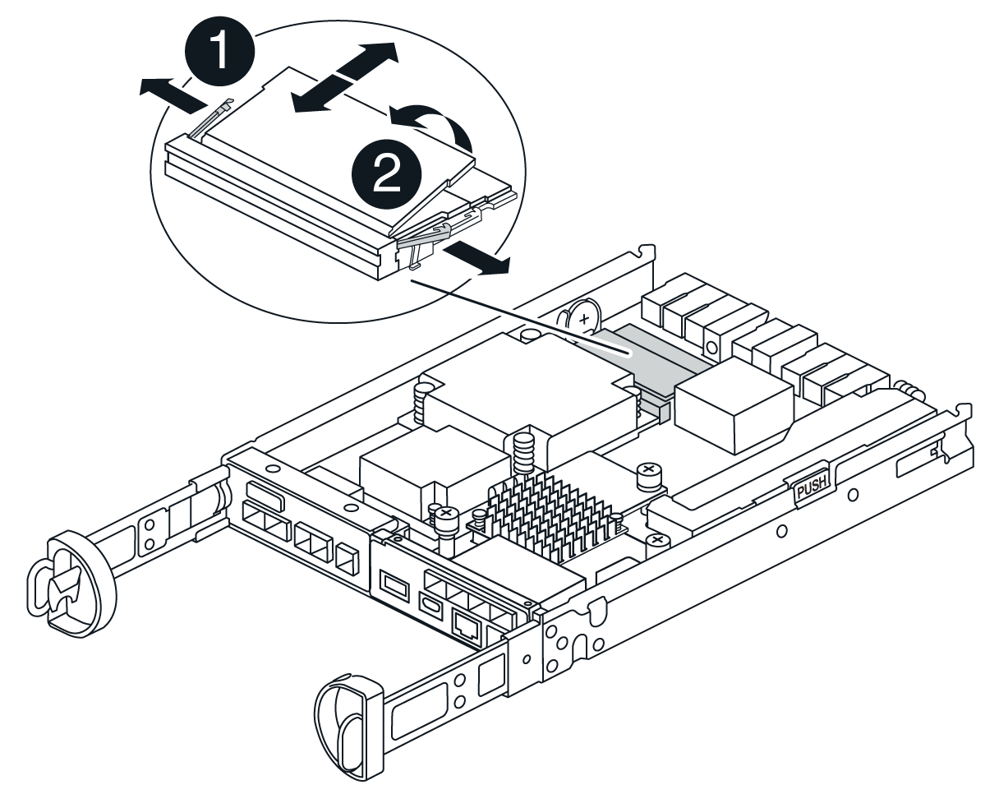

= コントローラの交換- E4000
:allow-uri-read: 
:icons: font
:imagesdir: ../media/

[role="lead"]
障害が発生したコントローラキャニスターを交換できます。

.作業を開始する前に
次のものがあることを確認します。

* 交換するコントローラキャニスターと同じパーツ番号の交換用コントローラキャニスター。
* ESD リストバンドを装着するか、静電気防止処置を施しておきます。
* コントローラキャニスターに接続する各ケーブルを識別するためのラベル。
* No.1 プラスドライバ。
* コントローラの SANtricity System Manager にアクセスできるブラウザを備えた管理ステーション。（ System Manager インターフェイスを開くには、ブラウザでコントローラのドメイン名または IP アドレスを指定します）。

== 手順 1 ：コントローラを交換する準備をします

コントローラキャニスターを交換する準備として、ドライブセキュリティキーを保存し、構成をバックアップし、サポートデータを収集します。その後、ホストI/O処理を停止して、コントローラをオフラインにするか電源をオフにすることができます。

[role="tabbed-block"]
====
.コントローラシェルフの電源をオフにする（シンプレックス）
--
.手順
. 可能であれば、コントローラに現在インストールされている SANtricity OS ソフトウェアのバージョンをメモしておいてください。SANtricityシステムマネージャを開き、*サポート›アップグレードセンター›ソフトウェアとファームウェアのインベントリの表示*を選択します。
. ドライブセキュリティ機能が有効になっている場合は、保存されたキーが存在すること、およびそのインストールに必要なパスフレーズを確認しておきます。
+

CAUTION: *データアクセスが失われる可能性*—ストレージアレイのすべてのドライブでセキュリティが有効になっている場合、SANtricity Storage ManagerのEnterprise Management Windowを使用してセキュリティ保護されたドライブのロックを解除するまで、新しいコントローラはストレージアレイにアクセスできません。

+
キーを保存する手順は次のとおりです（コントローラの状態によっては実行できない場合があります）。

+
.. SANtricityシステムマネージャで、*[設定]>[システム]を選択します。
.. ドライブセキュリティキー管理 * で、 * バックアップキー * を選択します。
.. [ * パスフレーズを定義 / パスフレーズを再入力 * ] フィールドに、このバックアップコピーのパスフレーズを入力して確認します。
.. [ バックアップ ] をクリックします。
.. 安全な場所にキー情報を記録し、 [*Close*] をクリックします。

. SANtricity システムマネージャを使用して、ストレージアレイの構成データベースをバックアップします。
+
コントローラを取り外すときに問題が発生した場合は、保存したファイルを使用して構成をリストアできます。RAID 構成データベースの現在の状態が保存されます。これには、コントローラ上のボリュームグループとディスクプールのすべてのデータが含まれます。

+
** System Manager から：
+
... *サポート›サポートセンター›診断*を選択します。
... [ 構成データの収集 *] を選択します。
... [*Collect*]( 収集 ) をクリックします
+
ブラウザの Downloads フォルダに、「 * configurationdata-<ArrayName>-<dateTime >.7z * 」という名前でファイルが保存されます。

** または、次の CLI コマンドを使用して構成データベースをバックアップすることもできます。
+
'ave storageArray dbmDatabase sourceLocation=onboard contentType=all file="filename";`

. SANtricity システムマネージャを使用してストレージアレイのサポートデータを収集します。
+
コントローラの取り外し時に問題が発生した場合は、保存したファイルを使用して問題のトラブルシューティングを行うことができます。ストレージアレイに関するインベントリ、ステータス、およびパフォーマンスデータが 1 つのファイルに保存されます。

+
.. *サポート›サポートセンター›診断*を選択します。
.. 「サポートデータの収集」を選択します。
.. [*Collect*]( 収集 ) をクリックします
+
ブラウザの Downloads フォルダに、「 * support-data.7z * 」という名前でファイルが保存されます。

. ストレージアレイと接続されているすべてのホストの間で I/O 処理が発生しないようにします。たとえば、次の手順を実行します。
+
** ストレージからホストにマッピングされた LUN に関連するすべてのプロセスを停止します。
** ストレージからホストにマッピングされた LUN にアプリケーションがデータを書き込んでいないことを確認します。
** アレイのボリュームに関連付けられているファイルシステムをすべてアンマウントします。
+

NOTE: ホスト I/O 処理を停止する具体的な手順はホストオペレーティングシステムや構成によって異なり、ここでは説明していません。環境内でホスト I/O 処理を停止する方法がわからない場合は、ホストをシャットダウンすることを検討してください。

+

CAUTION: *データ損失の可能性*—I/O処理の実行中にこの手順を続行すると、データが失われる可能性があります。

. キャッシュメモリ内のデータがドライブに書き込まれるまで待ちます。
+
キャッシュされたデータをドライブに書き込む必要がある場合は、コントローラの背面にある緑のキャッシュアクティブ LED が点灯します。この LED が消灯するまで待つ必要があります。

. SANtricity システムマネージャのホームページで、「 * 進行中の処理を表示」を選択します。
. すべての処理が完了したことを確認してから、次の手順に進みます。
. コントローラシェルフの両方の電源スイッチをオフにします。
. コントローラシェルフのすべての LED が消灯するまで待ちます。
. Recovery Guru で「 * 再確認」を選択し、「詳細」領域の「 * 削除してもよろしいですか * 」フィールドに「はい」と表示されていることを確認します。これは、このコンポーネントを削除しても安全であることを示します。コントローラキャニスターを交換するまで、ストレージアレイのデータにはアクセスできません。

--
.コントローラをオフラインにする（デュプレックス）
--
.手順
. 新しいコントローラキャニスターを開封し、静電気防止処置を施した平らな場所に置きます。
+
梱包材は、障害が発生したコントローラキャニスターを発送するときのために保管しておいてください。

. コントローラキャニスターの背面にある MAC アドレスと FRU パーツ番号のラベルを確認します。
. SANtricity System Manager で、交換するコントローラキャニスターの交換パーツ番号を確認します。
+
コントローラに障害が発生しているため交換が必要な場合は、 Recovery Guru の詳細領域に交換パーツ番号が表示されます。この番号を手動で確認する必要がある場合は、次の手順を実行します。

+
.. 「 * ハードウェア * 」を選択します。
.. コントローラアイコンが表示されたコントローラシェルフを探します。
.. コントローラアイコンをクリックします。
.. コントローラを選択し、 * 次へ * をクリックします。
.. [*Base] タブで、コントローラの交換パーツ番号 * をメモします。

. 障害が発生したコントローラの交換パーツ番号が交換用コントローラの FRU パーツ番号と同じであることを確認します。
+

CAUTION: *データアクセスが失われる可能性*—2つの部品番号が同じでない場合は、この手順を実行しないでください。コントローラが一致していないと、新しいコントローラをオンラインにしたときにロックダウン状態になります。

. SANtricity システムマネージャを使用して、ストレージアレイの構成データベースをバックアップします。
+
コントローラを取り外すときに問題が発生した場合は、保存したファイルを使用して構成をリストアできます。RAID 構成データベースの現在の状態が保存されます。これには、コントローラ上のボリュームグループとディスクプールのすべてのデータが含まれます。

+
** System Manager から：
+
... *サポート›サポートセンター›診断*を選択します。
... [ 構成データの収集 *] を選択します。
... [*Collect*]( 収集 ) をクリックします
+
ブラウザの Downloads フォルダに、「 * configurationdata-<ArrayName>-<dateTime >.7z * 」という名前でファイルが保存されます。

** または、次の CLI コマンドを使用して構成データベースをバックアップすることもできます。
+
[listing]
----
save storageArray dbmDatabase sourceLocation=onboard contentType=all file="filename";
----

. SANtricity システムマネージャを使用してストレージアレイのサポートデータを収集します。
+
コントローラの取り外し時に問題が発生した場合は、保存したファイルを使用して問題のトラブルシューティングを行うことができます。ストレージアレイに関するインベントリ、ステータス、およびパフォーマンスデータが 1 つのファイルに保存されます。

+
.. *サポート›サポートセンター›診断*を選択します。
.. 「サポートデータの収集」を選択します。
.. [*Collect*]( 収集 ) をクリックします
+
ブラウザの Downloads フォルダに、「 * support-data.7z * 」という名前でファイルが保存されます。

. コントローラがオフラインでない場合は、 SANtricity System Manager を使用してオフラインにします。
+
** SANtricity システムマネージャで次の作業を行います。
+
... 「 * ハードウェア * 」を選択します。
... 図にドライブが表示されている場合は、 * Show back of shelf * を選択してコントローラを表示します。
... オフラインに切り替えるコントローラを選択します。
... コンテキストメニューから * オフラインに切り替え * を選択し、操作を確定します。
+

NOTE: オフラインにするコントローラを使用して SANtricity System Manager にアクセスしている場合は、「 SANtricity System Manager を利用できません」というメッセージが表示されます。[代替ネットワーク接続に接続する]を選択すると、もう一方のコントローラを使用してSANtricityシステムマネージャに自動的にアクセスできます。

** または、次の CLI コマンドを使用してコントローラをオフラインにすることもできます。
+
*コントローラAの場合*： `set controller [a] availability=offline`

+
*コントローラBの場合*： `set controller [b] availability=offline`

. SANtricity System Manager でコントローラのステータスがオフラインに更新されるまで待ちます。
+

CAUTION: ステータスの更新が完了するまでは、他の処理を開始しないでください。

. Recovery Guru で「 * 再確認」を選択し、「詳細」領域の「 * 削除してもよろしいですか * 」フィールドに「はい」と表示されていることを確認します。これは、このコンポーネントを削除しても安全であることを示します。

--
====

== 手順 2 ：障害が発生したコントローラを取り外す

障害が発生したキャニスターを新しいキャニスターに交換します。

.手順
. コントローラキャニスターを取り外します。
+
.. ESD リストバンドを装着するか、静電気防止処置を施します。
.. コントローラキャニスターに接続された各ケーブルにラベルを付けます。
.. コントローラキャニスターからすべてのケーブルを外します。
+

CAUTION: パフォーマンスの低下を防ぐために、ケーブルをねじったり、折り曲げたり、はさんだり、踏みつけたりしないでください。

.. 必要に応じて、SFPトランシーバを取り外します。
.. コントローラの背面にあるキャッシュアクティブ LED が消灯していることを確認します。
+
キャッシュされたデータをドライブに書き込む必要がある場合は、コントローラの背面にある緑のキャッシュアクティブ LED が点灯します。この LED が消灯するのを待ってから、コントローラキャニスターを取り外す必要があります。

.. カムハンドルのラッチを外れるまで押し、カムハンドルをいっぱいまで開いてコントローラキャニスターをミッドプレーンから外し、両手でコントローラキャニスターをシャーシから引き出します。
.. コントローラキャニスターを裏返し、平らで安定した場所に置きます。
.. コントローラキャニスターの側面にある青いボタンを押してカバーを開き、カバーを上に回転させてコントローラキャニスターから取り外します。

== 手順3：バッテリを取り外す

障害のあるコントローラからバッテリを取り外し、交換用コントローラに取り付けます。

.手順
. コントローラキャニスターからバッテリを取り外します。
+
.. コントローラキャニスターの側面にある青いボタンを押します。
.. 保持ブラケットからバッテリを上にスライドさせ、持ち上げてコントローラキャニスターから取り出します。
.. バッテリプラグ前面のクリップを押してプラグをソケットから外し、バッテリケーブルをソケットから抜きます。
+
image::../media/drw_E4000_replace_nvbattery_IEOPS-862.png[バッテリを取り外します。]

+
|===

 a| 
image::../media/legend_icon_01.png[1つのアイコン]
| バッテリリリースタブ 

 a| 
image::../media/legend_icon_02.png[2つのアイコン]
| バッテリ電源コネクタ 
|===

. バッテリを交換用コントローラキャニスターに移動して取り付けます。
+
.. バッテリを金属板の側壁の保持ブラケットに合わせます。
.. バッテリラッチがカチッという音がして側壁の開口部に収まるまで、バッテリパックを下にスライドさせます。
+

NOTE: バッテリのプラグはまだ差し込まないでください。残りのコンポーネントを交換用コントローラキャニスターに移動したら、プラグを差し込みます。

== 手順 4 ： HIC を取り外す

障害のあるコントローラモジュールからHICベゼルとPCIe HICカードを取り外します。

.手順
. HICベゼルをコントローラモジュールからまっすぐ引き出して取り外します。
+
image::../media/drw_E4000_replace_HIC_source_IEOPS-864.png[コントローラモジュールからHICを取り外します。]

. HICの取り付けネジを緩めます。
+

NOTE: つまみネジは、指またはドライバで緩めることができます。

. HICを真上に持ち上げて、静電気防止処置を施した場所に置きます。

== 手順5：DIMMを移動する

障害のあるコントローラキャニスターからDIMMを取り外し、交換用コントローラキャニスターに取り付けます。

.手順
. コントローラキャニスターでDIMMの場所を確認します。
+

NOTE: DIMMを交換用コントローラキャニスターの同じ場所に正しい向きで挿入できるように、ソケット内のDIMMの場所をメモします。障害のあるコントローラキャニスターからDIMMを取り外します。

+
.. DIMMの両側にある2つのツメをゆっくり押し開いて、DIMMをスロットから外します。
+
DIMMが少し上に回転します。

.. DIMMを所定の位置まで回転させ、ソケットから引き出します。
+

NOTE: DIMM 回路基板のコンポーネントに力が加わらないように、 DIMM の両端を慎重に持ちます。

+

+
|===

 a| 
image::../media/legend_icon_01.png[1つのアイコン]
| DIMMのツメ 

 a| 
image::../media/legend_icon_02.png[2つのアイコン]
| DIMM 
|===

. 交換用コントローラキャニスターにバッテリが接続されていないことを確認します。
. DIMMは、障害コントローラと同じ場所に交換用コントローラに取り付けます。
+
.. DIMM の両端のノッチにツメがかかるまで、 DIMM の上部を慎重にしっかり押し込みます。
+
DIMM のスロットへの挿入にはある程度の力が必要です。簡単に挿入できない場合は、 DIMM をスロットに正しく合わせてから再度挿入してください。

+

NOTE: DIMM がスロットにまっすぐ差し込まれていることを目で確認してください。

. 他のDIMMについても同じ手順を繰り返します。

== 手順 6 ： HIC を取り付ける

HICを交換用コントローラキャニスターに取り付けます。

.手順
. 交換用HICプラグのソケットをマザーボードのソケットに合わせ、カードをソケットに対して垂直にそっと装着します。
. HICの3本の取り付けネジを締めます。
. HICカバーを再度取り付けます。

== 手順7：バッテリを取り付ける

交換用コントローラキャニスターにバッテリを取り付けます。

.手順
. バッテリプラグをコントローラキャニスターのソケットに再度接続します。
+
プラグがマザーボードのバッテリソケットに固定されていることを確認します。

. バッテリを金属板の側壁の保持ブラケットに合わせます。
. バッテリラッチがカチッという音がして側壁の開口部に収まるまで、バッテリパックを下にスライドさせます。
. コントローラキャニスターのカバーを再度取り付け、所定の位置にロックします。

== 手順 8 ：コントローラの交換後の処理

コントローラシェルフへの接続を再確立し、サポートデータを収集して、処理を再開します。

[role="tabbed-block"]
====
.コントローラシェルフの電源をオンにする（シンプレックス）
--
.手順
. 交換用コントローラをシェルフに取り付けます。
+
.. まだ接地していない場合は、自分で適切に接地してください。
.. 取り外し可能なカバーが下になるようにコントローラを裏返します。
.. カムハンドルを開いた状態で、コントローラをスライドしてシェルフに最後まで押し込みます。
.. ケーブルを交換します。
+

NOTE: 光ファイバケーブルを使用する場合は、メディアコンバータ（QSFPまたはSFP）を取り外したあとに再度取り付けてください。

.. フックとループストラップを使用して、ケーブルをケーブルマネジメントデバイスにバインドします。
.. コントローラシェルフの電源をオンにします。
.. E4000コントローラが再起動するまで待ちます。
.. 交換用コントローラに IP アドレスを割り当てる方法を決定します。
+

NOTE: 交換用コントローラにIPアドレスを割り当てる手順は、管理ポートを接続したネットワークにDHCPサーバがあるかどうか、およびすべてのドライブがセキュリティ保護されているかどうかによって異なります。

+
管理ポート 1 が DHCP サーバがあるネットワークに接続されている場合は、新しいコントローラの IP アドレスが DHCP サーバから取得されます。この値は、元のコントローラの IP アドレスと異なる場合があります。

. ストレージアレイにセキュアドライブがある場合は、ドライブセキュリティキーをインポートします。それ以外の場合は、次の手順に進みます。すべてのセキュアドライブを含むストレージアレイ、またはセキュアドライブとセキュアでないドライブが混在しているストレージアレイの場合は、以下の該当する手順に従います。
+

NOTE: セキュアでないドライブ _ 未割り当てのドライブ、グローバルホットスペアドライブ、またはドライブセキュリティ機能で保護されていないボリュームグループまたはプールに含まれるドライブです。セキュアドライブとは、ドライブセキュリティを使用してセキュアなボリュームグループまたはディスクプールに属するドライブを割り当てたものです。

+
** * セキュリティ保護されたドライブのみ ( セキュリティ保護されていないドライブは不要 )* ：
+
... ストレージアレイのコマンドラインインターフェイス（ CLI ）にアクセスします。
... 該当するシンプレックスNVSRAMをコントローラにロードします。
+
例： `download storageArray NVSRAM file=\"N4000-881834-SG4.dlp\" forceDownload=TRUE;`

... シンプレックスNVSRAMをロードしたあとに、コントローラが「最適」*であることを確認します。
... 外部セキュリティキー管理を使用している場合は、 https://docs.netapp.com/us-en/e-series/upgrade-controllers/upgrade-unlock-drives-task.html#external-key-management["コントローラで外部キー管理を設定する"]
... 内部セキュリティキー管理を使用している場合は、次のコマンドを入力してセキュリティキーをインポートします。
+
[listing]
----
import storageArray securityKey file="C:/file.slk"
passPhrase="passPhrase";
----
+
ここで、

+
**** 「 C:\file.slk 」は、ドライブセキュリティキーのディレクトリの場所と名前を表します
**** `passPhrase`は、セキュリティキーがインポートされてコントローラがリブートされ、新しいコントローラでストレージアレイに保存されている設定が適用されたあとにファイルのロックを解除するために必要なパスフレーズです。

... 次の手順に進み、新しいコントローラが「最適」になっていることを確認します。

** * 安全なドライブと安全でないドライブの混在 * ：
+
... サポートバンドルを収集して、ストレージアレイプロファイルを開きます。
... セキュアでないドライブの場所をすべて検出して記録します。これらの場所はサポートバンドルに含まれています。
... システムの電源を切ります。
... セキュアでないドライブを取り外します。
... コントローラを交換してください。
... システムに電源を投入します。
... SANtricityシステムマネージャで、*[設定]>[システム]を選択します。
... [ セキュリティキーの管理 ] セクションで、 [ キーの作成 / 変更 *] を選択して新しいセキュリティキーを作成します。
... 保存したセキュリティキーをインポートするには、「 Secure Drives のロック解除」を選択します。
... 「 set allDrives nativeState 」 CLI コマンドを実行します。
... コントローラが自動的にリブートされます。
... コントローラがブートし、デジタル表示ディスプレイにトレイ番号または L5 が点滅するまで待ちます。
... システムの電源を切ります。
... セキュアでないドライブを取り付け直します。
... SANtricity システムマネージャを使用してコントローラをリセットします。
... システムの電源を入れ、デジタル表示ディスプレイにトレイ番号が表示されるまで待ちます。
... 次の手順に進み、新しいコントローラが「最適」になっていることを確認します。

. SANtricity System Manager で、新しいコントローラが「最適」になっていることを確認します。
+
.. 「 * ハードウェア * 」を選択します。
.. コントローラシェルフの場合は、 * Show back of shelf * を選択します。
.. 交換したコントローラキャニスターを選択します。
.. 「 * 表示設定 * 」を選択します。
.. コントローラの * Status * が最適な状態であることを確認します。
.. ステータスが「最適」でない場合は、コントローラを強調表示し、「オンラインにする」を選択します。

. SANtricity システムマネージャを使用してストレージアレイのサポートデータを収集します。
+
.. *サポート›サポートセンター›*診断*を選択します。
.. 「サポートデータの収集」を選択します。
.. [*Collect*]( 収集 ) をクリックします
+
ブラウザの Downloads フォルダに、「 * support-data.7z * 」という名前でファイルが保存されます。

--
.コントローラをオンラインにする（デュプレックス）
--
.手順
. 交換用コントローラをシェルフに取り付けます。
+
.. まだ接地していない場合は、自分で適切に接地してください。
.. コントローラキャニスターのカバーを取り付けます（まだ取り付けていない場合）。
.. 取り外し可能なカバーが下になるようにコントローラを裏返します。
.. カムハンドルを開いた状態で、コントローラをスライドしてシェルフに最後まで押し込みます。
.. ケーブルを交換します。
+

NOTE: 光ファイバケーブルを使用する場合は、メディアコンバータ（QSFPまたはSFP）を取り外したあとに再度取り付けてください。

.. フックとループストラップを使用して、ケーブルをケーブルマネジメントデバイスにバインドします。
.. 元のコントローラの IP アドレスが DHCP を使用して取得したアドレスである場合は、交換用コントローラの背面のラベルに記載された MAC アドレスを確認します。取り外したコントローラの DNS / ネットワークおよび IP アドレスを交換用コントローラの MAC アドレスと関連付けるよう、ネットワーク管理者に依頼します。
+

NOTE: 元のコントローラの IP アドレスが DHCP を使用して取得したアドレスでなければ、取り外したコントローラの IP アドレスが新しいコントローラで使用されます。

. コントローラをオンラインにします。
+
.. System Managerで、*[ハードウェア]*ページに移動します。
.. 「 * コントローラの背面を表示 * 」を選択します。
.. 交換したコントローラを選択します。
.. ドロップダウンリストから「オンラインにする」 * を選択します。

. コントローラのブート時に、コントローラの LED を確認します。
+
** コントローラの黄色の警告 LED が点灯したあと、エラーがなければ消灯します。
** ホストリンク LED は、ホストインターフェイスに応じて、点灯、点滅、消灯のいずれかになります。

. コントローラがオンラインに戻ったら、ステータスが「最適」になっていることを確認し、コントローラシェルフの警告 LED を確認します。
+
ステータスが「最適」でない場合やいずれかの警告 LED が点灯している場合は、すべてのケーブルが正しく装着され、コントローラキャニスターが正しく取り付けられていることを確認します。必要に応じて、コントローラキャニスターを取り外して再度取り付けます。

+

NOTE: 問題が解決しない場合は、テクニカルサポートにお問い合わせください。

. 必要に応じて、 SANtricity システムマネージャを使用して、すべてのボリュームを再配置して優先所有者に戻します。
+
.. [ストレージ]>[ボリューム]*を選択します。
.. [その他]>[ボリュームの再配置]*を選択します。

. [ハードウェア]>[サポート]>[アップグレードセンター]*をクリックして、最新バージョンのSANtricity OSソフトウェア（コントローラファームウェア）がインストールされていることを確認します。
+
必要に応じて、最新バージョンをインストールします。

. SANtricity システムマネージャを使用してストレージアレイのサポートデータを収集します。
+
.. *サポート›サポートセンター›診断*を選択します。
.. 「サポートデータの収集」を選択します。
.. [*Collect*]( 収集 ) をクリックします
+
ブラウザの Downloads フォルダに、「 * support-data.7z * 」という名前でファイルが保存されます。

--
====
.次の手順
これでコントローラの交換は完了です。通常の運用を再開することができます。
