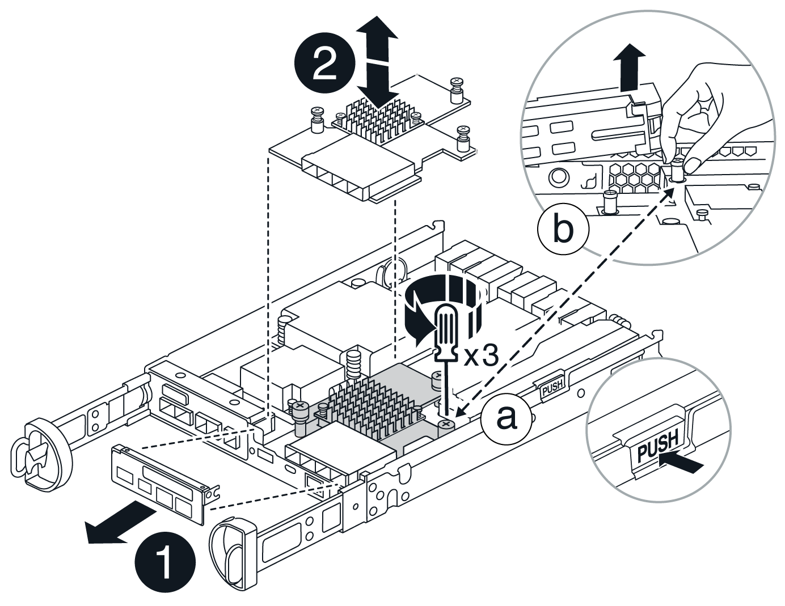

= E4000のHICの交換
:allow-uri-read: 
:icons: font
:imagesdir: ../media/

[role="lead"]
E4000アレイ内の障害が発生したホストインターフェイスカード（HIC）を交換する手順は、次のとおりです。

.このタスクについて
障害が発生したHICを交換するときは、ストレージアレイの電源をオフにするか（シンプレックス）、該当するコントローラをオフラインにする（デュプレックス）、HICを交換し、電源を再投入する（シンプレックス）かコントローラをオンラインにする（デュプレックス）必要があります。

.作業を開始する前に
* シンプレックス構成の場合は、この手順でダウンタイムのメンテナンス時間をスケジュールします。この手順が完了するまでは、ストレージアレイのデータにアクセスできません。
* 次のものがあることを確認します。
+
** コントローラと互換性があるHIC。
** ESD リストバンドを装着するか、静電気防止処置を施しておきます。
** 静電気防止処置を施した平らな作業場所。
** コントローラキャニスターに接続する各ケーブルを識別するためのラベル。
** No.1 プラスドライバ。
** コントローラの SANtricity System Manager にアクセスできるブラウザを備えた管理ステーション。（ System Manager インターフェイスを開くには、ブラウザでコントローラのドメイン名または IP アドレスを指定します）。
+

CAUTION: * データアクセスが失われる可能性 * - 別の E シリーズコントローラ用に設計された HIC を E4000 コントローラキャニスターに取り付けないでください。また、デュプレックス構成では、両方のコントローラと両方のHICが同一である必要があります。互換性がないHICや一致しないHICがあると、コントローラに電源を投入したときにロックダウン状態になります。

== 手順1：HICを交換する準備

HICを安全に交換できるように、コントローラシェルフの電源をオフにする（シンプレックス）か、該当するコントローラをオフラインにします（デュプレックス）。

[role="tabbed-block"]
====
.コントローラシェルフの電源をオフにする（シンプレックス）
--
.手順
. 可能であれば、コントローラに現在インストールされている SANtricity OS ソフトウェアのバージョンをメモしておいてください。SANtricityシステムマネージャを開き、*サポート›アップグレードセンター›ソフトウェアとファームウェアのインベントリの表示*を選択します。
. ドライブセキュリティ機能が有効になっている場合は、保存されたキーが存在すること、およびそのインストールに必要なパスフレーズを確認しておきます。
+

CAUTION: *データアクセスが失われる可能性*—ストレージアレイのすべてのドライブでセキュリティが有効になっている場合、SANtricity Storage ManagerのEnterprise Management Windowを使用してセキュリティ保護されたドライブのロックを解除するまで、新しいコントローラはストレージアレイにアクセスできません。

+
キーを保存する手順は次のとおりです（コントローラの状態によっては実行できない場合があります）。

+
.. SANtricityシステムマネージャで、*[設定]>[システム]を選択します。
.. セキュリティキー管理*で、*バックアップキー*を選択します。
.. [ * パスフレーズを定義 / パスフレーズを再入力 * ] フィールドに、このバックアップコピーのパスフレーズを入力して確認します。
.. [ バックアップ ] をクリックします。
.. 安全な場所にキー情報を記録し、 [*Close*] をクリックします。

. SANtricity システムマネージャを使用して、ストレージアレイの構成データベースをバックアップします。
+
コントローラを取り外すときに問題が発生した場合は、保存したファイルを使用して構成をリストアできます。RAID 構成データベースの現在の状態が保存されます。これには、コントローラ上のボリュームグループとディスクプールのすべてのデータが含まれます。

+
** System Manager から：
+
... *サポート›サポートセンター›診断*を選択します。
... [ 構成データの収集 *] を選択します。
... [*Collect*]( 収集 ) をクリックします
+
ブラウザの Downloads フォルダに、「 * configurationdata-<ArrayName>-<dateTime >.7z * 」という名前でファイルが保存されます。

** または、次の CLI コマンドを使用して構成データベースをバックアップすることもできます。
+
'ave storageArray dbmDatabase sourceLocation=onboard contentType=all file="filename";`

. SANtricity システムマネージャを使用してストレージアレイのサポートデータを収集します。
+
コントローラの取り外し時に問題が発生した場合は、保存したファイルを使用して問題のトラブルシューティングを行うことができます。ストレージアレイに関するインベントリ、ステータス、およびパフォーマンスデータが 1 つのファイルに保存されます。

+
.. *サポート›サポートセンター›診断*を選択します。
.. 「サポートデータの収集」を選択します。
.. [*Collect*]( 収集 ) をクリックします
+
ブラウザの Downloads フォルダに、「 * support-data.7z * 」という名前でファイルが保存されます。

. ストレージアレイと接続されているすべてのホストの間で I/O 処理が発生しないようにします。たとえば、次の手順を実行します。
+
** ストレージからホストにマッピングされた LUN に関連するすべてのプロセスを停止します。
** ストレージからホストにマッピングされた LUN にアプリケーションがデータを書き込んでいないことを確認します。
** アレイのボリュームに関連付けられているファイルシステムをすべてアンマウントします。
+

NOTE: ホスト I/O 処理を停止する具体的な手順はホストオペレーティングシステムや構成によって異なり、ここでは説明していません。環境内でホスト I/O 処理を停止する方法がわからない場合は、ホストをシャットダウンすることを検討してください。

+

CAUTION: *データ損失の可能性*—I/O処理の実行中にこの手順を続行すると、データが失われる可能性があります。

. キャッシュメモリ内のデータがドライブに書き込まれるまで待ちます。
+
キャッシュされたデータをドライブに書き込む必要がある場合は、コントローラの背面にある緑のキャッシュアクティブ LED が点灯します。この LED が消灯するまで待つ必要があります。

. SANtricity システムマネージャのホームページで、「 * 進行中の処理を表示」を選択します。
. すべての処理が完了したことを確認してから、次の手順に進みます。
. コントローラシェルフの両方の電源スイッチをオフにします。
. コントローラシェルフのすべての LED が消灯するまで待ちます。
. Recovery Guru で「 * 再確認」を選択し、「詳細」領域の「 * 削除してもよろしいですか * 」フィールドに「はい」と表示されていることを確認します。これは、このコンポーネントを削除しても安全であることを示します。コントローラキャニスターを交換するまで、ストレージアレイのデータにはアクセスできません。

--
.コントローラをオフラインにする（デュプレックス）
--
.手順
. 新しいコントローラキャニスターを開封し、静電気防止処置を施した平らな場所に置きます。
+
梱包材は、障害が発生したコントローラキャニスターを発送するときのために保管しておいてください。

. コントローラキャニスターの背面にある MAC アドレスと FRU パーツ番号のラベルを確認します。
. SANtricity System Manager で、交換するコントローラキャニスターの交換パーツ番号を確認します。
+
コントローラに障害が発生しているため交換が必要な場合は、 Recovery Guru の詳細領域に交換パーツ番号が表示されます。この番号を手動で確認する必要がある場合は、次の手順を実行します。

+
.. 「 * ハードウェア * 」を選択します。
.. コントローラアイコンが表示されたコントローラシェルフを探します。
.. コントローラアイコンをクリックします。
.. コントローラを選択し、 * 次へ * をクリックします。
.. [*Base] タブで、コントローラの交換パーツ番号 * をメモします。

. 障害が発生したコントローラの交換パーツ番号が交換用コントローラの FRU パーツ番号と同じであることを確認します。
+

CAUTION: *データアクセスが失われる可能性*—2つの部品番号が同じでない場合は、この手順を実行しないでください。コントローラが一致していないと、新しいコントローラをオンラインにしたときにロックダウン状態になります。

. SANtricity システムマネージャを使用して、ストレージアレイの構成データベースをバックアップします。
+
コントローラを取り外すときに問題が発生した場合は、保存したファイルを使用して構成をリストアできます。RAID 構成データベースの現在の状態が保存されます。これには、コントローラ上のボリュームグループとディスクプールのすべてのデータが含まれます。

+
** System Manager から：
+
... *サポート›サポートセンター›診断*を選択します。
... [ 構成データの収集 *] を選択します。
... [*Collect*]( 収集 ) をクリックします
+
ブラウザの Downloads フォルダに、「 * configurationdata-<ArrayName>-<dateTime >.7z * 」という名前でファイルが保存されます。

** または、次の CLI コマンドを使用して構成データベースをバックアップすることもできます。
+
[listing]
----
save storageArray dbmDatabase sourceLocation=onboard contentType=all file="filename";
----

. コントローラがオフラインでない場合は、 SANtricity System Manager を使用してオフラインにします。
+
** SANtricity システムマネージャで次の作業を行います。
+
... 「 * ハードウェア * 」を選択します。
... 図にドライブが表示されている場合は、 * Show back of shelf * を選択してコントローラを表示します。
... オフラインに切り替えるコントローラを選択します。
... コンテキストメニューから * オフラインに切り替え * を選択し、操作を確定します。
+

NOTE: オフラインにするコントローラを使用して SANtricity System Manager にアクセスしている場合は、「 SANtricity System Manager を利用できません」というメッセージが表示されます。[代替ネットワーク接続に接続する]を選択すると、もう一方のコントローラを使用してSANtricityシステムマネージャに自動的にアクセスできます。

** または、次の CLI コマンドを使用してコントローラをオフラインにすることもできます。
+
*コントローラAの場合*： `set controller [a] availability=offline`

+
*コントローラBの場合*： `set controller [b] availability=offline`

. SANtricity System Manager でコントローラのステータスがオフラインに更新されるまで待ちます。
+

CAUTION: ステータスの更新が完了するまでは、他の処理を開始しないでください。

. Recovery Guru で「 * 再確認」を選択し、「詳細」領域の「 * 削除してもよろしいですか * 」フィールドに「はい」と表示されていることを確認します。これは、このコンポーネントを削除しても安全であることを示します。

--
====

== 手順 2 ：コントローラキャニスターを取り外す

コントローラキャニスターをシステムから取り外し、コントローラキャニスターカバーを取り外します。

.手順
. まだ接地していない場合は、自分で適切に接地してください。
. ケーブルマネジメントデバイスに接続しているケーブルをまとめているフックとループストラップを緩め、システムケーブルとSFPをコントローラキャニスターから外し（必要な場合）、どのケーブルがどこに接続されていたかを記録します。
+
ケーブルはケーブルマネジメントデバイスに入れたままにしておきます。これは、ケーブルマネジメントデバイスを取り付け直すときにケーブルが整理されるようにするためです。

. ケーブルマネジメントデバイスをコントローラキャニスターの左右から取り外し、脇に置きます。
. カムハンドルのラッチを外れるまで押し、カムハンドルをいっぱいまで開いてコントローラキャニスターをミッドプレーンから外し、両手でコントローラキャニスターをシャーシから引き出します。
. コントローラキャニスターを裏返し、平らで安定した場所に置きます。
. コントローラキャニスターの側面にある青いボタンを押してカバーを開き、カバーを上に回転させてコントローラキャニスターから取り外します。
+
image::../media/drw_E4000_open_controller_module_cover_IEOPS-870.png[コントローラキャニスターのカバーを開きます。]

== 手順 3 ： HIC を交換します

HICを交換してください。

.手順
. まだ接地していない場合は、自分で適切に接地してください。
. HICを取り外します。
+

+
.. HICカバーをコントローラモジュールからまっすぐ引き出して取り外します。
.. HICの取り付けネジを緩めて真上に持ち上げます。
+

NOTE: つまみネジを指で緩めている場合は、アクセスしやすくするために、バッテリリリースタブを押してバッテリを上に回転させなければならないことがあります。

. HICを再度取り付けます。
+
.. 交換用HICプラグのソケットをマザーボードのソケットに合わせ、カードをソケットに対して垂直にそっと装着します。
.. HICの3本の取り付けネジを手で締めます。
+
ネジを締め付けすぎる可能性があるため、ドライバは使用しないでください。

.. HICカバーを再度取り付けます。

. コントローラモジュールのカバーを再度取り付け、所定の位置にロックします。

== 手順 4 ：コントローラキャニスターを再度取り付ける

コントローラキャニスターをシャーシに再度取り付けます。

.手順
. まだ接地していない場合は、自分で適切に接地してください。
. コントローラキャニスターのカバーを取り付けます（まだ取り付けていない場合）。
. 取り外し可能なカバーが下になるようにコントローラを裏返します。
. カムハンドルを開いた状態で、コントローラをスライドしてシェルフに最後まで押し込みます。
. ケーブルを交換します。
+

NOTE: 光ファイバケーブルを使用する場合は、メディアコンバータ（QSFPまたはSFP）を取り外したあとに再度取り付けてください。

. フックとループストラップを使用して、ケーブルをケーブルマネジメントデバイスにバインドします。

== 手順 5 ： HIC の交換を完了します

コントローラの電源をオンにする（シンプレックス）かコントローラをオンラインにする（デュプレックス）か、サポートデータを収集して、処理を再開します。

[role="tabbed-block"]
====
.コントローラの電源をオンにする（シンプレックス）
--
.手順
. コントローラシェルフの背面にある 2 つの電源スイッチをオンにします。
+
** 電源投入プロセスの実行中は電源スイッチをオフにしないでください。通常、このプロセスは 90 秒以内に完了します。
** 各シェルフのファンは起動時に大きな音を立てます。起動時に大きな音がしても問題はありません。

. コントローラがオンラインに戻ったら、コントローラシェルフの警告LEDを確認します。
+
ステータスが「最適」でない場合やいずれかの警告 LED が点灯している場合は、すべてのケーブルが正しく装着され、バッテリとコントローラキャニスターが正しく取り付けられていることを確認します。必要に応じて、コントローラキャニスターとバッテリを取り外して再度取り付けます。

+

NOTE: 問題を解決できない場合は、テクニカルサポートにお問い合わせください。必要に応じて、 SANtricity System Manager を使用してストレージアレイのサポートデータを収集します。

. SANtricity システムマネージャを使用してストレージアレイのサポートデータを収集します。
+
.. *サポート›サポートセンター›診断*を選択します。
.. [サポートデータの収集]を選択します。
.. 収集をクリックします。
+
ブラウザの Downloads フォルダに、「 * support-data.7z * 」という名前でファイルが保存されます。

--
.コントローラをオンラインにする（デュプレックス）
--
.手順
. SANtricity System Manager を使用して、コントローラをオンラインにします。
+
** SANtricity システムマネージャで次の作業を行います。
+
... 「 * ハードウェア * 」を選択します。
... 図にドライブが表示されている場合は、 * シェルフの背面を表示 * を選択します。
... オンラインに切り替えるコントローラを選択します。
... コンテキストメニューから * オンラインに配置 * を選択し、操作を確定します。
+
コントローラがオンラインになります。

** または、次の CLI コマンドを使用して、コントローラをオンラインに戻すこともできます。
+
*コントローラA *： `set controller [a] availability=online`；

+
*コントローラBの場合*： `set controller [b] availability=online`；

. コントローラがオンラインに戻ったら、コントローラシェルフの警告LEDを確認します。
+
ステータスが「最適」でない場合やいずれかの警告 LED が点灯している場合は、すべてのケーブルが正しく装着され、バッテリとコントローラキャニスターが正しく取り付けられていることを確認します。必要に応じて、コントローラキャニスターとバッテリを取り外して再度取り付けます。

+

NOTE: 問題を解決できない場合は、テクニカルサポートにお問い合わせください。必要に応じて、 SANtricity System Manager を使用してストレージアレイのサポートデータを収集します。

. すべてのボリュームが優先所有者に戻っていることを確認します。
+
.. [ストレージ]>[ボリューム]*を選択します。[ * すべてのボリューム * ] ページで、ボリュームが優先所有者に配布されていることを確認します。ボリューム所有者を表示するには、[その他]>[所有権の変更]*を選択します。
.. すべてのボリュームが優先所有者に所有されている場合は、手順5に進みます。
.. いずれのボリュームも戻っていない場合は、手動でボリュームを戻す必要があります。詳細›ボリュームの再配置*に進みます。
.. 自動配信または手動配信のあとに一部のボリュームだけが優先所有者に戻される場合は、Recovery Guruでホスト接続の問題がないかを確認する必要があります。
.. Recovery Guruが表示されない場合、またはRecovery Guruの手順に従ってもボリュームが優先所有者に戻らない場合は、サポートにお問い合わせください。

. SANtricity システムマネージャを使用してストレージアレイのサポートデータを収集します。
+
.. *サポート›サポートセンター›診断*を選択します。
.. [サポートデータの収集]を選択します。
.. 収集をクリックします。
+
ブラウザの Downloads フォルダに、「 * support-data.7z * 」という名前でファイルが保存されます。

--
====
.次の手順
これでホストインターフェイスカードの交換は完了です。通常の運用を再開することができます。
