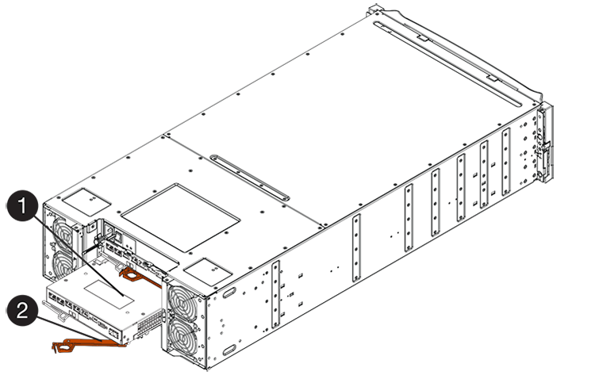
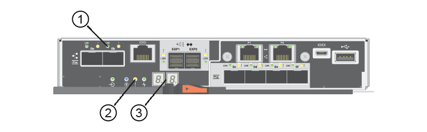

= E5700 バッテリを交換します
:allow-uri-read: 
:experimental: 
:icons: font
:imagesdir: ../media/

[role="lead"]
E5700 ストレージシステムの障害が発生したバッテリを交換することができます。

.このタスクについて
E5700 コントローラキャニスターには、 AC 電源で障害が発生した場合にキャッシュデータを保持するバッテリが搭載されています。SANtricity System Manager の Recovery Guru から「バッテリで障害が発生しました」または「バッテリの交換が必要です」のいずれかのステータスが報告された場合は、該当するバッテリを交換する必要があります。

.作業を開始する前に
* 使用中のボリュームがないこと、またはボリュームを使用しているすべてのホストにマルチパスドライバがインストールされていることを確認します。
* レビュー link:batteries-intro-concept.html["E5700 バッテリの交換に関する要件"]。

.必要なもの
* 交換用バッテリ。
* ESD リストバンドを装着するか、静電気防止処置を施しておきます。
* コントローラキャニスターに接続する各ケーブルを識別するためのラベル。
* コントローラの SANtricity System Manager にアクセスできるブラウザを備えた管理ステーション。（ System Manager インターフェイスを開くには、ブラウザでコントローラのドメイン名または IP アドレスを指定します）。

== 手順 1 ：コントローラをオフラインにする（デュプレックス）

デュプレックス構成の場合、障害が発生したバッテリを安全に取り外せるように、該当するコントローラをオフラインにします。オフラインに切り替えないコントローラはオンライン（最適状態）である必要があります。

NOTE: このタスクは、コントローラが 2 台のストレージアレイ（デュプレックス構成）でのみ実行します。

.手順
. SANtricity System Manager の Recovery Guru で詳細を確認し、問題にバッテリが搭載されていること、および先に対処する必要がある項目がほかにないことを確認します。
. Recovery Guru の詳細領域で、交換するバッテリを特定します。
. SANtricity システムマネージャを使用して、ストレージアレイの構成データベースをバックアップします。
+
コントローラを取り外すときに問題が発生した場合は、保存したファイルを使用して構成をリストアできます。RAID 構成データベースの現在の状態が保存されます。これには、コントローラ上のボリュームグループとディスクプールのすべてのデータが含まれます。

+
** SANtricity システムマネージャで次の作業を行います。
+
... メニューを選択します。 Support [ Support Center > Diagnostics ] （サポートセンター > 診断）。
... [ 構成データの収集 *] を選択します。
... [*Collect*]( 収集 ) をクリックします
+
ブラウザの Downloads フォルダに、「 * configurationdata-<ArrayName>-<dateTime >.7z * 」という名前でファイルが保存されます。

** または、次の CLI コマンドを使用して構成データベースをバックアップすることもできます。
+
'ave storageArray dbmDatabase sourceLocation=onboard contentType=all file="filename";`

. SANtricity システムマネージャを使用してストレージアレイのサポートデータを収集します。
+
コントローラの取り外し時に問題が発生した場合は、保存したファイルを使用して問題のトラブルシューティングを行うことができます。ストレージアレイに関するインベントリ、ステータス、およびパフォーマンスデータが 1 つのファイルに保存されます。

+
.. メニューを選択します。 Support [ Support Center > Diagnostics ] （サポートセンター > 診断）。
.. 「サポートデータの収集」を選択します。
.. [*Collect*]( 収集 ) をクリックします
+
ブラウザの Downloads フォルダに、「 * support-data.7z * 」という名前でファイルが保存されます。

. コントローラがオフラインでない場合は、 SANtricity System Manager を使用してオフラインにします。
+
** SANtricity システムマネージャで次の作業を行います。
+
... 「 * ハードウェア * 」を選択します。
... 図にドライブが表示されている場合は、 * Show back of shelf * を選択してコントローラを表示します。
... オフラインに切り替えるコントローラを選択します。
... コンテキストメニューから * オフラインに切り替え * を選択し、操作を確定します。
+

NOTE: オフラインにするコントローラを使用して SANtricity System Manager にアクセスしている場合は、「 SANtricity System Manager を利用できません」というメッセージが表示されます。別のコントローラを使用して SANtricity System Manager に自動的にアクセスするには、 * 代替ネットワーク接続に接続する * を選択します。

** または、次の CLI コマンドを使用してコントローラをオフラインにすることもできます。
+
* コントローラ A ： * 'et controller [a] availability=offline

+
* コントローラ B の場合： * 'et controller [b] availability=offline

. SANtricity System Manager でコントローラのステータスがオフラインに更新されるまで待ちます。
+

CAUTION: ステータスの更新が完了するまでは、他の処理を開始しないでください。

== 手順 2 ：コントローラキャニスターを取り外す

障害が発生したバッテリを取り外す前に、コントローラキャニスターを取り外す必要があります。

.手順
. ESD リストバンドを装着するか、静電気防止処置を施します。
. コントローラキャニスターに接続された各ケーブルにラベルを付けます。
. コントローラキャニスターからすべてのケーブルを外します。
+

CAUTION: パフォーマンスの低下を防ぐために、ケーブルをねじったり、折り曲げたり、はさんだり、踏みつけたりしないでください。

. コントローラキャニスターのホストポートで SFP+ トランシーバを使用している場合は、取り付けたままにしておきます。
. コントローラの背面にあるキャッシュアクティブ LED が消灯していることを確認します。
. カムハンドルのラッチを外れるまで押し、カムハンドルを右側に開いてコントローラキャニスターをシェルフから外します。
+
次の図は、 E5724 のコントローラシェルフの例です。

+
image::../media/28_dwg_e2824_remove_controller_canister_maint-e5700.gif[28 dwg e2824 ：コントローラキャニスター maint e5700 を削除します]

+
* （ 1 ） * _ コントローラキャニスター _

+
* （ 2 ） * _CAM ハンドル _

+
E5760 コントローラシェルフの例は次のとおりです。

+

+
* （ 1 ） * _ コントローラキャニスター _

+
* （ 2 ） * _CAM ハンドル _

. 両手でカムハンドルをつかみ、コントローラキャニスターをスライドしてシェルフから引き出します。
+

CAUTION: コントローラキャニスターは重いので、必ず両手で支えながら作業してください。

+
E5724 コントローラシェルフでは、コントローラキャニスターを取り外すと、可動式のふたが所定の位置に戻って、通気と冷却が維持されます。

. 取り外し可能なカバーが上になるようにコントローラキャニスターを裏返します。
. コントローラキャニスターを静電気防止処置を施した平らな場所に置きます。

== 手順 3 ：障害が発生したバッテリを取り外す

コントローラキャニスターをコントローラシェルフから取り外したあと、バッテリを取り外します。

.手順
. コントローラキャニスターのカバーをボタンを押し下げながらスライドして取り外します。
. コントローラ内部（バッテリと DIMM の間）の緑の LED が消灯していることを確認します。
+
この緑の LED が点灯している場合は、コントローラがまだバッテリ電源を使用しています。この LED が消灯するのを待ってから、コンポーネントを取り外す必要があります。

+
image::../media/28_dwg_e2800_internal_cache_active_led_maint-e5700.gif[28 dwg e2800 内部キャッシュアクティブ LED maint e5700]

+
* （ 1 ） * _ 内部キャッシュアクティブ LED_

+
* （ 2 ） * _ バッテリ _

. バッテリの青色のリリースラッチの位置を確認します。
. バッテリをリリースラッチを押し下げながら引き出し、コントローラキャニスターから外します。
+
image::../media/28_dwg_e2800_remove_battery_maint-e5700.gif[28 dwg e2800 バッテリメンテナンス e5700 を取り外します]

+
* （ 1 ） * _ バッテリリリースラッチ _

+
* （ 2 ） * _ バッテリ _

. バッテリを持ち上げながらスライドし、コントローラキャニスターから引き出します。
. 障害が発生したバッテリをリサイクルまたは廃棄するには、地域の該当する手順に従ってください。
+

CAUTION: 国際航空運送協会（ IATA ）の規制に従い、コントローラシェルフに搭載されているものを除き、リチウムバッテリは航空便で送らないでください。

== 手順 4 ：新しいバッテリを取り付ける

障害が発生したバッテリを取り外したあと、新しいバッテリを取り付けます。

.手順
. 新しいバッテリを開封し、静電気防止処置を施した平らな場所に置きます。
+

NOTE: IATA 安全規則に準拠するため、交換用バッテリは 30% 以下の充電状態（ SoC ）で出荷されます。交換用バッテリに電源を再投入したあと、フル充電されて最初の学習サイクルが完了するまでは、書き込みキャッシュが再開されないことに注意してください。

. バッテリのスロットが手前になるようにコントローラキャニスターの向きを変えます。
. バッテリを少し下に傾けながらコントローラキャニスターに挿入します。
+
バッテリ前部の金属製のフランジをコントローラキャニスター下部のスロットに挿入し、バッテリの上部がキャニスターの左側にある小さな位置決めピンの下にくるまでスライドする必要があります。

. バッテリラッチを上に動かしてバッテリを固定します。
+
カチッという音がしてラッチが固定されると、ラッチの下部がシャーシの金属製のスロットに収まります。

+
image::../media/28_dwg_e2800_insert_battery_maint-e5700.gif[28 DWG e2800 INSERT BATTERY maint e5700]

+
* （ 1 ） * _ バッテリリリースラッチ _

+
* （ 2 ） * _ バッテリ _

. コントローラキャニスターを裏返し、バッテリが正しく取り付けられていることを確認します。
+

CAUTION: * ハードウェアの破損の可能性 * - バッテリ前部の金属製のフランジがコントローラキャニスターのスロットにしっかりと挿入されている必要があります（ 1 つ目の図）。バッテリが正しく取り付けられていないと（ 2 つ目の図）、金属製のフランジがコントローラボードに接触し、電源を投入したときにコントローラの破損の原因となる可能性があります。

+
** * 正解 * - バッテリの金属製のフランジがコントローラのスロットにしっかりと挿入されています。
+
image:../media/28_dwg_e2800_battery_flange_ok_maint-e5700.gif[""]

** * 不正解 * - バッテリの金属製のフランジがコントローラのスロットに挿入されていません：
+
image:../media/28_dwg_e2800_battery_flange_not_ok_maint-e5700.gif[""]

== 手順 5 ：コントローラキャニスターを再度取り付ける

新しいバッテリを取り付けたら、コントローラキャニスターをコントローラシェルフに再度取り付けます。

.手順
. カチッという音がしてボタンが固定されるまでカバーを前方から後方にスライドして、コントローラキャニスターにカバーを再度取り付けます。
. 取り外し可能なカバーが下になるようにコントローラキャニスターを裏返します。
. カムハンドルを開いた状態でコントローラキャニスターをスライドし、コントローラシェルフに最後まで挿入します。
+
image::../media/28_dwg_e2824_remove_controller_canister_maint-e5700.gif[28 dwg e2824 ：コントローラキャニスター maint e5700 を削除します]

+
* （ 1 ） * _ コントローラキャニスター _

+
* （ 2 ） * _CAM ハンドル _

+

+
* （ 1 ） * _ コントローラキャニスター _

+
* （ 2 ） * _CAM ハンドル _

. カムハンドルを左側に動かして、コントローラキャニスターを所定の位置にロックします。
. すべてのケーブルを再接続します。

== 手順 6 ：コントローラをオンラインにする（デュプレックス）

デュプレックス構成の場合は、コントローラをオンラインにし、サポートデータを収集して処理を再開します。

NOTE: このタスクは、コントローラが 2 台のストレージアレイでのみ実行します。

.手順
. コントローラのブート時に、コントローラの LED とデジタル表示ディスプレイを確認します。
+

NOTE: この図はコントローラキャニスターの例を示したものです。ホストポートの数やタイプは、コントローラによって異なる場合があります。

+
もう一方のコントローラとの通信が再確立されると次のような状態

+
** デジタル表示ディスプレイの表示が、コントローラがオフラインになっていることを示す連続した * OS * 、 * OL * 、 * _ blank_ * と表示されます。
** 黄色の警告 LED が点灯したままになります。
** ホストリンク LED は、ホストインターフェイスに応じて、点灯、点滅、消灯のいずれかになります。
+
* （ 1 ） * _ ホストリンク LED _

+
* （ 2 ） * _Attention LED （アンバー） _

+
* （ 3 ） * _ デジタル表示ディスプレイ _

. SANtricity System Manager を使用して、コントローラをオンラインにします。
+
** SANtricity システムマネージャで次の作業を行います。
+
... 「 * ハードウェア * 」を選択します。
... 図にドライブが表示されている場合は、 * シェルフの背面を表示 * を選択します。
... オンラインに切り替えるコントローラを選択します。
... コンテキストメニューから * オンラインに配置 * を選択し、操作を確定します。
+
コントローラがオンラインになります。

** または、次の CLI コマンドを使用して、コントローラをオンラインにすることもできます。
+
* コントローラ A の場合： *`et controller [a] availability=online;`

+
* コントローラ B の場合： * 'et controller [b] availability=online ； `

. コントローラがオンラインに戻ったら、ステータスが「最適」になっていることを確認し、コントローラシェルフの警告 LED を確認します。
+
ステータスが「最適」でない場合やいずれかの警告 LED が点灯している場合は、すべてのケーブルが正しく装着され、バッテリとコントローラキャニスターが正しく取り付けられていることを確認します。必要に応じて、コントローラキャニスターとバッテリを取り外して再度取り付けます。

+

NOTE: 問題が解決しない場合は、テクニカルサポートにお問い合わせください。

. 必要に応じて、 SANtricity System Manager を使用してストレージアレイのサポートデータを収集します。
+
.. [ サポート * （ Support * ） ]>[ * サポートセンター * （ * Support Center * ） ]>[ * 診断 * （ Diagnostics * ） ] を選択
.. 「サポートデータの収集」を選択します。
.. [*Collect*]( 収集 ) をクリックします
+
ブラウザの Downloads フォルダに、「 * support-data.7z * 」という名前でファイルが保存されます。

.次の手順
これでバッテリの交換は完了です。通常の運用を再開することができます。
