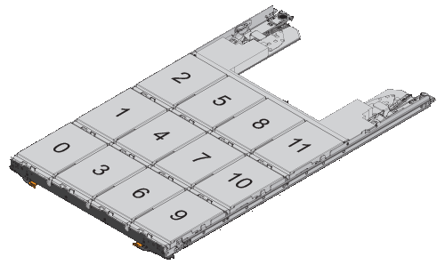

= E5700 ドライブの交換に際しての要件
:allow-uri-read: 
:icons: font
:imagesdir: ../media/

[role="lead"]
ドライブを交換する前に、要件と考慮事項を確認してください。

== シェルフタイプ

24 ドライブシェルフ、 60 ドライブシェルフ、またはドライブドロワー内のドライブを交換することができます。

この 手順 環境 IOM12 および IOM12B ドライブシェルフおよび DCM と DCM2 ドライブシェルフです

NOTE: この手順 は、シェルフの IOM のホットスワップや交換に使用されます。つまり、 IOM12 モジュールを別の IOM12 モジュールに交換するか、 IOM12B モジュールを別の IOM12B モジュールに交換しなければなりません。（シェルフに IOM12 モジュールを 2 台搭載することも、 IOM12B モジュールを 2 つ使用することもできます）

=== 24 ドライブシェルフ

次の図は、各タイプのシェルフのドライブの番号を示しています（シェルフの前面ベゼルまたは背面カバーは取り外した状態です）。

* E5724 コントローラシェルフと DE224C ドライブシェルフ * のドライブ番号

image::../media/28_dwg_e2824_de224c_drive_numbering_maint-e5700.gif[28 dwg e2824 de224c ドライブの番号が maint e5700 となっています]

NOTE: E5724 のストレージアレイには、 DE5600 24 ドライブトレイや DE6600 60 ドライブトレイなど、従来の SAS-2 拡張ドライブトレイが搭載されている場合がありますいずれかのドライブトレイのドライブを交換する手順については、を参照してください link:https://mysupport.netapp.com/ecm/ecm_download_file/ECMLP2577975["E2660 、 E2760 、 E5460 、 E5560 、または E5660 ドライブトレイのドライブの交換"] および link:https://library.netapp.com/ecmdocs/ECMLP2577971/html/GUID-E9157E41-F4BF-4237-9454-F1C9145247F0.html["E2600 、 E2700 、 E5400 、 E5500 、および E5600 の 12 ドライブトレイまたは 24 ドライブトレイのドライブの交換"]。

=== 60 ドライブシェルフ

E5760 コントローラシェルフと DE460C ドライブシェルフは、それぞれ 12 個のドライブスロットがある 5 台のドロワーで構成されます。ドライブドロワーの番号は、一番上が 1 で一番下が 5 です。

image::../media/28_dwg_e2860_de460c_front_no_callouts_maint-e5700.gif[28 dwg e2860 de460c front no callouts e5700]

E5760 コントローラシェルフドロワーと DE460C ドライブシェルフドロワーでは、シェルフ内の各ドライブドロワーで、ドライブに 0~11 の番号が付けられています。

NOTE: E5760 のストレージアレイには、 DE1600 12 ドライブトレイ、 DE5600 24 ドライブトレイ、 DE6600 60 ドライブトレイなど、従来の SAS-2 拡張ドライブトレイが搭載されている場合がありますいずれかのドライブトレイのドライブを交換する手順については、を参照してください link:https://mysupport.netapp.com/ecm/ecm_download_file/ECMLP2577975["E2660 、 E2760 、 E5460 、 E5560 、または E5660 ドライブトレイのドライブの交換"] および link:https://library.netapp.com/ecmdocs/ECMLP2577971/html/GUID-E9157E41-F4BF-4237-9454-F1C9145247F0.html["E2600 、 E2700 、 E5400 、 E5500 、および E5600 の 12 ドライブトレイまたは 24 ドライブトレイのドライブの交換"]。

=== ドライブドロワー

E5760 コントローラシェルフおよび DE460C ドライブシェルフに搭載されたドライブドロワーを交換することができます。これらの 60 ドライブシェルフには、それぞれ 5 つのドライブドロワーが搭載されています。

image::../media/28_dwg_e2860_de460c_front_no_callouts_maint-e5700.gif[28 dwg e2860 de460c front no callouts e5700]

5 台の各ドロワーに最大 12 本のドライブを搭載できます。

image::../media/92_dwg_de6600_drawer_with_hdds_no_callouts_maint-e5700.gif[92 DWG DE6600 ドロワー、 HDD の番号は maint e5700 ではなくなりました]

== ドライブの取り扱いに際しての要件

CAUTION: ストレージアレイのドライブは壊れやすいので注意して扱ってください。ドライブの取り扱いが適切でないことは、ドライブ障害の主要な原因です。

ストレージアレイのドライブの破損を防ぐために、次のルールに従ってください。

* 静電放電（ ESD ）防止処置を施す：
+
** 取り付け準備ができるまで、ドライブを ESD バッグに入れたままにしておきます。
** ESD バッグに金属製の工具やナイフを入れないでください。
+
ESD バッグを手で開けるか、バッグの上部をハサミで切り落とします。

** ESD バッグと梱包材は、あとでドライブの返却が必要になったときのために保管しておいてください。
** 作業中は常に ESD リストストラップを着用し、ストレージエンクロージャのシャーシの塗装されていない表面部分にリストストラップを接地させます。
+
リストストラップがない場合は、ドライブに触る前に、ストレージエンクロージャのシャーシの塗装されていない部分を手で触ります。

* ドライブは慎重に扱う：
+
** 取り外し、取り付け、持ち運びなど、ドライブを扱うときは常に両手で作業してください。
** ドライブをシェルフに取り付けるときは、無理に押し込まず、ドライブラッチにしっかりと固定されるまでそっと押し込んでください。
** ドライブはやわらかい場所に置き、他のドライブと重ねて置かないでください。
** ドライブをぶつけないでください。
** ドライブをシェルフから取り外すときは、ハンドルを外し、ドライブがスピンダウンするまで 30 秒待ってください。
** ドライブを発送するときは、必ず承認された梱包材を使用し

* 磁場を避ける：
+
** ドライブを磁気デバイスに近づけないでください。
+
磁場によってドライブに保存されているすべてのデータが破損したり、ドライブの回路が故障し、原因が修理不可能となる場合があります。

