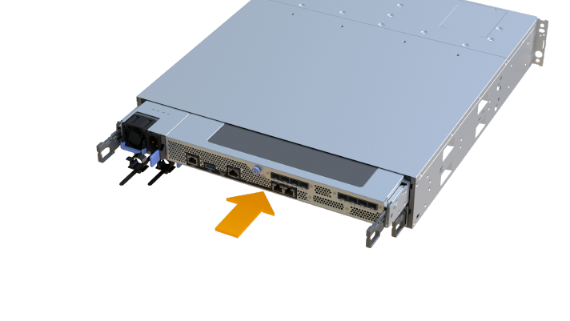

= EF300 または EF600 コントローラを交換します
:allow-uri-read: 
:experimental: 
:icons: font
:imagesdir: ../media/

[role="lead"]
EF300 または EF600 コントローラシェルフに搭載された単一のコントローラを交換することができます。

.このタスクについて
障害が発生したコントローラキャニスターを交換するときは、元のコントローラキャニスターからバッテリ、電源装置、 DIMM 、ファン、およびホストインターフェイスカード（ HIC ）を取り外して、交換用コントローラキャニスターに取り付ける必要があります。

.作業を開始する前に
* レビュー link:controllers-overview-supertask-concept.html["EF300 または EF600 コントローラの交換に際しての要件"]。
* コントローラキャニスターに障害が発生したかどうかを次の 2 つの方法で確認します。
+
** SANtricity System Manager の Recovery Guru で、コントローラキャニスターを交換するように指示されます。
** コントローラキャニスターの黄色の警告 LED が点灯して、コントローラに障害が発生したことが通知されます。
+
[]
====

NOTE: コントローラの黄色の警告LEDは、交換時に次の状況が発生すると消灯します。

*** Alt電源装置で障害が発生しました
*** 代替ドライブパスで障害が発生しました
*** ドロワーが開いている/見つからない
*** ファンに障害が発生している/見つからない
*** 電源装置がありません

====

* 次のものがあることを確認します。
+
** 交換するコントローラキャニスターと同じパーツ番号の交換用コントローラキャニスター。
** ESD リストバンドを装着するか、静電気防止処置を施しておきます。
** 静電気防止処置を施した平らな作業場所。
** No.1 プラスドライバ
** コントローラキャニスターに接続する各ケーブルを識別するためのラベル。
** コントローラの SANtricity System Manager にアクセスできるブラウザを備えた管理ステーション。（ System Manager インターフェイスを開くには、ブラウザでコントローラのドメイン名または IP アドレスを指定します）。

== 手順 1 ：コントローラを交換する準備をします

障害が発生したコントローラキャニスターを交換する準備として、交換用コントローラキャニスターの FRU パーツ番号が正しいことを確認し、構成をバックアップし、サポートデータを収集します。

.手順
. 新しいコントローラキャニスターを開封し、静電気防止処置を施した平らな場所に置きます。
+
梱包材は、障害が発生したコントローラキャニスターを発送するときのために保管しておいてください。

. コントローラキャニスターの背面にある MAC アドレスと FRU パーツ番号のラベルを確認します。
. SANtricity System Manager で、交換するコントローラキャニスターの交換パーツ番号を確認します。
+
コントローラに障害が発生しているため交換が必要な場合は、 Recovery Guru の詳細領域に交換パーツ番号が表示されます。この番号を手動で確認する必要がある場合は、次の手順を実行します。

+
.. 「 * ハードウェア * 」を選択します。
.. コントローラアイコンが付いたコントローラシェルフを探します image:../media/sam1130_ss_hardware_controller_icon_maint-ef600.gif[""]。
.. コントローラアイコンをクリックします。
.. コントローラを選択し、 * 次へ * をクリックします。
.. [*Base] タブで、コントローラの交換パーツ番号 * をメモします。

. 障害が発生したコントローラの交換パーツ番号が交換用コントローラの FRU パーツ番号と同じであることを確認します。
+

CAUTION: * データアクセスが失われる可能性 * -- 2 つのパーツ番号が同じでない場合は、この手順を試みないでください。また、障害が発生したコントローラキャニスターにホストインターフェイスカード（ HIC ）が搭載されている場合は、新しいコントローラキャニスターにその HIC を取り付ける必要があります。コントローラや HIC が一致していないと、新しいコントローラをオンラインにしたときにロックダウン状態になります。

. SANtricity システムマネージャを使用して、ストレージアレイの構成データベースをバックアップします。
+
コントローラを取り外すときに問題が発生した場合は、保存したファイルを使用して構成をリストアできます。RAID 構成データベースの現在の状態が保存されます。これには、コントローラ上のボリュームグループとディスクプールのすべてのデータが含まれます。

+
** System Manager から：
+
... メニューを選択します。 Support [ Support Center > Diagnostics ] （サポートセンター > 診断）。
... [ 構成データの収集 *] を選択します。
... [*Collect*]( 収集 ) をクリックします
+
ブラウザの Downloads フォルダに、「 * configurationdata-<ArrayName>-<dateTime >.7z * 」という名前でファイルが保存されます。

. コントローラがオフラインでない場合は、 SANtricity System Manager を使用してオフラインにします。
+
.. 「 * ハードウェア * 」を選択します。
.. 図にドライブが表示されている場合は、 * Show back of shelf * を選択してコントローラを表示します。
.. オフラインに切り替えるコントローラを選択します。
.. コンテキストメニューから * オフラインに切り替え * を選択し、操作を確定します。

+

NOTE: オフラインにするコントローラを使用して SANtricity System Manager にアクセスしている場合は、「 SANtricity System Manager を利用できません」というメッセージが表示されます。別のコントローラを使用して SANtricity System Manager に自動的にアクセスするには、 * 代替ネットワーク接続に接続する * を選択します。

. SANtricity System Manager でコントローラのステータスがオフラインに更新されるまで待ちます。
+

CAUTION: ステータスの更新が完了するまでは、他の処理を開始しないでください。

. Recovery Guru で「 * 再確認」を選択し、「詳細」領域の「 * 削除してもよろしいですか * 」フィールドに「はい」と表示されていることを確認します。これは、このコンポーネントを削除しても安全であることを示します。

== 手順 2 ：障害が発生したコントローラを取り外す

新しいコントローラキャニスターに交換するために、障害が発生したキャニスターを取り外します。

これは、バッテリ、ホストインターフェイスカード、電源装置、 DIMM 、およびファンの各コンポーネントを取り外す必要がある、複数の手順から成る手順です。

=== 手順 2a ：コントローラキャニスターを取り外す

新しいコントローラキャニスターに交換できるように、障害が発生したコントローラキャニスターを取り外します。

.手順
. ESD リストバンドを装着するか、静電気防止処置を施します。
. コントローラキャニスターに接続された各ケーブルにラベルを付けます。
. コントローラキャニスターからすべてのケーブルを外します。
+

CAUTION: パフォーマンスの低下を防ぐために、ケーブルをねじったり、折り曲げたり、はさんだり、踏みつけたりしないでください。

. コントローラキャニスターの HIC で SFP+ トランシーバを使用している場合は、 SFP を取り外します。
+
障害が発生したコントローラキャニスターから HIC を取り外す必要があるため、 HIC ポートから SFP をすべて取り外す必要があります。それらの SFP は、ケーブルを再接続するときに新しいコントローラキャニスターに移すことができます。

. コントローラの両側にあるハンドルをつかみ、シェルフから外れるまで引き出します。
+
image::../media/remove_controller_5.png[コントローラ 5 を取り外します]

. 両手でハンドルをつかみ、コントローラキャニスターをスライドしてシェルフから引き出します。コントローラの前面がエンクロージャの外に出たら、両手で完全に引き出します。
+

CAUTION: コントローラキャニスターは重いので、必ず両手で支えながら作業してください。

+
image::../media/remove_controller_6.png[コントローラ 6 を取り外します]

. コントローラキャニスターを静電気防止処置を施した平らな場所に置きます。

=== 手順 2b ：バッテリを取り外します

新しいコントローラキャニスターに取り付けられるように、障害が発生したコントローラキャニスターからバッテリを取り外します。

.手順
. 1 本の取り付けネジを外し、ふたを持ち上げてコントローラキャニスターのカバーを取り外します。
. コントローラの側面にある「 Press 」タブを探します。
. このツメを押しながらバッテリケースをつかんで、バッテリのラッチを外します。
+
image::../media/batt_3.png[BATT 3]

. バッテリ配線を収容しているコネクタをそっとつかみます。バッテリーを引き上げてボードから取り外します。image:../media/batt_2.png[""]
. バッテリをコントローラから取り出し、静電気防止処置を施した平らな場所に置きます。image:../media/batt_4.png[""]

=== 手順 2c ： HIC を取り外します

コントローラキャニスターに HIC が搭載されている場合は、元のコントローラキャニスターから HIC を取り外す必要があります。それ以外の場合は、この手順を省略できます。

.手順
. コントローラキャニスターに HIC カバーを固定している 2 本のネジをプラスドライバで外します。
+
image::../media/hic_2.png[HIC 2]

+

NOTE: 上の図は例です。 HIC の外観は異なる場合があります。

. HIC カバーを取り外します。
. コントローラカードに HIC を固定している 1 本の取り付けネジを手またはプラスドライバで緩めます。
+
image::../media/hic_3.png[HIC 3.]

+

NOTE: HIC の上面にはネジ穴が 3 つありますが、そのうちの 1 つだけで固定されています。

. HIC をコントローラから持ち上げて取り出し、コントローラカードから慎重に外します。
+

CAUTION: HIC の底面やコントローラカードの表面のコンポーネントをこすったりぶつけたりしないように注意してください。

+
image::../media/hic_4.png[HIC 4.]

. HIC を静電気防止処置を施した平らな場所に置きます。

=== 手順 2D ：電源装置を取り外す

新しいコントローラに取り付けられるように、電源装置を取り外します。

.手順
. 電源ケーブルを外します。
+
.. 電源コード固定クリップを開き、電源装置から電源コードを抜きます。
.. 電源から電源コードを抜きます。

. 電源装置の右側にあるタブを電源装置の方に押します。
+
image::../media/psup_2.png[psup2]

. 電源装置の前面にあるハンドルを確認します。
. ハンドルをつかみ、電源装置をスライドしてシステムから引き出します。
+
image::../media/psup_3.png[psup3.]

+

CAUTION: 電源装置を取り外すときは、重量があるので必ず両手で支えながら作業してください。

=== 手順 2e ： DIMM を取り外す

新しいコントローラに取り付けられるように、 DIMM を取り外します。

.手順
. コントローラで DIMM の場所を確認します。
. 交換用 DIMM を正しい向きで挿入できるように、ソケット内の DIMM の向きをメモします。
+

NOTE: DIMM の下部にある切り欠きを使用して DIMM の位置を合わせます。

. DIMM の両側にある 2 つのツメをゆっくり押し開いて DIMM をスロットから外し、スライドしてスロットから取り出します。
+

NOTE: DIMM 回路基板のコンポーネントに力が加わらないように、 DIMM の両端を慎重に持ちます。

+
image::../media/dimm_2.png[DIMM 2.]

+
image::../media/dimim_3.png[ディム 3]

=== 手順 2f ：ファンを取り外します

新しいコントローラに取り付けられるように、ファンを取り外します。

.手順
. ファンをコントローラからそっと持ち上げます。
+
image::../media/fan_2.png[ファン 2.]

. 同じ手順でファンをすべて取り外します。

== 手順 3 ：新しいコントローラを取り付ける

障害が発生したコントローラキャニスターの代わりに、新しいコントローラキャニスターを取り付けます。

これは複数の手順に対応した手順で、元のコントローラから次のコンポーネントを取り付ける必要があります：バッテリ、ホストインターフェイスカード、電源装置、 DIMM 、およびファン。

=== 手順 3a ：バッテリを取り付ける

交換用コントローラキャニスターにバッテリを取り付けます。

.手順
. 次のものが揃っていることを確認します。
+
** 元のコントローラキャニスターから取り外したバッテリ、または注文した新しいバッテリ。
** 交換用コントローラキャニスター。

. コントローラの側面にある金属製ラッチにバッテリケースを合わせ、バッテリをコントローラに挿入します。
+
image::../media/batt_5.png[BATT 5]

+
カチッと所定の位置に収まるまでバッテリを押し込みます。

. バッテリーコネクタをボードに再接続します。

=== 手順 3b ： HIC を取り付ける

元のコントローラキャニスターから HIC を取り外した場合、その HIC を新しいコントローラキャニスターに取り付ける必要があります。それ以外の場合は、この手順を省略できます。

.手順
. 交換用コントローラキャニスターにブランクカバーを固定している 2 本のネジを No.1 プラスドライバを使用して外し、カバーを取り外します。
. HIC の 1 本の取り付けネジをコントローラの対応する穴に合わせ、 HIC の底面のコネクタをコントローラカードの HIC インターフェイスコネクタに合わせます。
+
HIC の底面やコントローラカードの表面のコンポーネントをこすったりぶつけたりしないように注意してください。

+
image::../media/hic_7.png[HIC 7.]

+

NOTE: 上の図は一例です。 HIC の外観は異なる場合があります。

. HIC を所定の位置に慎重に置き、 HIC をそっと押して HIC コネクタを固定します。
+

CAUTION: * 機器の破損の可能性 * -- HIC と取り付けネジの間にあるコントローラ LED の金色のリボンコネクタをはさまないように十分に注意してください。

. HIC の取り付けネジを手で締めます。
+
ネジを締め付けすぎる可能性があるため、ドライバは使用しないでください。

+
image::../media/hic_3.png[HIC 3.]

+

NOTE: 上の図は一例です。 HIC の外観は異なる場合があります。

. 元のコントローラキャニスターから取り外した HIC カバーを新しいコントローラキャニスターに取り付け、 No.1 プラスドライバを使用して 2 本のネジで固定します。

=== 手順 3c ：電源装置を取り付ける

交換用コントローラキャニスターに電源装置を取り付けます。

.手順
. 両手で支えながら電源装置の端をシステムシャーシの開口部に合わせ、カムハンドルを使用して電源装置をシャーシにそっと押し込みます。
+
電源装置にはキーが付いており、一方向のみ取り付けることができます。

+

CAUTION: 電源装置をスライドしてシステムに挿入する際に力を入れすぎないように注意してください。コネクタが破損することがあります。

+
image::../media/psup_4.png[psup4.]

=== 手順 3D ： DIMM を取り付けます

新しいコントローラキャニスターに DIMM を取り付けます。

.手順
. DIMM の両端を持ち、スロットに合わせます。
+
DIMM のピンの間にある切り欠きを、ソケットの突起と揃える必要があります。

. DIMM をスロットに対して垂直に挿入します。
+
image::../media/dimm_4.png[DIMM 4.]

+
DIMM のスロットへの挿入にはある程度の力が必要です。簡単に挿入できない場合は、 DIMM をスロットに正しく合わせてから再度挿入してください。

+

NOTE: DIMM がスロットにまっすぐ差し込まれていることを目で確認してください。

. DIMM の両端のノッチにラッチがかかるまで、 DIMM の上部を慎重にしっかり押し込みます。
+

NOTE: DIMM がしっかりと装着されます。場合によっては、片側ずつそっと押して、それぞれのタブで個別に固定する必要があります。

+
image::../media/dimm_5.png[DIMM 5.]

=== 手順 3e ：ファンを取り付けます

交換用コントローラキャニスターにファンを取り付けます。

.手順
. ファンをスライドして交換用コントローラに最後まで押し込みます。
+
image::../media/fan_3.png[ファン 3.]

+
image::../media/fan_3_a.png[ファン 3 A]

. 同じ手順でファンをすべて取り付けます。

=== 手順 3F ：新しいコントローラキャニスターを取り付ける

最後に、新しいコントローラキャニスターをコントローラシェルフに取り付けます。

.手順
. コントローラキャニスターのカバーを下げ、取り付けネジを固定します。
. コントローラのハンドルをつかみながら、コントローラキャニスターをそっとスライドさせてコントローラシェルフの奥まで押し込みます。
+

NOTE: コントローラがシェルフに正しく取り付けられると、カチッという音がします。

+

. 元のコントローラに SFP が取り付けられていた場合は、元のコントローラから取り外した SFP を新しいコントローラのホストポートに取り付け、すべてのケーブルを再接続します。
+
ホストプロトコルを複数使用している場合は、 SFP を取り付けるホストポートを間違えないように注意してください。

. 元のコントローラの IP アドレスが DHCP を使用して取得したアドレスである場合は、交換用コントローラの背面のラベルに記載された MAC アドレスを確認します。取り外したコントローラの DNS / ネットワークおよび IP アドレスを交換用コントローラの MAC アドレスと関連付けるよう、ネットワーク管理者に依頼します。
+

NOTE: 元のコントローラの IP アドレスが DHCP を使用して取得したアドレスでなければ、取り外したコントローラの IP アドレスが新しいコントローラで使用されます。

== 手順 4 ：コントローラの交換後の処理

コントローラをオンラインにし、サポートデータを収集し、運用を再開します。

.手順
. コントローラをオンラインにします。
+
.. System Manager で、ハードウェアページに移動します。
.. 「 * コントローラの背面を表示 * 」を選択します。
.. 交換したコントローラを選択します。
.. ドロップダウンリストから「オンラインにする」 * を選択します。

. コントローラのブート時に、コントローラの LED を確認します。
+
もう一方のコントローラとの通信が再確立されると次のような状態

+
** 黄色の警告 LED が点灯した状態になります。
** ホストリンク LED は、ホストインターフェイスに応じて、点灯、点滅、消灯のいずれかになります。

. コントローラがオンラインに戻ったら、Recovery GuruでNVSRAMの不一致が報告されていないかどうかを確認します。
+
.. NVSRAMの不一致が報告された場合は、次のSMcliコマンドを使用してNVSRAMをアップグレードします。
+
[listing]
----
SMcli <controller A IP> <controller B IP> -u admin -p <password> -k -c "download storageArray NVSRAM file=\"C:\Users\testuser\Downloads\NVSRAM .dlp file>\" forceDownload=TRUE;"
----
+
。 `-k` アレイがhttpsで保護されていない場合は、パラメータが必要です。

+

NOTE: SMcliコマンドを完了できない場合は、 https://www.netapp.com/company/contact-us/support/["NetAppテクニカルサポート"^] または、 https://mysupport.netapp.com["ネットアップサポートサイト"^] ケースを作成します。

. システムのステータスが「最適」になっていることを確認し、コントローラシェルフの警告LEDを確認します。
+
ステータスが「最適」でない場合やいずれかの警告 LED が点灯している場合は、すべてのケーブルが正しく装着され、コントローラキャニスターが正しく取り付けられていることを確認します。必要に応じて、コントローラキャニスターを取り外して再度取り付けます。

+

NOTE: 問題が解決しない場合は、テクニカルサポートにお問い合わせください。

. メニュー：[ハードウェア][サポート]>[アップグレードセンター]をクリックして、システムのファームウェアとNVSRAMのバージョンが適切なレベルになっていることを確認します。
+
必要に応じて、最新バージョンをインストールします。

. すべてのボリュームが優先所有者に戻っていることを確認します。
+
.. 選択メニュー： Storage [Volumes][ * すべてのボリューム * ] ページで、ボリュームが優先所有者に配布されていることを確認します。メニューを選択します。 [More （その他） ] [Change ownership （所有権の変更） ] （ボリューム所有者を表示
.. すべてのボリュームが優先所有者に所有されている場合は、手順 6 に進みます。
.. いずれのボリュームも戻っていない場合は、手動でボリュームを戻す必要があります。メニューに移動します。 More [redistribution volumes （ボリュームの再配置） ] 。
.. 自動配信または手動配信のあとに一部のボリュームだけが優先所有者に戻った場合は、 Recovery Guru でホスト接続の問題を確認する必要があります。
.. Recovery Guru がない場合、または Recovery Guru の手順に従ってもボリュームが優先所有者に戻らない場合は、サポートに問い合わせてください。

. SANtricity システムマネージャを使用してストレージアレイのサポートデータを収集します。
+
.. メニューを選択します。 Support [ Support Center > Diagnostics ] （サポートセンター > 診断）。
.. 「サポートデータの収集」を選択します。
.. [*Collect*]( 収集 ) をクリックします
+
ブラウザの Downloads フォルダに、「 * support-data.7z * 」という名前でファイルが保存されます。

.次の手順
これでコントローラの交換は完了です。通常の運用を再開することができます。
