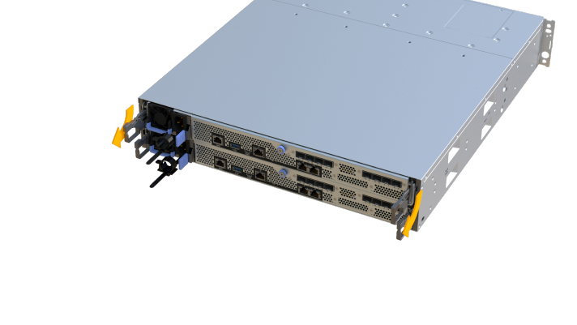

= EF300およびEF600にSAS拡張カードを追加します
:allow-uri-read: 
:experimental: 
:icons: font
:imagesdir: ../media/

[role="lead"]
EF300、EF600、EF300C、EF600CコントローラにSAS拡張カードを追加して、ドライブトレイを拡張することができます。

.このタスクについて
SAS 拡張カードを追加するには、ストレージアレイの電源をオフにし、新しい SAS 拡張カードを取り付けてから再度オンにする必要があります。

.作業を開始する前に
* レビュー link:sas-overview-supertask-concept.html["EF300およびEF600 SAS拡張カードの交換に際しての要件"]。
* この手順のダウンタイムメンテナンス時間をスケジュールする必要があります。この手順が完了するまではストレージアレイのデータにアクセスできません。
+

CAUTION: この手順 は両方のコントローラキャニスターで行う必要があります。コントローラHICの構成が正確に一致している必要があります

* 次のものがあることを確認します。
+
** コントローラと互換性のある SAS 拡張カード。
** ESD リストバンドを装着するか、静電気防止処置を施しておきます。
** 静電気防止処置を施した平らな作業場所。
** No.1 プラスドライバ。
** コントローラキャニスターに接続する各ケーブルを識別するためのラベル。
** コントローラの SANtricity System Manager にアクセスできるブラウザを備えた管理ステーション。（ System Manager インターフェイスを開くには、ブラウザでコントローラのドメイン名または IP アドレスを指定します）。

== 手順 1 ：コントローラシェルフをオフラインにする

SAS 拡張カードを安全に追加できるように、コントローラシェルフをオフラインにします。

.手順
. SANtricity System Manager のホームページで、ストレージアレイのステータスが最適であることを確認します。
+
ステータスが「最適」でない場合は、 Recovery Guru を使用するかテクニカルサポートに問い合わせて問題を解決してください。この手順を続行しないでください。

. SANtricity システムマネージャを使用して、ストレージアレイの構成データベースをバックアップします。
+
コントローラを取り外すときに問題が発生した場合は、保存したファイルを使用して構成をリストアできます。RAID 構成データベースの現在の状態が保存されます。これには、コントローラ上のボリュームグループとディスクプールのすべてのデータが含まれます。

+
** System Manager から：
+
... メニューを選択します。 Support [ Support Center > Diagnostics ] （サポートセンター > 診断）。
... [ 構成データの収集 *] を選択します。
... [*Collect*]( 収集 ) をクリックします
+
ブラウザの Downloads フォルダに、「 * configurationdata-<ArrayName>-<dateTime >.7z * 」という名前でファイルが保存されます。

. ストレージアレイと接続されているすべてのホストの間で I/O 処理が発生しないようにします。たとえば、次の手順を実行します。
+
** ストレージからホストにマッピングされた LUN に関連するすべてのプロセスを停止します。
** ストレージからホストにマッピングされた LUN にアプリケーションがデータを書き込んでいないことを確認します。
** アレイのボリュームに関連付けられているファイルシステムをすべてアンマウントします。
+

NOTE: ホスト I/O 処理を停止する具体的な手順はホストオペレーティングシステムや構成によって異なり、ここでは説明していません。環境内でホスト I/O 処理を停止する方法がわからない場合は、ホストをシャットダウンすることを検討してください。

+

CAUTION: * データ損失の可能性 * - I/O 処理の実行中にこの手順を続行すると、ストレージがアクセスできないため、ホストアプリケーションがデータにアクセスできなくなる可能性があります。

. キャッシュメモリ内のデータがドライブに書き込まれるまで待ちます。
+
キャッシュされたデータをドライブに書き込む必要がある場合は、各コントローラの背面にある緑のキャッシュアクティブ LED が点灯します。この LED が消灯するまで待つ必要があります。

. SANtricity システムマネージャのホームページで、「 * 進行中の操作を表示」を選択します。すべての処理が完了するまで待ってから、次の手順に進みます。
. コントローラシェルフの電源をオフにします。
+
.. 両方の電源ケーブルにラベルを付けてコントローラシェルフから抜きます。
.. コントローラシェルフのすべての LED が消灯するまで待ちます。

== 手順 2 ：コントローラキャニスターを取り外す

新しい SAS 拡張カードを追加できるように、コントローラキャニスターを取り外します。

.手順
. ESD リストバンドを装着するか、静電気防止処置を施します。
. コントローラキャニスターに接続された各ケーブルにラベルを付けます。
. コントローラキャニスターからすべてのケーブルを外します。
+

CAUTION: パフォーマンスの低下を防ぐために、ケーブルをねじったり、折り曲げたり、はさんだり、踏みつけたりしないでください。

. コントローラの背面にあるキャッシュアクティブ LED が消灯していることを確認します。
. コントローラの両側にあるハンドルをつかみ、シェルフから外れるまで引き出します。
+

. 両手でハンドルをつかみ、コントローラキャニスターをスライドしてシェルフから引き出します。コントローラの前面がエンクロージャの外に出たら、両手で完全に引き出します。
+

CAUTION: コントローラキャニスターは重いので、必ず両手で支えながら作業してください。

+
image::../media/remove_controller_6.png[取り外すときは、コントローラの重量を両手で支えながら作業します。]

. コントローラキャニスターを静電気防止処置を施した平らな場所に置きます。

== 手順 3 ：新しい SAS 拡張カードを追加します

SAS 拡張カードを取り付けて、ドライブトレイを拡張できるようにします。

.手順
. 1 本の取り付けネジを外し、ふたを持ち上げてコントローラキャニスターのカバーを取り外します。
. コントローラ内部の緑の LED が消灯していることを確認します。
+
この緑の LED が点灯している場合は、コントローラがまだバッテリ電源を使用しています。この LED が消灯するのを待ってから、コンポーネントを取り外す必要があります。

. コントローラキャニスターにカバーを固定している 2 本のネジを No.1 プラスドライバを使用して外し、カバーを取り外します。
. SAS 拡張カードの 1 本の取り付けネジをコントローラの対応する穴に合わせ、拡張カード底面のコネクタをコントローラカードの拡張カードインターフェイスコネクタに合わせます。
+
SAS 拡張カードの底面やコントローラカードの表面のコンポーネントをこすったりぶつけたりしないように注意してください。

. SAS 拡張カードを所定の位置に慎重に下ろし、拡張カードを軽く押して拡張カードコネクタを固定します。
. SAS 拡張カードの取り付けネジを手で締めます。
+
ネジを締め付けすぎる可能性があるため、ドライバは使用しないでください。

. 元のコントローラキャニスターから取り外したカバーを新しいコントローラキャニスターに取り付け、 No.1 プラスドライバを使用して 2 本のネジで固定します。

== 手順 4 ：コントローラキャニスターを再度取り付けます

新しい SAS 拡張カードを取り付けたら、コントローラキャニスターをコントローラシェルフに再度取り付けます。

.手順
. コントローラキャニスターのカバーを下げ、取り付けネジを固定します。
. コントローラのハンドルをつかみながら、コントローラキャニスターをそっとスライドさせてコントローラシェルフの奥まで押し込みます。
+

NOTE: コントローラがシェルフに正しく取り付けられると、カチッという音がします。

+
image::../media/remove_controller_7.png[シェルフへのコントローラの設置]

== 手順 5 ： SAS 拡張カードの追加後の処理

コントローラをオンラインにし、サポートデータを収集し、運用を再開します。

.手順
. 電源ケーブルを接続してコントローラをオンラインにします。
. コントローラのブート時に、コントローラの LED を確認します。
+
** 黄色の警告 LED が点灯した状態になります。
** ホストリンク LED は、ホストインターフェイスに応じて、点灯、点滅、消灯のいずれかになります。

. コントローラがオンラインに戻ったら、ステータスが「最適」になっていることを確認し、コントローラシェルフの警告 LED を確認します。
+
ステータスが「最適」でない場合やいずれかの警告 LED が点灯している場合は、すべてのケーブルが正しく装着され、コントローラキャニスターが正しく取り付けられていることを確認します。必要に応じて、コントローラキャニスターを取り外して再度取り付けます。

+

NOTE: 問題が解決しない場合は、テクニカルサポートにお問い合わせください。

. [ メニュー ] 、 [ サポート ] 、 [ アップグレードセンター ] の順にクリックして、最新バージョンの SANtricity OS がインストールされていることを確認します。
+
必要に応じて、最新バージョンをインストールします。

. すべてのボリュームが優先所有者に戻っていることを確認します。
+
.. 選択メニュー： Storage [Volumes][ * すべてのボリューム * ] ページで、ボリュームが優先所有者に配布されていることを確認します。メニューを選択します。 [More （その他） ] [Change ownership （所有権の変更） ] （ボリューム所有者を表示
.. すべてのボリュームが優先所有者に所有されている場合は、手順 6 に進みます。
.. いずれのボリュームも戻っていない場合は、手動でボリュームを戻す必要があります。メニューに移動します。 More [redistribution volumes （ボリュームの再配置） ] 。
.. 自動配信または手動配信のあとに一部のボリュームだけが優先所有者に戻った場合は、 Recovery Guru でホスト接続の問題を確認する必要があります。
.. Recovery Guru がない場合、または Recovery Guru の手順に従ってもボリュームが優先所有者に戻らない場合は、サポートに問い合わせてください。

. SANtricity システムマネージャを使用してストレージアレイのサポートデータを収集します。
+
.. メニューを選択します。 Support [ Support Center > Diagnostics ] （サポートセンター > 診断）。
.. 「サポートデータの収集」を選択します。
.. [*Collect*]( 収集 ) をクリックします
+
ブラウザの Downloads フォルダに、「 * support-data.7z * 」という名前でファイルが保存されます。

. 2台目のコントローラキャニスターでこのタスクを繰り返します。

NOTE: SAS 拡張のケーブル接続については、を参照してください link:../install-hw-cabling/index.html["E シリーズハードウェアのケーブル接続"] 手順については、を参照し

.次の手順
これでストレージアレイに SAS 拡張カードを追加する処理は完了です。通常の運用を再開することができます。
