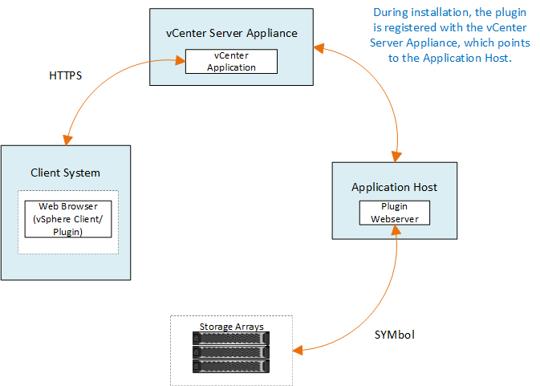

= vCenter 向けストレージプラグインの概要
:hardbreaks:
:allow-uri-read: 
:nofooter: 
:icons: font
:linkattrs: 
:imagesdir: ../media/

[role="lead"]
SANtricity Storage Plugin for vCenter では、 VMware vSphere Client セッションから E シリーズストレージアレイを統合管理できます。

vCenter 向けプラグインでは、次の機能を使用できます。

* ネットワーク内で検出されたストレージアレイを表示および管理します。
* 複数のストレージアレイのグループに対してバッチ処理を実行する。
* ソフトウェア OS でアップグレードを実行
* ストレージアレイから別のストレージアレイへ設定をインポートする。
* ボリューム、 SSD キャッシュ、ホスト、ホストクラスタ、プールの構成 ボリュームグループを指定します。
* アレイでのその他の管理タスクを実行するには、 System Manager インターフェイスを起動してください。

NOTE: このプラグインは、 SANtricity System Manager ソフトウェアに代わるものではありません。1 つのアレイで特定のストレージ管理タスクを実行する場合も、 System Manager が必要です。

このプラグインを使用するには、 VMware 環境に導入された VMware vCenter Server Appliance と、プラグイン Web サーバをインストールして実行するアプリケーションホストが必要です。

vCenter 環境での通信の詳細については、次の図を参照してください。

== 設定の概要

. link:san-spvc-ic-installation.html["プラグインをインストールして登録します"]。
. link:san-spvc-ic-user-access.html["プラグインアクセス権限を設定します"]。
. link:san-spvc-ic-login-and-navigation.html["プラグインインターフェイスにログインします"]。
. link:san-spvc-ic-storage-array-discovery.html["ストレージアレイを検出"]。
. link:san-spvc-ic-storage-provisioning.html["ストレージのプロビジョニング"]。

== 詳細については、こちらをご覧ください

* オンラインヘルプについては、 Storage Plugin for vCenter のユーザインターフェイスを参照してください。
* vSphere Client でのデータストアの管理の詳細については、を参照してください https://docs.vmware.com/en/VMware-vSphere/index.html["VMware vSphere のドキュメント"^]。

